# UE5_GameplayAbilitySystem_Aura

> Online repo for Gameplay Ability System
> UE5.5.3

<br>
<br>

# 第1节：项目创建

1. 	在多人游戏中，复制的本质是当服务器上的实体发生变化时，服务器上发生的更改会复制或发送到它连接的所有客户端上。
    > 多人网络这块不熟悉的建议把官方文档上的这一模块看完：👉[Networking and Multiplayer](https://dev.epicgames.com/documentation/en-us/unreal-engine/networking-and-multiplayer-in-unreal-engine)

>

2. 	(1) 对于C++中的指针，我们可以使用 **check** 代替 if 判断是否有效，如果这是调试模式这会触发断点，如果你希望 false 时发生崩溃可以这样做；
	(2) 对于转换我们也可以使用 **CastChecked** 代替 Cast，会比 Cast 多个断言；
    (3) Cast 如果转换失败会返回 nullptr；
    (4) **checkf** 如果判断失败会比 check 多打印字符到日志中；
    (5) 尽量使用 **TObjectPtr** 将指针包起来，它提供了额外的访问追踪和延迟优化相关
    (6) **思考你是否真正需要 Tick，如果不需要，注意禁用掉**

>

3. 	创建动画蓝图时，可以选择创建 Specific Skeleton 和 Template，如果想做成通用的可以试试创建一个 Template，创建一个动画蓝图模板，继承该动画蓝图会同样继承 Event Graph 和 Anim Graph；

>

4. 	(1) 可以在 Character 和 Controller 中绑定和实现移动逻辑，不过比较推荐在 Controller 中写，
        这样让 Controller 分担一些逻辑更方便维护，而不是所有逻辑全写在 Character 里面；
	(2) 然后一些功能相关的逻辑推荐写到组件里面，这样方便复用以及维护；

>

5. 	使用接口的好处
	例如：
    在这个 Top-Down 游戏中，我们希望玩家可以使用鼠标点击敌人让敌人产生高亮轮廓，
    UPlayerController 可以获取光标下面的 AActor  ( `APlayerController::GetHitResultUnderCursor` , 注意 Actor 碰撞预设的设置) ，但我们不想将逻辑写在 UPlayerController 中，
    我们可以创建一个高亮显示用的接口，让敌人实现高亮显示的函数，不同的敌人可以以不同的方式实现高亮函数，
    这样 UPlayerController 就不用管怎么实现了，交给实现了接口的 AActor 即可；
    > 我们还可以将这个接口添加到桶或门上，并以不同的方式突出显示这些对象

>

6. > _这其实是一个通用的功能需求：鼠标悬停 (Hover) 的敌人或者 Actor 可以高亮显示。_
   **最好创建一个接口，虽然敌人有基类，但我们可能也想能够高亮显示其他 Actor，而且这也让我们的代码不依赖敌人，达到解耦的目的。更通用。** 实现了接口的 Actor，只需要在鼠标悬停时调用特定函数，而且针对不同 Class，可以实现定制化操作，更灵活。还可以将这个接口添加到桶或门上。
   这就是有经验的开发人员称之为的 “良好的编程实践”
      
   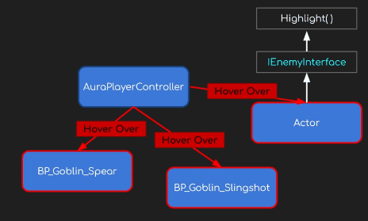

>

7. 	将成员变量保存到接口的正确做法是使用 TScriptInterface<> 而不是直接使用 IxxxInterface*
	参考文档：👉[Unreal Interfaces](https://dev.epicgames.com/documentation/en-us/unreal-engine/interfaces-in-unreal-engine)
	> 看这个模块Safely Store Object and Interface Pointers

	使用这个的好处：
	(1) 安全
	(2) 方便，TScriptInterface 内置了构造函数和操作符重载，比如可以省去 Cast 转换用来判断是否实现了接口：
    ```cpp
    TScriptInterface<IHighlightInterface> LastActor;
    TScriptInterface<IHighlightInterface> ThisActor;
    LastActor = ThisActor;
    ThisActor = CursorHit.GetActor();
    ```

>

8.  _**使用自定义深度模板值时注意有没有设置 ProjectSettings/Rendering->CustomDepth-StencilPass 为 Enabled with Stencil，默认 Enabled 是禁用 Stencil 的；**_
    不熟悉高亮材质制作思路的可以了解下 Content/Assets/Materials/PP_Highlight
    使用后处理材质时在场景中需要拖入 PostProcessVolume

<br>
<br>

# 第2节：介绍GAS系统 (Gameplay Ability System)

> 在游戏能力系统 (GAS) 还没有出现之前，已经创造出了无数的游戏，甚至是超级复杂的角色扮演游戏。
> 不过记得我在腾讯时的组长跟我们说过一句话：**“好的框架能让团队少犯错误，让我们开发效率更高。”**
> GAS 也是完全复制 (Fully replicated) 的，意味着它可以在网络多人游戏环境中工作，并提供延迟补偿 (lag compensation)，即使存在延迟，也能获得流畅的游戏体验。

> _学习如何使用和实施 GAS 框架将使您能够以专业组织的方式做到这一点，易于扩展、模块化，并且效率足以满足快节奏、有竞争力的游戏。(例如 Moba)_
> 实际上你可以节省数年的时间来设计这样的艺术品。

官方文档：👉[Gameplay Ability System (GAS)](https://dev.epicgames.com/documentation/en-us/unreal-engine/gameplay-ability-system-for-unreal-engine)

这里列出目录，如果不太熟悉，建议先熟悉下官方文档介绍的 GAS

- **Ability System Component And Attributes**
  > Using the Ability System Component with Gameplay Attributes and Attribute Sets
  使用带有玩法属性和属性集的能力系统组件
- **Gameplay Ability**
  > Overview of the Gameplay Ability class.
- **Gameplay Attributes and Attribute Sets**
- **Gameplay Ability System Overview**
  > The Gameplay Ability System is a framework for building abilities and interactions that Actors can own and trigger. This system is designed mainly for RPGs, action-adventure games, MOBAs, and other types of games where characters have abilities that need to coordinate mechanics, visual effects, animations, sounds, and data-driven elements, although it can be adapted to a wide variety of projects. The Gameplay Ability System also supports replication for multiplayer games, and can save developers a lot of time scaling up their designs to support multiplayer.
  With this system, you can create abilities as simple as a single attack, or as complex as a spell that triggers many status effects depending on data from the user and the targets. This page provides an overview of the Ability System and how its components work together.
  > 什么是游戏能力？
  > 游戏能力是演员可以拥有并重复触发的游戏内动作。常见的例子包括法术、特殊攻击或物品触发的效果。
  > 虚幻引擎的游戏能力系统的设计涉及三个主要考虑因素:
  > - **追踪能力的拥有者**
  > - **跟踪能力状态**：
        1. 当能力被激活时；
        2. 当前正在进行该能力的执行时；
        3. 当能力完全完成并且不再有效时；
  > - **协调能力的执行** (Coordinating an Ability's Execution)：
        一种能力必须能够在执行过程中以特定的时间与多个不同的系统进行交互。这些交互可以是您在 Blueprint 中可以执行的任何操作，包括：
        - 激活动画蒙太奇；
        - 暂时控制角色的移动；
        - 触发视觉效果；
        - 执行重叠或碰撞事件；
        - 取消正在进行中的其他能力；
        - 等等...
        根据能力的工作方式，它可以在处于活动状态时在许多不同的时间点执行这些交互中的任何一个，包括在动画中间，并且某些效果可能需要在能力本身完成后持续存在。
  
  > 在多人游戏中，能力系统组件还负责将信息复制到客户端、将玩家操作传达到服务器以及验证客户端是否有权更改能力系统组件的状态。能力系统组件的父 Actor 必须由本地控制的玩家拥有才能进行远程激活，这意味着您只能对您控制的 Actor 执行能力。
  
  > - 您可以通过四种主要方法激活游戏能力：
      1. 您可以使用游戏能力句柄通过蓝图或 C++ 代码显式激活能力。这是在授予能力时由能力系统组件提供的；
      2. 使用游戏事件。这会通过匹配的能力触发器触发所有能力。如果您需要抽象输入和决策机制，则此方法更可取，因为它提供了最大程度的灵活性；
      3. 使用带有匹配标签的游戏​​效果。这会通过匹配的能力触发器触发所有能力。这是触发游戏效果能力的首选方法。一个典型的用例是睡眠减益，它会触发播放禁用动画并抑制其他游戏操作的能力；
      4. 使用输入代码。这些被添加到能力系统组件中，当被调用时它们将触发所有匹配的能力。其功能与游戏事件类似；
  
  > 当您激活游戏能力时，系统会将该能力识别为正在进行中。然后，它会触发附加到 Activate 事件的任何代码，遍历每个函数和游戏任务，直到您调用EndAbility函数来表示该能力已完成执行。如果需要进行任何额外的清理，您可以将更多代码附加到OnRemove事件。您还可以取消在执行过程中停止它的能力。 GameplayAbility 中的大多数函数在AbilitySystemComponent 中都有对应的函数，因此您可以为每个GameplayAbility 或每个AbilitySystemComponent 类选择不同的功能。
  
  > 游戏能力使用游戏标签来限制执行。所有能力都有一个在激活时添加到其所属 Actor 上的标签列表，以及阻止激活或自动取消该能力的标签列表。虽然您可以使用自己的代码手动取消、阻止或允许能力的执行，但这提供了一种系统一致的方法。

  > - **Attribute Sets and Attributes**
  > - **Handling Gameplay Effects**
      **游戏提示 (Gameplay Cue) 是负责运行视觉和声音效果的 Actor 和 UObject**，是在多人游戏中复制装饰反馈的首选方法。**游戏提示不使用可靠的复制**，因此，游戏提示应仅用于装饰性反馈。对于需要复制到所有客户端的游戏相关反馈，您应该依靠能力任务来处理复制。播放蒙太奇能力任务就是一个很好的例子。
  >   <br>
  >   例如，如果你给一个游戏事件添加了标签 Ability.Magic.Fire.Weak，那么任何包含 Ability.Magic.Fire.Weak 的游戏效果都会自动触发该游戏事件并运行它。这使得创建一个通用的视觉效果库变得快速且容易，而无需从代码中手动触发它们。
  >   <br>  
  > - 网络游戏中的大部分能力都需要在服务器上运行并复制到客户端，因此能力激活通常会存在滞后。这在大多数快节奏的多人游戏中是不可取的。为了掩盖这种延迟，您可以在本地激活一项能力，然后告诉服务器您已激活它，以便它可以赶上。

  > 更多资料请阅读：👉[Gameplay Ability System Overview](https://dev.epicgames.com/documentation/en-us/unreal-engine/understanding-the-unreal-engine-gameplay-ability-system)
- **Gameplay Effects**
  > **Gameplay Effects 是某种导致属性值改变的游戏机制，以及原因。**
  游戏性技能系统使用游戏效果来更改游戏性技能所针对的 Actor 的属性。游戏效果由可应用于 Actor 属性的函数库组成。这些效果可以是即时效果，例如造成伤害；也可以是持续性效果，例如中毒，会随着时间的推移对角色造成伤害。
  存在一些例外情况，例如游戏效果在运行时创建，但数据一旦创建和配置就不会被修改。
  **游戏效果生命周期**
  游戏效果的持续时间可以设置为Instant 、 Infinite或Has Duration 。
  > - 游戏效果组件 (Gameplay Effect Components)
- **Ability Tasks**

<br>

## GAS 中的主要部分

- GAS 最重要的部分之一就是 _**Ability System Component**_，_**Ability System Component**_，这是一种可以添加到 Actor 中的组件，它可以处理 GAS 中许多重要的事情，例如授予能力、激活这些能力、处理通知。当某些能力被激活或效果被应用时，以及许多其他我们会做的事情。

    > **所以能力系统组件是我们必须添加到角色中的东西。 (如果我们希望该角色参与 GAS。)**

>

- 与能力系统组件一样重要的是，几乎所有游戏都涉及**属性集** (_**Attribute Set**_)，与任何给定对象或角色相关联的许多属性，这些属性的范围包括生命值、法力还有几乎是你能想到的 GAS 的任何其他属性。我们将这些属性存储在属性集上，属性集具有许多功能，使我们能够将这些属性与气体系统的其他各个部分相关联。

>

- GAS 的核心是能力。**游戏能力** (_**Gameplay Ability**_) 是我们用来封装某种事物功能的类，角色或物体在游戏中可以做的事情。像攻击、施法之类的东西一般都是能力，而游戏能力让我们将所有代码和功能保留在特定的游戏能力类别中。

>

- **游戏能力** 运行异步任务，我们称之为 **能力任务** (_**Abillity Task**_)。这些允许我们执行异步代码，这意味着一旦我们启动任务，它就可以执行它的工作并立即完成，或者它的工作可能跨越一段时间，并且可能做不同的事情，取决于该特定能力的游戏中发生的情况。所以能力任务就像是为游戏能力本身执行工作的工人。

>

- **游戏效果** (_**Gameplay Effect**_)。这些是我们用来更改属性值的内容，它们具有多种不同的与属性相关的功能。我们使用游戏效果来直接改变属性，随着时间的推移改变它们，周期性地增加或减少它们，并将这些属性更改与采用其他参数的各种计算相关联和属性考虑在内。

>

- **游戏提示** (_**Gameplay Cue**_)。它们负责处理粒子系统和声音等外观效果，并且可以处理复制 (不可靠的复制)。

>

- 能力系统的另一个核心部分是 **游戏玩法标签** (_**Gameplay Tag**_)。游戏标签实际上并不是 GAS 所独有的。它们存在于 GAS 之外，可以用于非游戏能力系统项目，但它们的用途是贯穿始终的，GAS 和游戏标签对于识别几乎任何东西都非常有用。

    > 你可以想到，它们 (_**Gameplay Tag**_) 的层次性质使它们比简单变量。

<br>

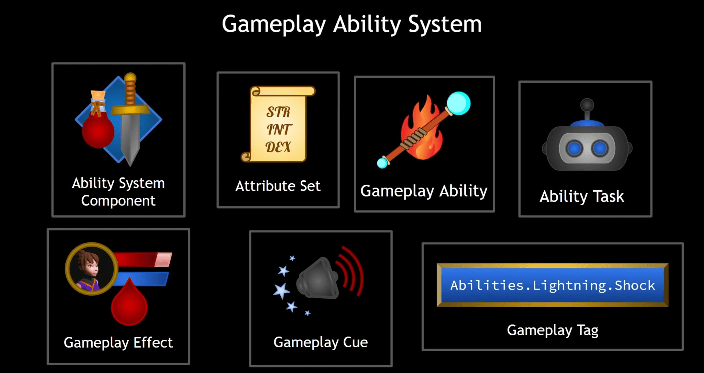

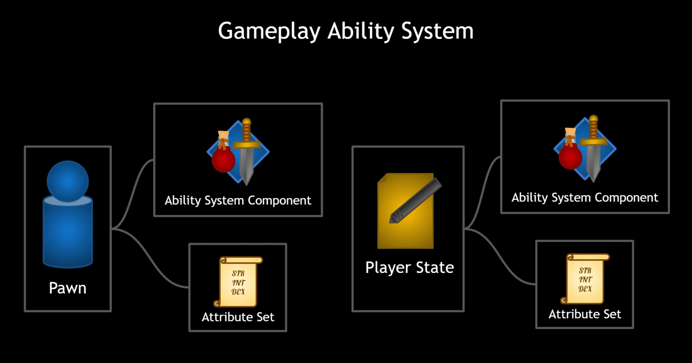

为了将 GAS 纳入我们的项目，我们首先需要一个能力系统组件 (Ability System Component) 和一个属性集 (Attribute Set)

> 添加 Ability System Component 的方式可能有所不同， ***可以将 Ability System Component 和 Attribute Set 挂在 Pawn 或者 PlayerState 上。***

1. 如果是敌人 AI，这些敌人不需要 PlayerState，因为它们很简单，可以选择添加在 Pawn 上，直接在 Pawn 上挂载 Ability System Component 和 Attribute Set 可能更合适这种场景；

>

2. 如果是玩家，考虑到 Pawn 会销毁重生，如果你没有在 SaveGame 或者某些数据库中保存这些数据，那么当 Pawn 销毁时，这些数据也会销毁，那么添加在 PlayerState 上是一个好的选择，还有一些原因，比如你不想让你的玩家类变得混乱，或者你不想只作用于特定的某一个角色 (比如你想换角色)，想更通用一点；

<br>

***在这个项目中，我们的敌人角色 (Enemy Character) 将直接拥有他们的能力系统组件和属性集，但是对于我们的玩家控制的角色，我们将把我们的能力系统组件和属性集 挂在 PlayerState 上；***

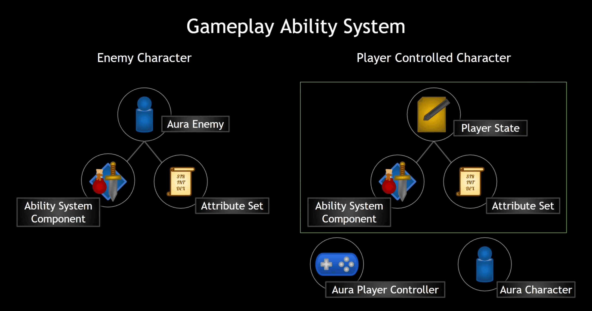

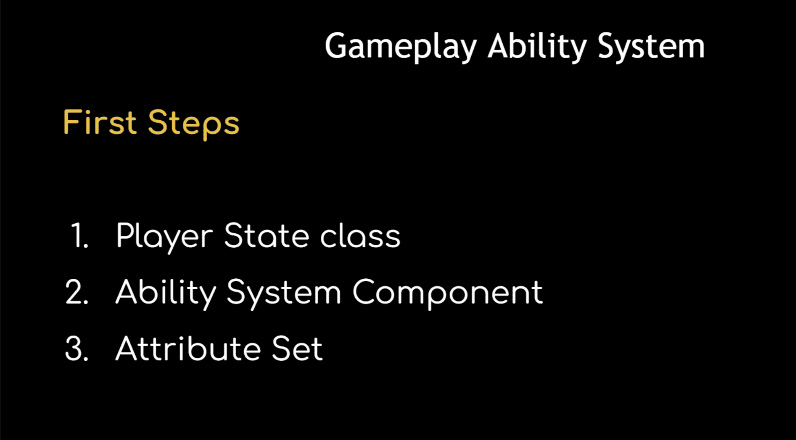

## 启用 GAS 插件

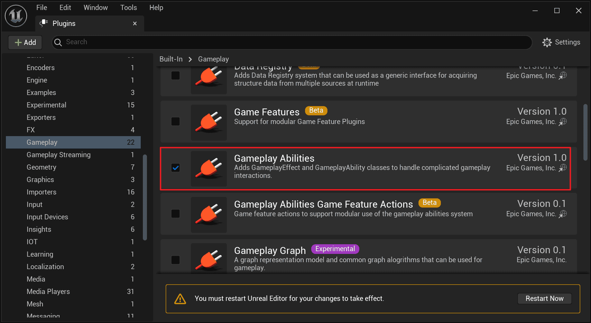

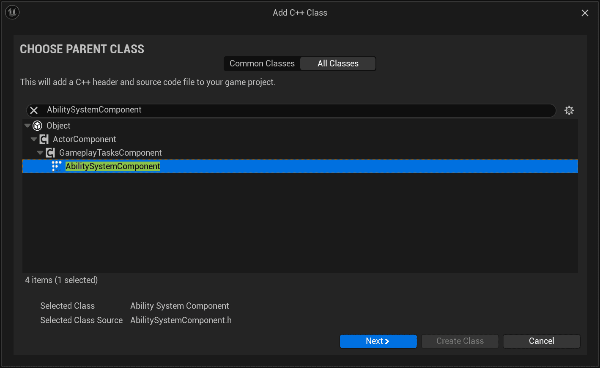

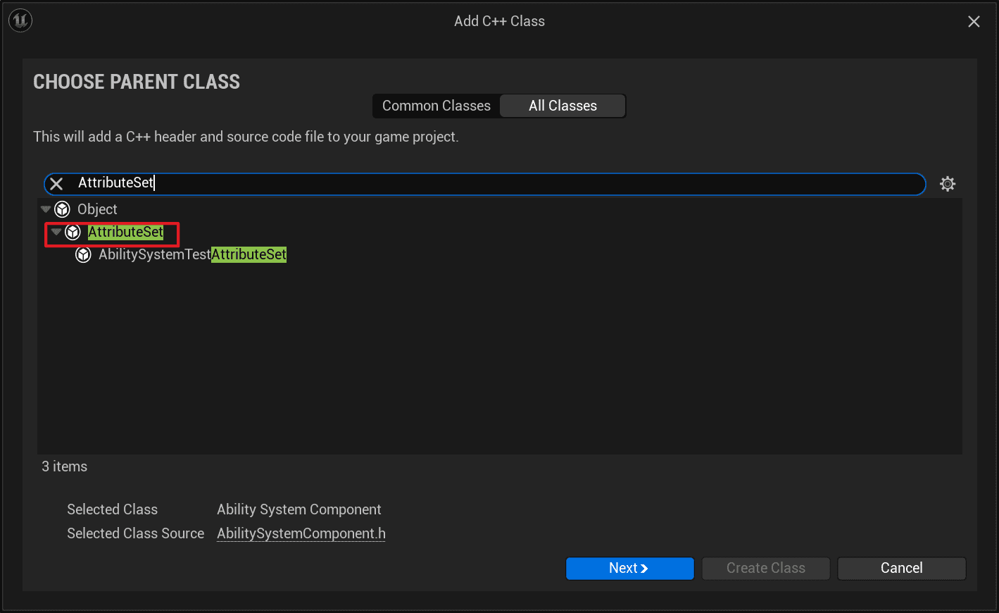

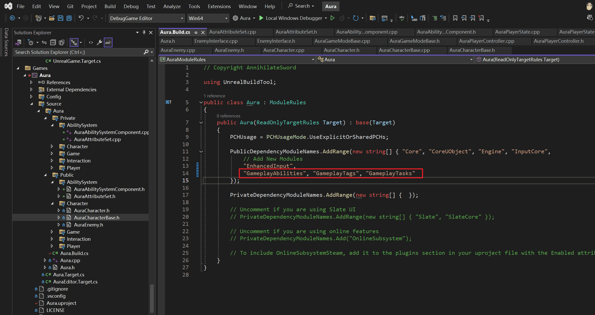

## GAS In Multiplayer

> 游戏逻辑会发生在专用服务器上，只是并没有渲染到屏幕上。

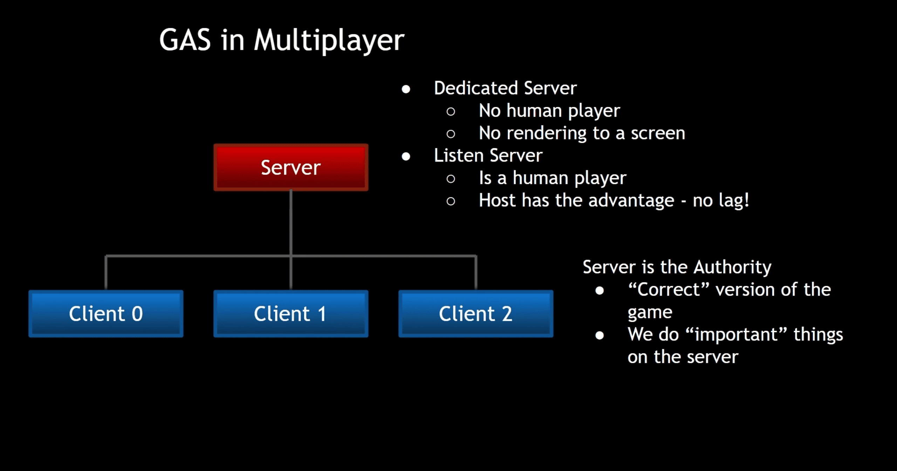

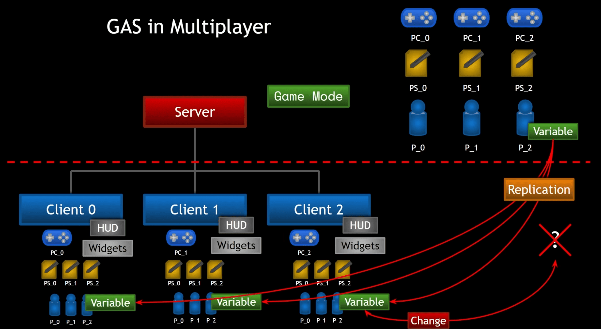

> - 像 GameMode 负责游戏规则，玩家生成，重新开始等事情，这些重要事情应该只在服务器上处理。服务器拥有每个玩家控制器 (PC) 的权威服务器版本，并且每个客户端都有自己的本地 PC 版本。注意每个客户端只有他自己的 PlayerController 而没有其他玩家的。只有服务器才能拥有游戏中的所有玩家控制器并可以访问他们。

<br>

> - 特殊的：PlayerState 对于每个玩家来说，他们都存在于服务器上，但他们也都存在于每个客户端上。一个客户端不仅拥有自己的 PlayerState 也拥有其他客户端的 PlayerState，如果这看起来令人困惑，可以把 PS 想象成 Pawn，客户端拥有所有的 Pawn，这是有道理的，你在玩游戏时，你必须能够看到你的 Pawn 和其他玩家的 Pawn，当然这些都是服务器上的副本，这才有意义。

<br>

## 构造能力系统组件和属性集

1. **在 PlayerState 构造函数中设置，服务器尝试更新客户端的频率（每秒更新多少次），如果我们要在玩家状态身上设置技能系统组件和属性集，可以将这个值设置得更快一些，比如可以设置 100.0f 左右，目前我看默认值是 1.0f ：**
   ```cpp
   // 这意味着每秒更新 100 次
   NetUpdateFrequency = 100.0f;
   ```
   > 事实上，在 Lyra 和像 Fortnite 这样的游戏中，它们也将挂载了技能系统组件和属性集的 PlayerState 中的 NetUpdateFrequency 设置为更高的值。

>

2. 使用 GAS 还必须要继承接口 ***IAbilitySystemInterface***：
   > 官方文档：要设置你的 AActor 子类以使用 Gameplay 技能系统，请实现 IAbilitySystemInterface 接口并覆盖 GetAbilitySystemComponent 函数。此函数必须返回与你的 Actor 关联的 技能系统组件（Ability System Component）。
   ```cpp
   class AURA_API AAuraPlayerState : public APlayerState, public IAbilitySystemInterface
   {
   protected:
        // 玩家会在 PlayerState 中构造 GAS 相关信息
        UPROPERTY()
        TObjectPtr<UAbilitySystemComponent> m_AbilitySystemComponent;

        UPROPERTY()
        TObjectPtr<UAttributeSet> m_AttributeSet;
   }
   ```
   这个接口非常有用，它允许我们简单地检查 Actor 是否继承了该接口，使用 GetAbilitySystemComponent() 轻松的从中获取 AbilitySystemComponent
   ***继承这个接口只是使用这个框架需要实现的要求之一。***

<br>

## 【设置复制模式】 (Replication Mode)

1. **为 AbilitySystemComponent 设置复制模式：**
   
   ```cpp
   // Example
   UAbilitySystemComponent::SetReplicationMode(EGameplayEffectReplicationMode::Mixed);
   ```

   这张表的 Use Case 是经验法则可以参考，我们可以遵循这些：
   
   > ***我们将为玩家控制的角色的 PlayerState 设置能力系统组件的复制模式为 Mixed 模式，将敌人的能力系统组件的复制模式设置为 Minimal 模式，因为它是一个 AI***
   > 原因是如果 AI 数量一多，那么网络同步的压力是很大的。

<br>

## 调用 InitAbilityActorInfo 的时机【重要】

回顾一下，我们在玩家所控制的角色的 PlayerState 的构造函数中初始化了 AbilitySystemComponent 和 AttributeSet，敌人AI 是在 AuraEnemy 类构造函数中构造的。

> 这里引出几个问题：
> 1. 玩家所控制的角色类中的 m_AbilitySystemComponent 指针是空的，并没有被赋值。
> 2. 我们想要确保能力系统组件本身知道它的所有者是谁。
>       - 对于敌人AI，AbilitySystemComponent 的所有者显然就是这个敌人类
>       - 但是对于玩家角色来说，情况却不一定如此。因为实际上是 PlayerState 构造了 AbilitySystemComponent (ASC)
>       - ASC 有了 `Ability Actor Info` 这个概念，这样 ASC 就知道参与者信息，例如谁拥有该能力系统组件 (所有者)
>       - 考虑到会有 ASC 挂在玩家角色的 PlayerState 上，而不是操作的 Character 身上，所以 Ability System Component 有了两个变量：**Owner Actor** 和 **Avatar Actor**。***Owner Actor 是实际拥有 ASC 的任何类，Avatar Actor 是与该能力系统组件相关的世界中的代表。***

对于敌人类，Owner Actor 和 Avatar Actor 都是敌人类，对于玩家角色来说，Owner Actor 是 PlayerState，Avatar Actor 是玩家角色 AuraCharacter (即在世界中看到的角色)

1. **初始化 ASC 的 Owner Actor 和 Avator Actor：**
   
   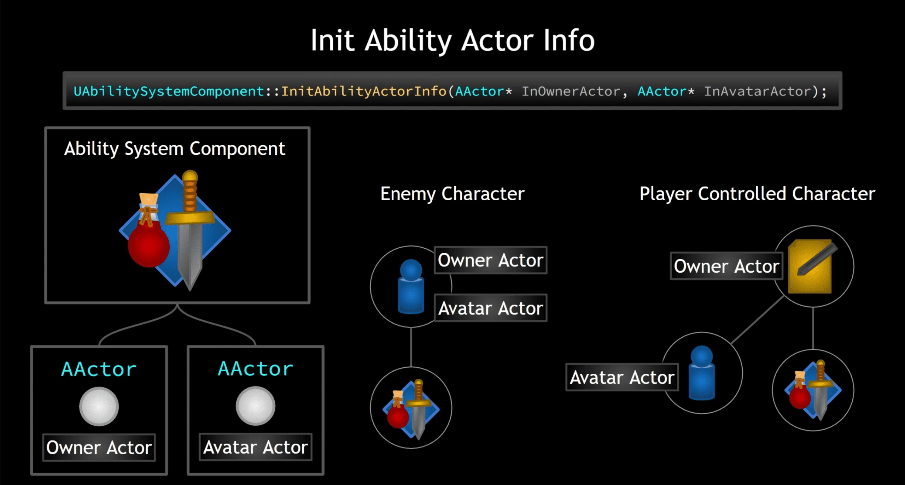

   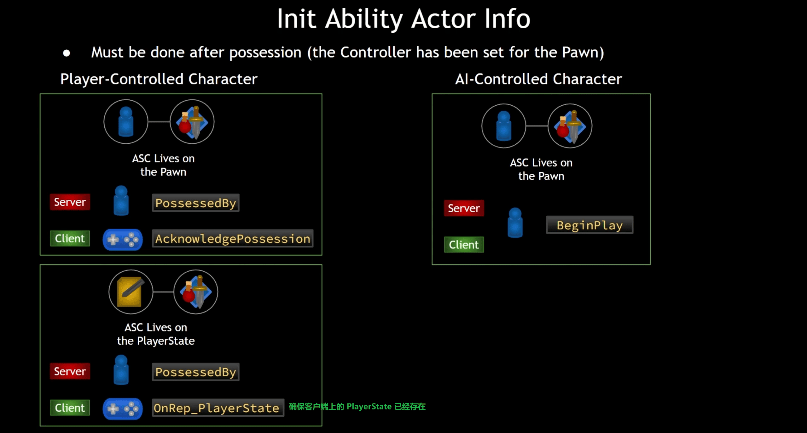

   AbilitySystemComponent 提供了一个接口 **InitAbilityActorInfo** 去帮助我们初始化 ActorInfo。***那么该接口的调用时机是什么时候？ (上图也表示很清楚)***
   > **对于玩家控制的角色：**
   现在这里有一些经验法则以及在多人游戏中这样做的好地方，我们首先需要知道的是，调用 InitAbilityActorInfo 必须在 Possession 之后进行，换句话说，必须要在为 Pawn 设置 PlayerController 之后执行这个操作。(控制器已设置并且我们的玩家状态有效且可访问，这时我们可以调用此函数)
   > - 如果我们的 ASC 挂在 PlayerState 上，那么在服务端调用 **InitAbilityActorInfo** 的时机是在 **ACharacter::PossessedBy** 函数中，在客户端是在 **APawn::OnRep_PlayerState** 函数中，因为一旦为我们的 Pawn 设置了该玩家状态，该 PlayerState 就会被复制。所以在这里是很合适的。
   > - 如果 ASC 直接挂在 Pawn 上，那么服务端也是在 **ACharacter::PossessedBy** 函数中，客户端是在 **AcknowledgePossession** 函数中。

   > **对于 AI：**
   > - 现在对于AI控制的角色来说就更简单了，我们只需要在 BeginPlay() 时调用 UAbilitySystemComponent::InitAbilityActorInfo 即可。

   示例：
    ```cpp
    UCLASS()
    class AURA_API AAuraCharacter : public AAuraCharacterBase
    {
        GENERATED_BODY()

    public:
        AAuraCharacter();

    protected:
        virtual void PossessedBy(AController* NewController) override;
        virtual void OnRep_PlayerState() override;

    private:
        // 初始化 Ability Actor Info.
        void InitAbilityActorInfo();
        
    private:
        UPROPERTY(VisibleDefaultsOnly, Category = "Camera")
        TObjectPtr<USpringArmComponent> m_SpringArm;

        UPROPERTY(VisibleDefaultsOnly, Category = "Camera")
        TObjectPtr<UCameraComponent> m_MainCamera;
    };
    ```

    ```cpp
    void AAuraCharacter::PossessedBy(AController* NewController)
    {
        Super::PossessedBy(NewController);

        // Init Ability Actor Info for [Server].
        InitAbilityActorInfo();
    }

    void AAuraCharacter::OnRep_PlayerState()
    {
        Super::OnRep_PlayerState();

        // Init Ability Actor Info for [Client].
        InitAbilityActorInfo();
    }

    void AAuraCharacter::InitAbilityActorInfo()
    {
        AAuraPlayerState* AuraPlayerState = GetPlayerState<AAuraPlayerState>();
        check(AuraPlayerState);
        check(AuraPlayerState->GetAbilitySystemComponent());
        check(AuraPlayerState->GetAttributeSet());
        AuraPlayerState->GetAbilitySystemComponent()->InitAbilityActorInfo(AuraPlayerState, this);
        m_AbilitySystemComponent = AuraPlayerState->GetAbilitySystemComponent();
        m_AttributeSet = AuraPlayerState->GetAttributeSet();
    }
    ```

>

2. ***对于混合复制（Mixed）模式：OwnerActor 的 Owner 必须是 Controller。对于 pawn，这是在 Posssedby() 中自动设置的；***
    ```cpp
    void APawn::PossessedBy(AController* NewController)
    {
        SetOwner(NewController);
        ...
    }
    ```
   ***PlayerState 的所有者被自动设置为 Controller；
   因此，如果你的 OwnerActor 不是 PlayerState，并且你使用混合复制模式，你必须在 OwnerActor 上调用 SetOwner() 来将其所有者设置为 Controller；***
   
   > 默认情况下。PlayerState 的所有者会自动设置为 Controller，因此我们实际上不需要执行任何操作。

<br>

> 小Tip：复制是服务器向客户端的单向复制，如果一个变量设置为复制，那么它不应该在客户端上有任何更改，因为服务器不会知道该更改，可能无法进行校验，请注意服务器是正确的版本。

<br>
<br>

# 第3节：属性 (Atrributes)

1. 在构造函数中，当我们在 AbilitySystemComponent 旁边构建 AttributeSet 时，它会自动注册到 AbilitySystemComponent 中。(这块要深入了解得看看源码)  **AbilitySystemComponent 可以访问它以及注册的任何其他 AttributeSet；**
   > 官方文档：https://dev.epicgames.com/documentation/en-us/unreal-engine/gameplay-attributes-and-attribute-sets-for-the-gameplay-ability-system-in-unreal-engine
   将属性集注册到相应的能力系统组件中。这会在实例化属性集时自动发生，你可以在 Actor 的构造函数中实例化属性集，或者在 BeginPlay 期间进行，只要 Actor 的 GetAbilitySystemComponent 函数在实例化时返回有效的能力系统组件即可。你还可以编辑 Actor 的蓝图，并将属性集类型添加到能力系统组件的默认起始数据中。第三种方法是指导能力系统组件实例化属性集，然后它会自动注册，如下例所示：
    ```cpp
    // Get the appropriate Ability System Component. It could be on another Actor, so use GetAbilitySystemComponent and check that the result is valid.
    AbilitySystemComponent* ASC = GetAbilitySystemComponent();
    // Make sure the AbilitySystemComponent is valid. If failure is unacceptable, replace this if() conditional with a check() statement.
    if (IsValid(ASC))
    {
        // Get the UMyAttributeSet from our Ability System Component. The Ability System Component will create and register one if needed.
        AttributeSet = ASC->GetSet<UMyAttributeSet>();
    
        // We now have a pointer to the new UMyAttributeSet that we can use later. If it has an initialization function, this is a good place to call it.
    }
    ```
    > *能力系统组件 (ASC) 可以拥有多个属性集，但每个属性集必须与其他所有属性集的类不同。否则，尝试从 AbilitySystemComponent 检索时会有歧义；*
   
   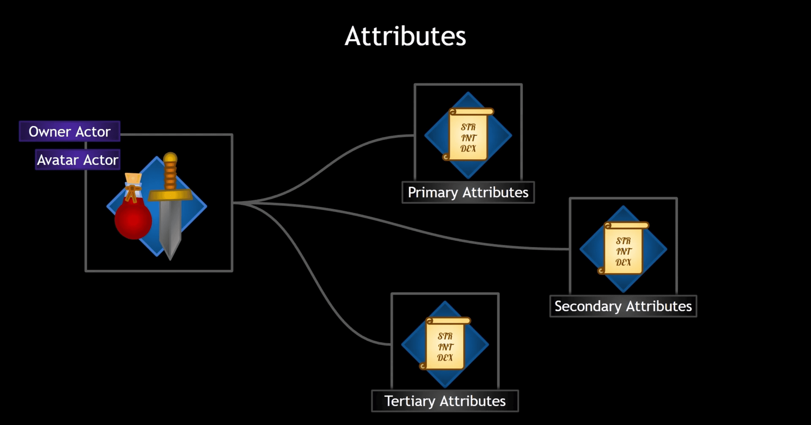

   > 将所有属性包含在同一属性上是完全可以接受的（在这个项目中就是这样）

   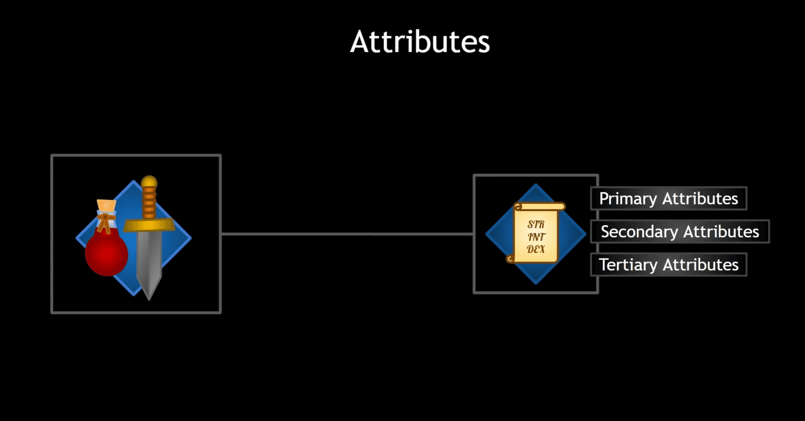

>

2. **属性是与游戏中给定实体（例如角色）相关的数值，所有属性 (Attribute) 都是 *浮点数***，他们存在于称为 ***FGameplayAttributeData*** 的结构体中（包含两个 float 值，官方建议使用），**属性 (Attribute) 存储在属性集 (Attribute Set) 上**，属性集对其进行密切监督；我们可以知道属性何时发生变化，并使用我们喜欢的任何功能来影响它；
   > *可以直接在代码中设置属性值，但更改它的首选方法是应用 **游戏效果 (Gameplay Effects)**；*

   **使用它的另一个原因是 Gameplay Effects 还帮我们做了预测，这可以让我们的多人游戏体验更加流畅：**

   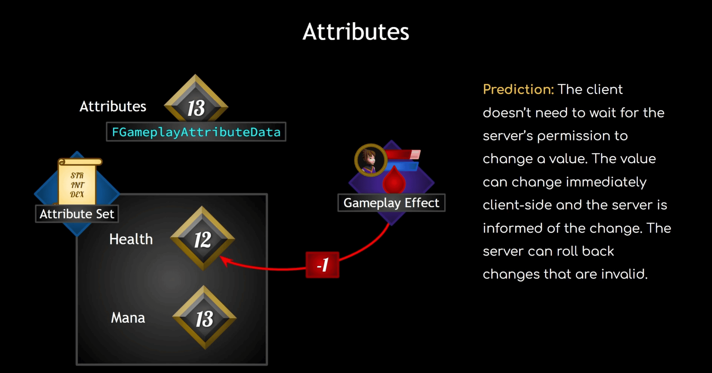

    > 预测意味着客户端不需要等待服务器的许可来更改值。然后，服务器可以回滚任何它认为无效的更改。这是一个巨大的好处，因为预测可能需要大量额外的工作来自己编程。而 Gameplay Effect 帮我们做了许多。
    > 这是当它存在时你不会注意到的事情之一，但当它不存在时你会注意到。

>

3. 通过 **GAS 预测**，Gameplay Effects 会修改客户端的属性，并且在客户端上可以立即感知到该变化，无滞后时间；
   然后，该更改将发送到服务器，服务器仍然负责验证该更改。如果服务器认为这是有效的更改，那就没问题了。它可以将更改通知其他客户端。但是，如果服务器确定更改无效，假设客户端破解了游戏，例如，尝试造成不合常理的损害，那么服务器可以拒绝该更改并回滚到正确的值。所以服务器仍然有权限，但是我们的客户端不必有延迟。预测很复杂，将其作为整个 GAS 的内置功能是一个巨大的好处。让我们专注于创建游戏机制，而不用担心实施滞后补偿。

   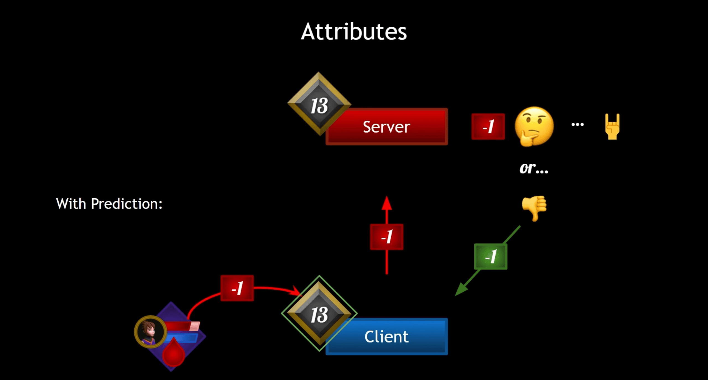

>

4. **属性 (FGameplayAttributeData) 实际上由两个值组成：<font color=red>基值（Base Value）</font> 和 <font color=red>当前值（Current Value）</font>，基值是属性的永久值。当前值是基础值加上游戏效果（Gameplay Effects）造成的任何临时的修改。**
   
   
   > 临时值，比如像 buffs 和 debuffs
   > 永久值，比如像泰拉瑞亚中吃了生命果实永久增加了生命值的最大上限

>

5. 在多人游戏中，我们会将属性设置为 Replicated (不过也有一些例外情况)，我们也知道，游戏效果会自动帮我们做预测的工作；
   **对于属性，我们需要使用代表通知（RepNotify），请记住，当变量被复制时，RepNotify 会自动被调用，因此当服务器复制时，将变量发送给客户端，客户端会触发该变量的 RepNotify（注意 RepNotify 必须用 UFUNCTION 修饰）**；

   > 【重要】 *复制通知可以接受 0个 或者 1个 参数，如果它们接受一个参数（只能是对应的复制变量，可以是 const 和 &），当被调用时会传入对应复制变量的旧值（这对于比较新旧值很有用）*

   > 下面是添加属性的示例模板代码：(GAS 项目基本上需要做这些操作)
    ```cpp
    UCLASS()
    class AURA_API UAuraAttributeSet : public UAttributeSet
    {
        GENERATED_BODY()
        
    public:
        UAuraAttributeSet();

    protected:
        virtual void GetLifetimeReplicatedProps(TArray<FLifetimeProperty>& OutLifetimeProps) const override;

    public:
        UPROPERTY(BlueprintReadOnly, ReplicatedUsing = OnRep_Health, Category = "Vital Attributes")
        FGameplayAttributeData m_Health;

        UPROPERTY(BlueprintReadOnly, ReplicatedUsing = OnRep_MaxHealth, Category = "Vital Attributes")
        FGameplayAttributeData m_MaxHealth;

        UPROPERTY(BlueprintReadOnly, ReplicatedUsing = OnRep_Mana, Category = "Vital Attributes")
        FGameplayAttributeData m_Mana;

        UPROPERTY(BlueprintReadOnly, ReplicatedUsing = OnRep_MaxMana, Category = "Vital Attributes")
        FGameplayAttributeData m_MaxMana;

        UFUNCTION()
        void OnRep_Health(const FGameplayAttributeData& OldHealth) const;

        UFUNCTION()
        void OnRep_MaxHealth(const FGameplayAttributeData& OldMaxHealth) const;

        UFUNCTION()
        void OnRep_Mana(const FGameplayAttributeData& OldMana) const;

        UFUNCTION()
        void OnRep_MaxMana(const FGameplayAttributeData& OldMaxMana) const;
    };
    ```

    > GAMEPLAYATTRIBUTE_REPNOTIFY(ClassName, PropertyName, OldValue)

    ```cpp
    #include "AbilitySystemComponent.h"
    #include "Net/UnrealNetwork.h"

    UAuraAttributeSet::UAuraAttributeSet()
    {
    }

    void UAuraAttributeSet::GetLifetimeReplicatedProps(TArray<FLifetimeProperty>& OutLifetimeProps) const
    {
        Super::GetLifetimeReplicatedProps(OutLifetimeProps);

        /**
        * 对于 DOREPLIFETIME_CONDITION_NOTIFY 来说 REPNOTIFY_OnChanged 条件默认启用，是当变量值改变时才复制
        * 对于 GAS，我们无论如何都想复制它，因为如果我们设置它，我们可能想要响应设置它的行为。
        * 无论我们将其设置为新值还是其自身的相同值，您都可能想要响应，即使它的数值没有改变。
        * 因此这里我们使用 REPNOTIFY_Always
        */
        DOREPLIFETIME_CONDITION_NOTIFY(UAuraAttributeSet, m_Health, COND_None, REPNOTIFY_Always);
        DOREPLIFETIME_CONDITION_NOTIFY(UAuraAttributeSet, m_MaxHealth, COND_None, REPNOTIFY_Always);
        DOREPLIFETIME_CONDITION_NOTIFY(UAuraAttributeSet, m_Mana, COND_None, REPNOTIFY_Always);
        DOREPLIFETIME_CONDITION_NOTIFY(UAuraAttributeSet, m_MaxMana, COND_None, REPNOTIFY_Always);
    }

    void UAuraAttributeSet::OnRep_Health(const FGameplayAttributeData& OldHealth) const
    {
        // 负责通知 AbilitySystemComponent (ASC) 属性被复制了，ASC 注册这个更改，并跟踪旧值，以防万一需要回滚任何内容
        // 请记住，在预测的情况下，如果服务器认为发生变化，则可以回滚更改并撤消它们
        // @see https://dev.epicgames.com/documentation/en-us/unreal-engine/gameplay-attributes-and-attribute-sets-for-the-gameplay-ability-system-in-unreal-engine#replication
        GAMEPLAYATTRIBUTE_REPNOTIFY(UAuraAttributeSet, m_Health, OldHealth);
    }

    void UAuraAttributeSet::OnRep_MaxHealth(const FGameplayAttributeData& OldMaxHealth) const
    {
        GAMEPLAYATTRIBUTE_REPNOTIFY(UAuraAttributeSet, m_MaxHealth, OldMaxHealth);
    }

    void UAuraAttributeSet::OnRep_Mana(const FGameplayAttributeData& OldMana) const
    {
        GAMEPLAYATTRIBUTE_REPNOTIFY(UAuraAttributeSet, m_Mana, OldMana);
    }

    void UAuraAttributeSet::OnRep_MaxMana(const FGameplayAttributeData& OldMaxMana) const
    {
        GAMEPLAYATTRIBUTE_REPNOTIFY(UAuraAttributeSet, m_MaxMana, OldMaxMana);
    }
    ```

>

6. **设置一些访问器函数 ( getter / setter ) 来检索和设置我们属性集中的属性，即使我们通常不从代码中设置它们（一般直接使用 Gameplay Effects），但可以了解一下如何使用，我们可以使用引擎内置的宏，也可以自己创建：**
   <br>
   > 官方文档：https://dev.epicgames.com/documentation/en-us/unreal-engine/gameplay-attributes-and-attribute-sets-for-the-gameplay-ability-system-in-unreal-engine
    
    ```cpp
    // -- AttributeSet.h

    /**
     * This defines a set of helper functions for accessing and  initializing attributes, to avoid having to manually write  these functions.
     * It would creates the following functions, for attribute  Health
     *
     *	static FGameplayAttribute UMyHealthSet::GetHealthAttribute ();
     *	FORCEINLINE float UMyHealthSet::GetHealth() const;
     *	FORCEINLINE void UMyHealthSet::SetHealth(float NewVal);
     *	FORCEINLINE void UMyHealthSet::InitHealth(float NewVal);
     *
     * To use this in your game you can define something like  this, and then add game-specific functions as necessary:
     * 
     *	#define ATTRIBUTE_ACCESSORS(ClassName, PropertyName) \
     *	GAMEPLAYATTRIBUTE_PROPERTY_GETTER(ClassName,  PropertyName) \
     *	GAMEPLAYATTRIBUTE_VALUE_GETTER(PropertyName) \
     *	GAMEPLAYATTRIBUTE_VALUE_SETTER(PropertyName) \
     *	GAMEPLAYATTRIBUTE_VALUE_INITTER(PropertyName)
     * 
     *	ATTRIBUTE_ACCESSORS(UMyHealthSet, Health)
     */
    ```

    不必理解宏是怎么做到的，这就是宏创造的魔法（有能力了后面再看懂也没事，现在看注释知道如何使用即可）

    可以在你的属性集中定义下面的宏，它帮我们创建了很多有用的访问器函数：
    ```cpp
    #define ATTRIBUTE_ACCESSORS(ClassName, PropertyName) \
        GAMEPLAYATTRIBUTE_PROPERTY_GETTER(ClassName, PropertyName) \
        GAMEPLAYATTRIBUTE_VALUE_GETTER(PropertyName) \
        GAMEPLAYATTRIBUTE_VALUE_SETTER(PropertyName) \
        GAMEPLAYATTRIBUTE_VALUE_INITTER(PropertyName)
    ```
    
    > 这会为我们定义很多有用的构造器函数，然后值得了解的是这里 Set 和 Init 的区别

    **不过我们一般不使用这些函数来更改属性，我们可以，但我们通常更喜欢使用游戏效果（Gameplay Effects），因为这些效果是可以预测的。**

    <br>

    *更新后的代码：*
    ```cpp
    //~ AuraAttributeSet.h

    #include "CoreMinimal.h"
    #include "AbilitySystemComponent.h"
    #include "AttributeSet.h"
    #include "AuraAttributeSet.generated.h"

    #define ATTRIBUTE_ACCESSORS(ClassName, PropertyName) \
        GAMEPLAYATTRIBUTE_PROPERTY_GETTER(ClassName, PropertyName) \
        GAMEPLAYATTRIBUTE_VALUE_GETTER(PropertyName) \
        GAMEPLAYATTRIBUTE_VALUE_SETTER(PropertyName) \
        GAMEPLAYATTRIBUTE_VALUE_INITTER(PropertyName)

    /**
    * 
    */
    UCLASS()
    class AURA_API UAuraAttributeSet : public UAttributeSet
    {
        GENERATED_BODY()
        
    public:
        UAuraAttributeSet();

    protected:
        virtual void GetLifetimeReplicatedProps(TArray<FLifetimeProperty>& OutLifetimeProps) const override;

    public:
        UPROPERTY(BlueprintReadOnly, ReplicatedUsing = OnRep_Health, Category = "Vital Attributes")
        FGameplayAttributeData m_Health;
        ATTRIBUTE_ACCESSORS(UAuraAttributeSet, m_Health);

        UPROPERTY(BlueprintReadOnly, ReplicatedUsing = OnRep_MaxHealth, Category = "Vital Attributes")
        FGameplayAttributeData m_MaxHealth;
        ATTRIBUTE_ACCESSORS(UAuraAttributeSet, m_MaxHealth);

        UPROPERTY(BlueprintReadOnly, ReplicatedUsing = OnRep_Mana, Category = "Vital Attributes")
        FGameplayAttributeData m_Mana;
        ATTRIBUTE_ACCESSORS(UAuraAttributeSet, m_Mana);

        UPROPERTY(BlueprintReadOnly, ReplicatedUsing = OnRep_MaxMana, Category = "Vital Attributes")
        FGameplayAttributeData m_MaxMana;
        ATTRIBUTE_ACCESSORS(UAuraAttributeSet, m_MaxMana);

        UFUNCTION()
        void OnRep_Health(const FGameplayAttributeData& OldHealth) const;

        UFUNCTION()
        void OnRep_MaxHealth(const FGameplayAttributeData& OldMaxHealth) const;

        UFUNCTION()
        void OnRep_Mana(const FGameplayAttributeData& OldMana) const;

        UFUNCTION()
        void OnRep_MaxMana(const FGameplayAttributeData& OldMaxMana) const;
    };
    ```

    ```cpp
    UAuraAttributeSet::UAuraAttributeSet()
    {
        Initm_Health(200.0f);
        Initm_MaxHealth(200.0f);
        Initm_Mana(100.0f);
        Initm_MaxMana(100.0f);
    }
    ```

>

7. 在游戏运行中，用波浪键打开控制台，输入 `showdebug abilitysystem` 可以打开 **ability system 【调试】（这个已经弃用了，后面会用 Gameplay Debugger）**；
   > 它显示 Avatar，Owner，OwnedTags ... 很多有用的调制信息，可以按 PageUp 和 PageDown 来切换目标
   
   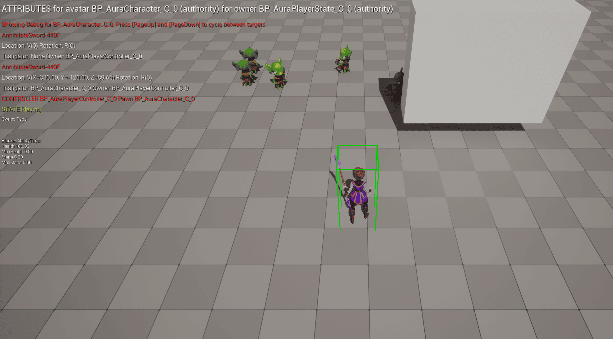

>

8. 我们经常希望世界中某种可拾取的物品以某种方式来影响我们的属性，
   我们现在还没有学习 Gameplay Effects，所以我们会创建一个通用的 EffectActor ( *了解* ) 。直接更改属性，我们将看到 **局限性（我们需要从能力系统组件获取属性集并转换成我们想要的类型，而且这种方式得到的结果是 const 类型的属性集，这也是 GAS 为了保护所作的事，我们不应该像这样在属性集上设置属性，属性集应该设置自己的默认值，或在游戏效果中响应**）；
   > 会了解到这是一种非常有限的方法，它在很多方面限制了我们。我们没有太多的自由和灵活性。
   *一旦我们使用 Gameplay Effects，如果我们想改变某个属性的某个值，我们就不必关心属性集的类型是什么。*

    ```cpp
    void AAuraEffectActor::OnBeginOverlap(UPrimitiveComponent* OverlappedComponent, AActor* OtherActor, UPrimitiveComponent* OtherComp, int32 OtherBodyIndex, bool bFromSweep, const FHitResult& SweepResult)
    {
        //TODO：将此更改为应用Gameplay Effect。现在，使用 const_cast 作为 hack！
        if (IAbilitySystemInterface* ASInterface = Cast<IAbilitySystemInterface>(OtherActor))
        {
            if (UAbilitySystemComponent* AbilitySystemComponent = ASInterface->GetAbilitySystemComponent())
            {
                // GetAttributeSet 返回值是 const xxx *
                const UAuraAttributeSet* AuraAttributeSet = Cast<UAuraAttributeSet>(AbilitySystemComponent->GetAttributeSet(UAuraAttributeSet::StaticClass()));
                if (AuraAttributeSet)
                {
                    // 我们稍微打破规则
                    UAuraAttributeSet* MutableAuraAttributeSet = const_cast<UAuraAttributeSet*>(AuraAttributeSet);
                    MutableAuraAttributeSet->Setm_Health(AuraAttributeSet->Getm_Health() + 25.0f);
                    Destroy();
                }
            }
        }
    }
    ```

    > 最大的问题是我们的 AuraEffectActor 非常非常具体。它将健康值改变 25。像 EffectActor 这样的东西应该能够以多种方式将任何效果应用于任何属性。它应该是通用的和可重用的，并且不应该违反任何指针的常量性。

<br>
<br>

# 第4节：RPG Game UI

> widget 对象应该如何获取这些数据呢？小部件 (Widget) 对象可以通过多种方式设法深入游戏代码，检索对角色控制器 (PC)、玩家状态 (PS)、能力系统组件 (ASC) 的指针和引用，属性集 (Attribute Set) 并直接访问所需的所有数据，因为 UI 需要显示的数据可能在不同的类，但这是最好的方法吗？
> **经验丰富的开发人员会如何做呢？3A游戏是如何做到的？如何以可扩展和可维护的方式做到这一点？**

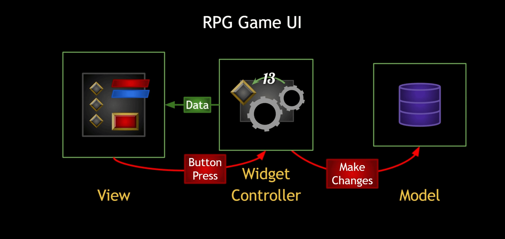

从模型获取数据到视图是我们需要考虑的任务。这可以通过多种方式完成，***但组织此操作的一个好方法是构建某个控制器类 ( Widget Controller )，它可以处理从模型检索数据并将其广播到视图。*** 该类不仅可以负责数据的检索，还可以负责任何计算或算法；

现在我们不是在讨论引擎中的控制器或玩家控制器类。这些旨在占有和控制棋子。我们讨论的是一个控制器类，**用于将数据驱动到视图**。因此，出于这个原因，我们将其称为小部件控制器（Widget Controller），**它可能只是继承自 UObject**；

**这意味着视图可以简单地关注数据应该如何接收来自任何广播的数据；** 但视图可能包含玩家可以与之交互的小部件，例如按钮。当玩家单击按钮时，该操作可能会导致模型发生一些变化，例如增加或赋予玩家新的能力。因此，控制器的工作也能促进小部件与玩家交互所产生的操作，导致模型发生变化。换句话说，**控制器是视图和模型之间的中间人**；

> 因此模型可以通过模型视图控制器 ***（ MVC ）*** 架构进行更改，我们有三个单独的关注点，并且每个域都与其他域隔离。**这使得系统高度模块化。它可以防止我们对依赖项进行硬编码，从而使系统变得僵化。我们的模型不应该需要关心使用哪些控制器或小部件来表示他们的数据。**

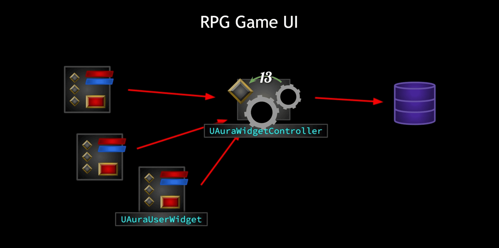

- 控制器本身依赖于模型中的类；
- 控制器永远不需要知道哪些小部件正在接收向它们广播的数据；
- 模型依赖于控制器的小部件。如果我们维护这些单向依赖关系，那么模型就可以更改其小部件控制器；

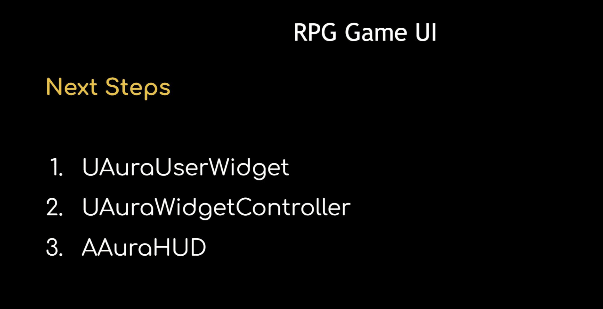

我们需要定义我们自己的 UserWidget 基类。该基类 Widget 中会包含 WidgetController

> *HUD是我们用来处理小部件的类。小部件是我们以某种方式添加到视窗中的实际UI元素。*

<br>

## 简单示例

Widget 中会包含 WidgetController，当小部件控制器广播数据时，我们的小部件将接收该数据并对其做出响应。因此，我们的依赖项将是从用户小部件到小部件控制器的一种方式。

***WidgetController 不会知道它与哪些 Widget 相关联，但 Widget 本身知道它们的 WidgetController 是什么；WidgetController 会获取数据然后广播到 Widget；***

```cpp
// AuraUserWidget.h
// ----------------
UCLASS()
class AURA_API UAuraUserWidget : public UUserWidget
{
	GENERATED_BODY()
	
public:
	UFUNCTION(BlueprintCallable)
	void SetWidgetController(UObject* InWidgetController);

protected:
	/** 每当我们为给定的 Widget 设置 WidgetController 时，我们也会调用此函数 */
	UFUNCTION(BlueprintImplementableEvent)
	void WidgetControllerSet();

public:
    // 这里使用的时候转换成具体的 WidgetController 类
	UPROPERTY(BlueprintReadOnly)
	TObjectPtr<UObject> m_WidgetController;
};

// AuraUserWidget.cpp
// ------------------
void UAuraUserWidget::SetWidgetController(UObject* InWidgetController)
{
	m_WidgetController = InWidgetController;
	WidgetControllerSet();
}
```

```cpp
// AuraWidgetController.h
// ----------------------
class UAbilitySystemComponent;
class UAttributeSet;

// 这里注意添加 Blueprintable, BlueprintType
UCLASS(Blueprintable, BlueprintType)
class AURA_API UAuraWidgetController : public UObject
{
	GENERATED_BODY()
	
protected:
    /** WidgetContoller 从下面这4个关键变量中获取数据 */
	//~ Begin Model Data.
	UPROPERTY(BlueprintReadOnly, Category = "WidgetController")
	TObjectPtr<APlayerController> m_PlayerController;

	UPROPERTY(BlueprintReadOnly, Category = "WidgetController")
	TObjectPtr<APlayerState> m_PlayerState;

	UPROPERTY(BlueprintReadOnly, Category = "WidgetController")
	TObjectPtr<UAbilitySystemComponent> m_AbilitySystemComponent;

	UPROPERTY(BlueprintReadOnly, Category = "WidgetController")
	TObjectPtr<UAttributeSet> m_AttributeSet;
	//~ End Model Data.
};
```

<br>

## Remarks

1. 在 `Event Pre Construct` 中设置一些变量，可以立即在 Designer 中 Preview：
    > 例如设置 Size Box 大小

    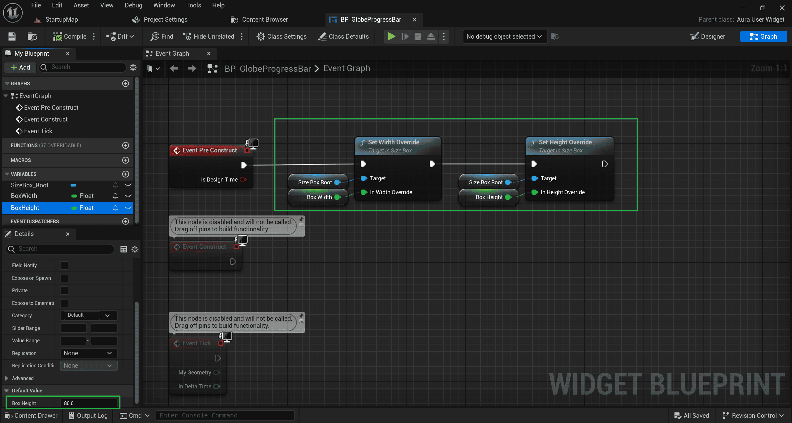

    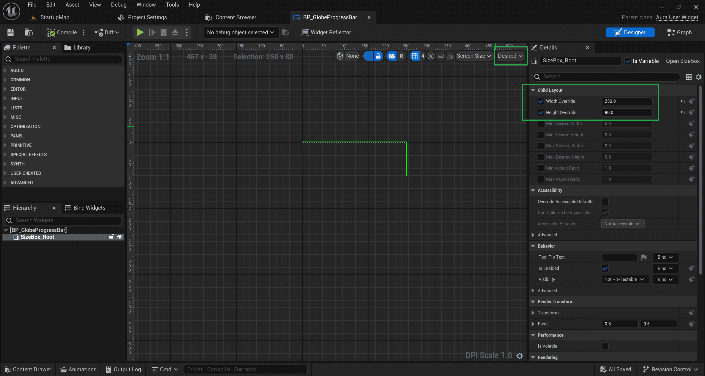

>

2. Globe ProgressBar 示例（血条和蓝条的基类）
   > Image_Background 使用资产 GlobeRing

    

    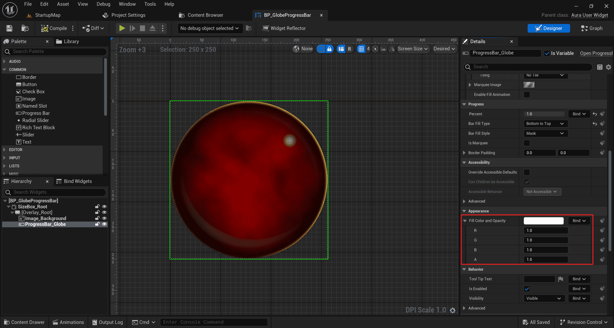

    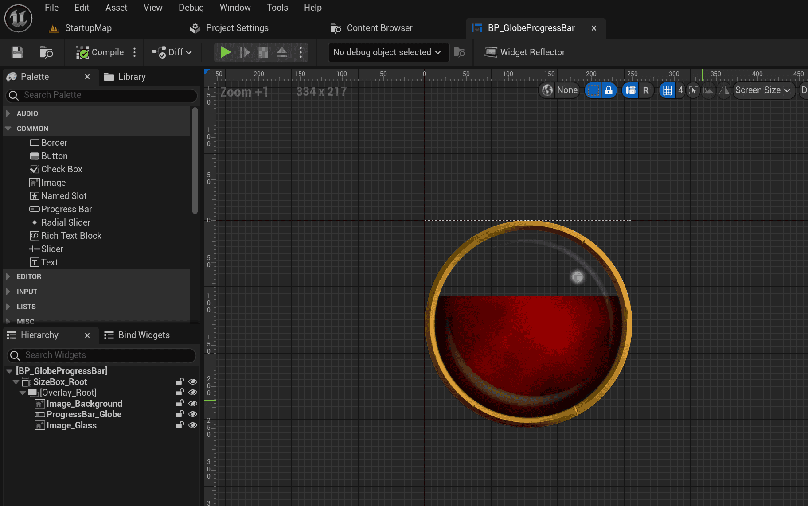

    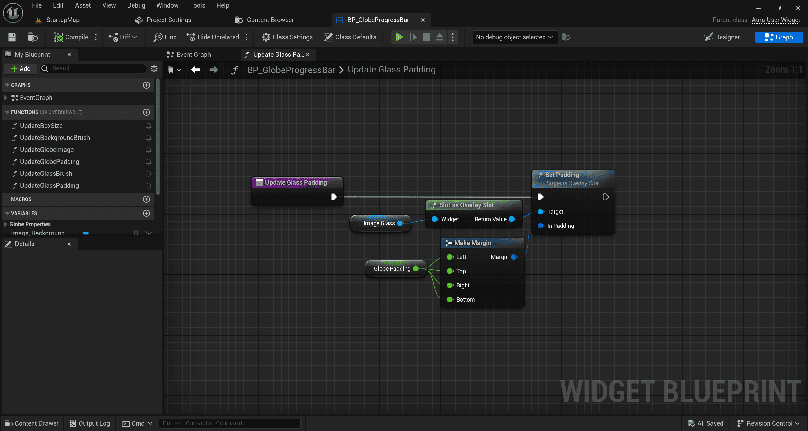

    > 可以公开变量，方便派生类配置属性；

    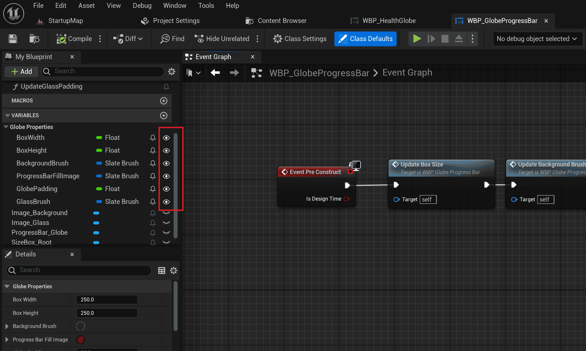

    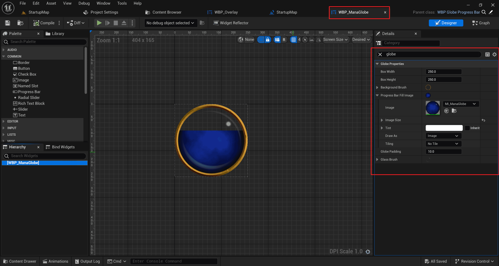

>

3. 该项目中会创建一个 WBP_Overlay 来包含其他 Widget，它也是继承 UAuraUserWidget 类的，我们还会创建一个 HUD（AuraHUD），在 HUD 中添加 WBP_Overlay 到视口（Viewport）中：
   
   > 不使用 Canvas Panel 效率更高，如果不需要尽量不要添加；

>

4. **可以在 AAuraCharacter::InitAbilityActorInfo() 中初始化 OverlayWidget， AuraHUD->InitOverlay，这时我们需要的关键数据都已经用有效数据初始化了：
   我们在 HUD 中存储 OverlayWidgetController：**
   
   > 项目中，**UOverlayWidgetController 的基类是 UAuraWidgetController** (*详细内容可以阅读源码*)，我们在 HUD 中保存 WidgetController，让其作为交互的中间件；
   > - 我们在项目中只会有一个 OverlayWidgetController，相当于单例。所以放在 HUD 中是挺合适的。
   > - 我们将这个 Controller 作为 Controller 层，各个 AuraUserWidget 共用

    ```cpp
    void AAuraHUD::InitOverlay(APlayerController* PC, APlayerState* PS, UAbilitySystemComponent* ASC, UAttributeSet* AS)
    {
        checkf(m_OverlayWidgetClass, TEXT("Overlay Widget Class uninitialized, please fill out BP_AuraHUD"));
        checkf(m_OverlayWidgetControllerClass, TEXT("Overlay Widget Controller Class uninitialized, please fill out BP_AuraHUD"));

        // 1. Create Aura User Widget
        m_OverlayWidget = CreateWidget<UAuraUserWidget>(GetWorld(), m_OverlayWidgetClass);

        const FWidgetControllerParams WidgetControllerParams(PC, PS, ASC, AS);
        UOverlayWidgetController* WidgetController = GetOverlayWidgetController(WidgetControllerParams);
        // 3. 这里设置我们的 Overlay Widget Controller!!!
        m_OverlayWidget->SetWidgetController(WidgetController);

        // 4. 广播以初始化属性值
        WidgetController->BroadcastInitialValues();

        // Add m_OverlayWidget to Viewport!!!
        m_OverlayWidget->AddToViewport();
    }
    ```

>

5. 我们在 WidgetController 中创建声明几个自定义委托，我们希望它是 **动态多播** 的：
   > 可以了解下 动态委托 和 标准委托 的区别 (动态委托可以支持在蓝图中绑定事件，也支持序列化)
   
   因为我想在蓝图中将事件分配给它们，并且会有多个 Widget 想要绑定到这些委托以便更新它们；

   > 这个委托的名称我们约定以 F 开头

    ```cpp
    // OverlayWidgetController.h
    // -------------------------
    DECLARE_DYNAMIC_MULTICAST_DELEGATE_OneParam(FOnHealthChangedSignature, float, NewHealth);
    DECLARE_DYNAMIC_MULTICAST_DELEGATE_OneParam(FOnMaxHealthChangedSignature, float, NewMaxHealth);

    UCLASS(BlueprintType, Blueprintable)
    class AURA_API UOverlayWidgetController : public UAuraWidgetController
    {
        GENERATED_BODY()
        
    public:
        /** 该函数将在 AAuraHUD::InitOverlay 中 OverlayWidget 设置了 WidgetController 之后调用 */
        virtual void BroadcastInitialValues() override;

        /** 为所有依赖 Widget 绑定回调 */
	    virtual void BindCallbacksToDependences() override;

    public:
        UPROPERTY(BlueprintAssignable, Category = "GAS|Attributes")
        FOnHealthChangedSignature OnHealthChanged;

        UPROPERTY(BlueprintAssignable, Category = "GAS|Attributes")
        FOnMaxHealthChangedSignature OnMaxHealthChanged;
    };

    // OverlayWidgetController.cpp
    // ---------------------------
    void UOverlayWidgetController::BroadcastInitialValues()
    {
        Super::BroadcastInitialValues();

        const UAuraAttributeSet* AuraAttributeSet = Cast<UAuraAttributeSet>(AttributeSet);
        OnHealthChanged.Broadcast(AuraAttributeSet->GetHealth());
        OnMaxHealthChanged.Broadcast(AuraAttributeSet->GetMaxHealth());
    }
    ```

    OverlayWidget 实现 WidgetControllerSet 这个函数，这里主要给各个 AuraUserWidget 设置

   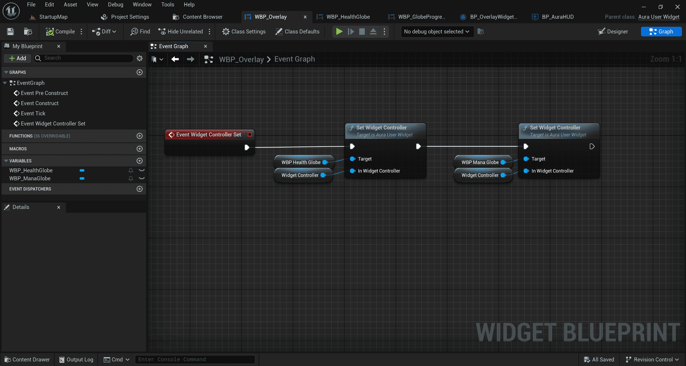

    实现 WidgetControllerSet 这个函数，这里用 OverlayWidgetController 获取数据，来更新具体 UI 属性
    这里还创建了 BP_OverlayWidgetController，并在 BP_HUD 中替换 OverlayWidgetController
    然后在 WBP_GlobeProgressBar 也就是父类里面新增了一个修改进度条数值的函数

   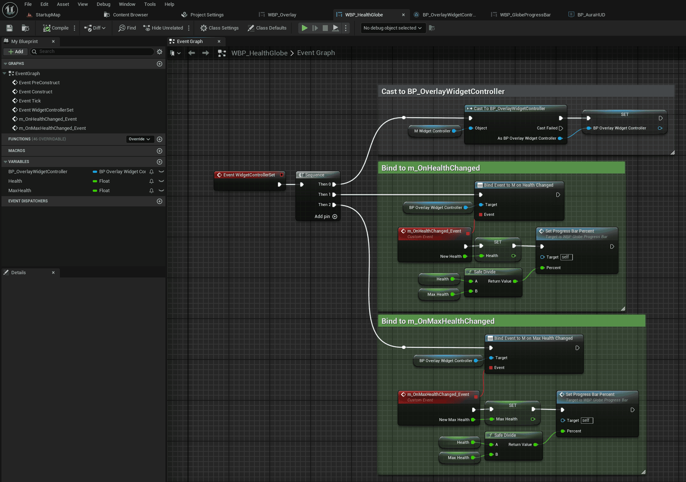

>

## 监听属性值更改

了解函数 ***AbilitySystemComponent->GetGameplayAttributeValueChangeDelegate***

```cpp
// 参考

// OverlayWidgetController.cpp
// ---------------------------
void UOverlayWidgetController::BindCallbacksToDependences()
{
    Super::BindCallbacksToDependences();

    const UAuraAttributeSet* AuraAttributeSet = Cast<UAuraAttributeSet>(AttributeSet);

    /** Bind Callbacks */
    AbilitySystemComponent->GetGameplayAttributeValueChangeDelegate(
        AuraAttributeSet->GetHealthAttribute()).AddUObject(this, &UOverlayWidgetController::HealthChanged);
    AbilitySystemComponent->GetGameplayAttributeValueChangeDelegate(
        AuraAttributeSet->GetMaxHealthAttribute()).AddUObject(this, &UOverlayWidgetController::MaxHealthChanged);
}

void UOverlayWidgetController::HealthChanged(const FOnAttributeChangeData& Data) const
{
    OnHealthChanged.Broadcast(Data.NewValue);
}

void UOverlayWidgetController::MaxHealthChanged(const FOnAttributeChangeData& Data) const
{
    OnMaxHealthChanged.Broadcast(Data.NewValue);
}

// AuraHUD.cpp
// -----------
UOverlayWidgetController* AAuraHUD::GetOverlayWidgetController(const FWidgetControllerParams& WCParams)
{
    if (OverlayWidgetController == nullptr)
    {
        OverlayWidgetController = NewObject<UOverlayWidgetController>(this, OverlayWidgetControllerClass);
        OverlayWidgetController->SetWidgetControllerParams(WCParams);

        // 2. 为所有依赖 Widget 绑定回调
        OverlayWidgetController->BindCallbacksToDependences();
        return OverlayWidgetController;
    }
    return OverlayWidgetController;
}
```

>

1. 上面是以 m_Health 为例，m_Mana 修改类似，**在该项目中如果添加新的属性，基本需要更改：UAuraAttributeSet，UOverlayWidgetController
   这两个类是很好的参考**

>

2. **Widgets 依赖于 WidgetController，而 WidgetController 又依赖于 Model 中的类**

<br>

***下面简单列出流程方便理清思路：***

1. Create Aura User Widget
2. 为所有依赖 Widget 绑定回调
3. 这里设置我们的 Overlay Widget Controller
4. 广播以初始化属性值


<br>
<br>

# 第5节：游戏效果 (Gameplay Effects)

什么是 Gameplay Effects？

- Gameplay Effects 是一个 UGameplayEffect 对象，我们使用 UGameplayEffect 来更改 **属性 (Attributes)** 和 **游戏标签 (Gameplay Tags)**
- **Gameplay Effects 仅是数据 (Data)，我们不给它添加逻辑**，通过 Modifiers 和 Executions 改变属性 (Attributes)
- 其中最强大的方法就是使用 Executions

> 下面看看图片吧，关键信息在里面

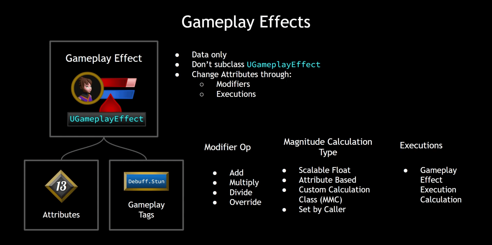

> 比如 Attribute Based 就是基于另一个属性值 (比如 玩家的力量值) 修改
> MMC 是指 Modifier magnitude calculations

Gameplay Effects 有持续时间的策略 ( Policy )，然后 GE ( Gameplay Effects ) 还可以叠加，并且有他们自己的叠加策略

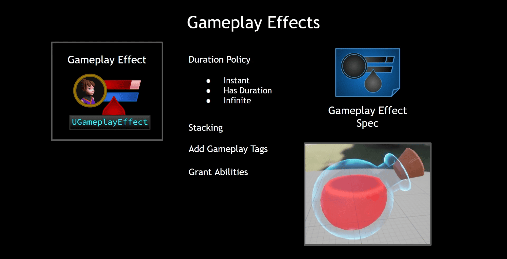

**现在可以直接应用 GameplayEffect，但通常我们会创建它们的更轻量级版本 GameplayEffectSpec （ 看后面代码示例 GameplayEffectSpec 其实是接口前缀，官方的规范 ）**

👉参考文档：https://github.com/tranek/GASDocumentation?tab=readme-ov-file#concepts-ge-spec

这种规范的概念在 Gas 中很常见，是一种优化形式。该规范包含执行修改所需的基本信息以及唯一实际的信息

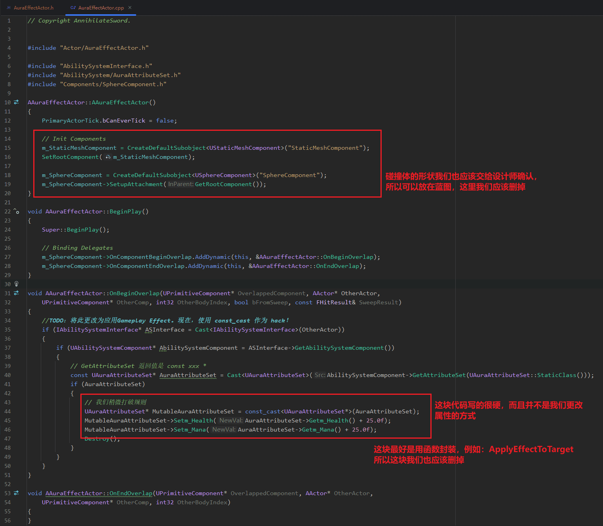

> 好吧，我仍然希望在 C++ 中拥有具体的功能实现，但我想给设计师对这个 Actor 的工作方式有一定的控制。我想让这个 Actor 在蓝图方面真正灵活且易于配置。

<br>

## 简单示例

> **UAbilitySystemBlueprintLibrary::GetAbilitySystemComponent** 可以方便的从 AActor 中获取 ASC

```cpp
void AAuraEffectActor::ApplyEffectToTarget(AActor* TargetActor, TSubclassOf<UGameplayEffect> GameplayEffectClass)
{
    /**
	 * 1. 从指定 Actor 获取 ASC；
	 * 2. ASC 创建 EffectContext 并添加 SourceObject；
	 * 3. ASC 使用 EffectContext 和 GameplayEffectClass 创建 GameplayEffectSpecHandle；
	 * 4. ASC 调用 ApplyGameplayEffectSpecToSelf 应用 Effect；
	 */
    UAbilitySystemComponent* TargetASC = UAbilitySystemBlueprintLibrary::GetAbilitySystemComponent(TargetActor);
    if (TargetASC == nullptr)
        return;

    check(GameplayEffectClass);
    FGameplayEffectContextHandle EffectContextHandle = TargetASC->MakeEffectContext();
    EffectContextHandle.AddSourceObject(this);
    const FGameplayEffectSpecHandle GameplayEffectSpecHandle = TargetASC->MakeOutgoingSpec(GameplayEffectClass, 1.0f, EffectContextHandle);
    TargetASC->ApplyGameplayEffectSpecToSelf(*GameplayEffectSpecHandle.Data.Get());
}
```

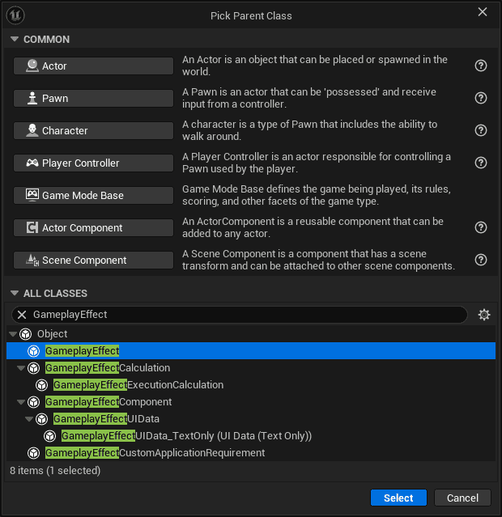

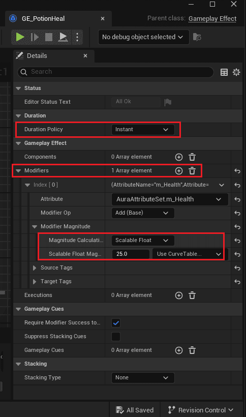

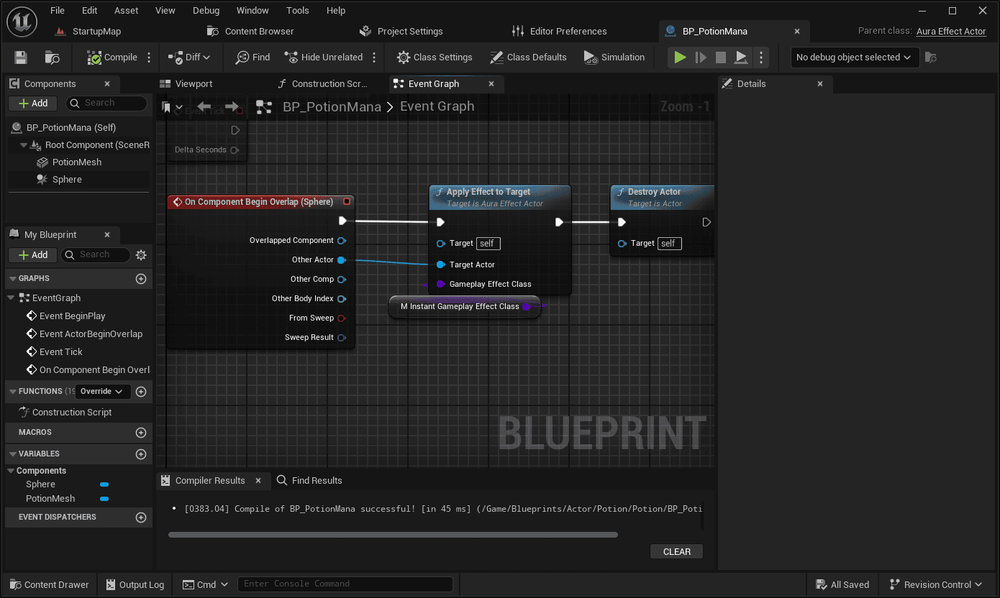

<br>


## Duration Effects 和 Period Effects 的区别

- **Instant Gameplay Effects**
  - 一般我们会 **永久改变基础值（Base Value）**
- **Duration / Infinite Gameplay Effects**
  - 一般会改变当前值（Current Value），**时间到了就会撤回修改**
- **Period Gameplay Effects**
  - 持续时间和无限效果可以转换为周期性效果（只需将其 period 值改为非零即可），定期对属性进行修改；
  - **不过与 Duration / Infinite 效果不同的是它会永久更改基础值（Base Value）**；
    > 例如将周期设为 0.01，每 0.01s 增加 Health 0.1，会得到更平滑的增长，我们知道 GAS 帮我们做了在网络中的预测，可能使用了某种技巧，比如插值；
      当设置周期为非零时，会有 Execute Periodic Effect on Application 供选择，是否一开始就应用更改；
      还可以设置 Periodic Inhibition Policy，根据特定技能系统组件的标签，可以阻止或抑制游戏效果；

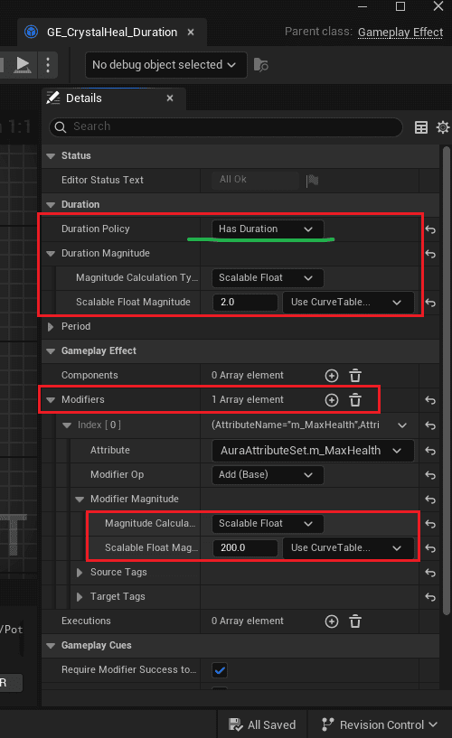

> 这很好，如果没有 GameplayEffect 可能我们需要手动实现一个计时器去实现这样的效果

<br>

## 堆叠 (Stacking)

👉参考文档：https://github.com/tranek/GASDocumentation?tab=readme-ov-file#concepts-ge-stacking

Stacking 使我们能够选择当我们有多种相同类型的游戏效果时会发生什么
> 想想武器大师的被动（LOL）和连续嗑几瓶药水（LOL），这也可以用堆叠做到

Gameplay Effect 中的一些属性介绍：

- **Stacking Type**
    - **None（默认值，比如吃了5个血瓶，会获得5次回血，且这5个血瓶的效果互相独立）**
    - **Aggregate by Source ( 按来源汇总 )**
      - 例如以设置 `Stack Limit Count = 2` 为例：
      - 这个选项意味着应用于目标的每个 Source 最多有 2个堆栈（这里源 Source 实际指的是导致这种情况的能力系统组件 AbilitySystemComponent ）
      - 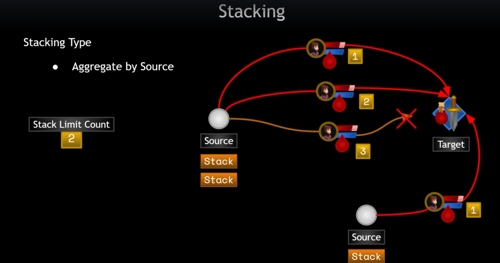
    - **Aggregate by Target ( 按目标汇总 )**
      - 例如以设置 `Stack Limit Count = 2` 为例：
      - 这个选项意味着作用的 Target 最多有 2个堆栈
      - 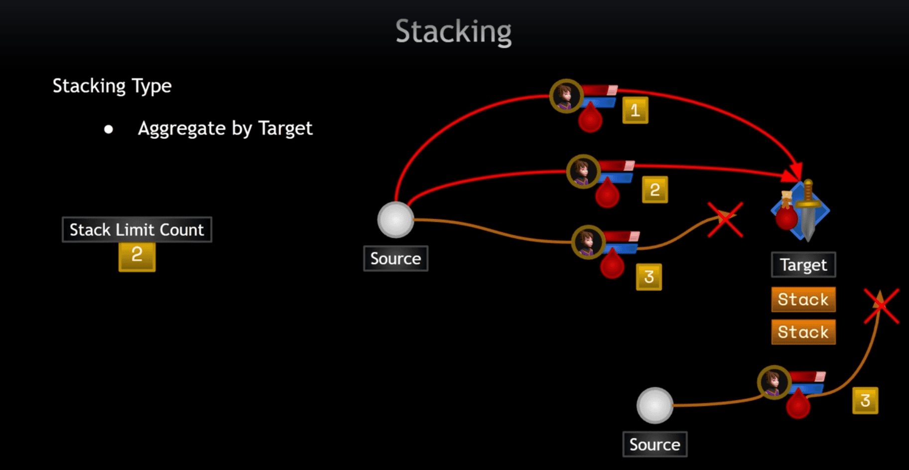
    > 使用 Stacking 的时候，需要注意 Period 的时间设置，如果周期太多可能会有刷新的问题（结果会有误差）

- **Stack Duration Refresh Policy**
    - Refresh on Successful Application
    在成功 Application 上刷新时，每次我们在其上堆叠另一个 Application 时，都会重置效果的持续时间
    - Never Refresh
    即使叠加效果，也不会刷新
- **Stack Period Reset Policy**
    - Refresh on Successful Application
    - Never Refresh

    > Stack Duration Refresh Policy 和 Stack Period Reset Policy 要配合使用，当前者设置为 Never Refresh，后者一般也会设置为 Never Refresh

- **Stack Expiration Policy ( 堆叠到期策略 )**
    - Clear Entire Stack
    结束时清除所有层数
    - Remove Single Stack and Refresh Duration
    结束时减少一层，然后重新经历一个Duration，一直持续到层数减为0
    - Refresh Duration
    结束时再次刷新Duration，这相当于无限Duration，可以通过调用 `OnStackCountChange` 来处理层数，可以达到 Duration 结束时减少两层并刷新 Duration 这样复杂的效果。
    ```cpp
    void FActiveGameplayEffectsContainer::OnStackCountChange(FActiveGameplayEffect& ActiveEffect, int32 OldStackCount, int32 NewStackCount)
    ```

    **上面的属性用来控制效果叠加，那么如果效果叠加满了溢出了怎么办，官方也有解决方案。
    就是 Overflow 属性的配置**
    <br>

- **Overflow**
    - **Overflow Effects**
    溢出时会触发的效果
    - **Deny Overflow Application** 
    阻止溢出效果产生
    - **Clear Stack on Overflow**
    如果勾选了阻止溢出，会出现这个选项，当溢出时是否清除效果

<br>

示例配置：

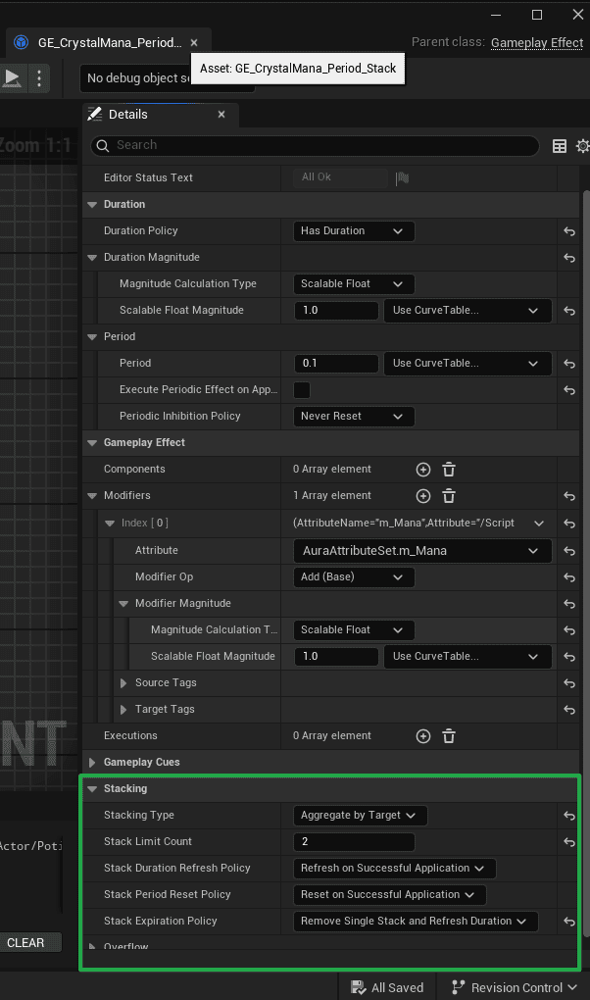

<br>

## Infinite Effect (无限效果)

- 对于无限效果，我们可以保存效果句柄，用来删除该效果；
- 但是需要小心，例如我们可能有多个参与者重叠火焰的情况（有的 AActor 有能力系统组件，有些可能没有，这种情况也需要考虑），而且如果多个参与者重叠我们却只保存一个效果句柄变量，后面重叠的会覆盖之前存储的变量；
- 现在有一种做法是，我们可以用 TMap 存储句柄以及它正在应用的这个 AActor；

一旦应用了游戏效果 `UAbilitySystemComponent::ApplyGameplayEffectSpecToSelf`，该游戏效果就会变成活动状态并且会返回一个 `FActiveGameplayEffectHandle`，所以我们可以使用这个句柄将无限效果删除；

<br>

我们也可以添加一些枚举来自定义我们的一些效果应用和移除策略：

```cpp
// 效果应用策略
UENUM(BlueprintType)
enum class EEffectApplicationPolicy : uint8
{
	ApplyOnOverlap,
	ApplyOnEndOverlap,
	DoNotApply
};

// 效果移除策略
UENUM(BlueprintType)
enum class EEffectRemovalPolicy : uint8
{
	RemoveOnEndOverlap,
	DoNotRemove
};
```

> 现在，删除策略实际上仅适用于无限游戏效果，因为基于持续时间的游戏效果会自行消除

<br>

## 示例 EffectActor 代码：

`AuraEffectActor.h`

```cpp
// 效果应用策略
UENUM(BlueprintType)
enum class EEffectApplicationPolicy : uint8
{
	ApplyOnOverlap,
	ApplyOnEndOverlap,
	DoNotApply
};

// 效果移除策略
UENUM(BlueprintType)
enum class EEffectRemovalPolicy : uint8
{
	RemoveOnEndOverlap,
	DoNotRemove
};

UCLASS()
class AURA_API AAuraEffectActor : public AActor
{
	GENERATED_BODY()
	
public:	
	AAuraEffectActor();

protected:
	virtual void BeginPlay() override;

private:
	UFUNCTION(BlueprintCallable)
	void ApplyEffectToTarget(AActor* TargetActor, TSubclassOf<UGameplayEffect> GameplayEffectClass);

	UFUNCTION(BlueprintCallable)
	void OnOverlap(AActor* TargetActor);

	UFUNCTION(BlueprintCallable)
	void OnEndOverlap(AActor* TargetActor);
	
private:
	UPROPERTY(EditAnywhere, BlueprintReadOnly, Category = "Applied Effects", meta = (AllowPrivateAccess = "true"))
	bool m_bDestroyOnEffectRemoval = false;
	
	/** 立即生效 */
	UPROPERTY(EditAnywhere, BlueprintReadOnly, Category = "Applied Effects", meta = (AllowPrivateAccess = "true"))
	TSubclassOf<UGameplayEffect> m_InstantGameplayEffectClass;

	UPROPERTY(EditAnywhere, BlueprintReadOnly, Category = "Applied Effects", meta = (AllowPrivateAccess = "true"))
	EEffectApplicationPolicy m_InstantEffectApplicationPolicy = EEffectApplicationPolicy::DoNotApply;

	/** 在一段时间内持续有效，引擎帮我们做了计时器的工作 */
	UPROPERTY(EditAnywhere, BlueprintReadOnly, Category = "Applied Effects", meta = (AllowPrivateAccess = "true"))
	TSubclassOf<UGameplayEffect> m_DurationGameplayEffectClass;

	UPROPERTY(EditAnywhere, BlueprintReadOnly, Category = "Applied Effects", meta = (AllowPrivateAccess = "true"))
	EEffectApplicationPolicy m_DurationEffectApplicationPolicy = EEffectApplicationPolicy::DoNotApply;

	/** 无限效果，如果要移除效果需要删除 */
	UPROPERTY(EditAnywhere, BlueprintReadOnly, Category = "Applied Effects", meta = (AllowPrivateAccess = "true"))
	TSubclassOf<UGameplayEffect> m_InfiniteGameplayEffectClass;

	UPROPERTY(EditAnywhere, BlueprintReadOnly, Category = "Applied Effects", meta = (AllowPrivateAccess = "true"))
	EEffectApplicationPolicy m_InfiniteEffectApplicationPolicy = EEffectApplicationPolicy::DoNotApply;

	UPROPERTY(EditAnywhere, BlueprintReadOnly, Category = "Applied Effects", meta = (AllowPrivateAccess = "true"))
	EEffectRemovalPolicy m_InfiniteEffectRemovalPolicy = EEffectRemovalPolicy::RemoveOnEndOverlap;

	TMap<FActiveGameplayEffectHandle, UAbilitySystemComponent*> m_ActiveEffectHandles;
};
```

`AuraEffectActor.cpp`

```cpp
AAuraEffectActor::AAuraEffectActor()
{
	PrimaryActorTick.bCanEverTick = false;

	SetRootComponent(CreateDefaultSubobject<USceneComponent>("SceneRoot"));
}

void AAuraEffectActor::BeginPlay()
{
	Super::BeginPlay();

}

void AAuraEffectActor::ApplyEffectToTarget(AActor* TargetActor, TSubclassOf<UGameplayEffect> GameplayEffectClass)
{
	/**
	 * 1. 从指定 Actor 获取 ASC；
	 * 2. ASC 创建 EffectContext 并添加 SourceObject；
	 * 3. ASC 使用 EffectContext 和 GameplayEffectClass 创建 GameplayEffectSpecHandle；
	 * 4. ASC 调用 ApplyGameplayEffectSpecToSelf 应用 Effect；
	 */
	UAbilitySystemComponent* TargetASC = UAbilitySystemBlueprintLibrary::GetAbilitySystemComponent(TargetActor);
	if (!IsValid(TargetASC))
		return;

	check(GameplayEffectClass);
	FGameplayEffectContextHandle EffectContextHandle = TargetASC->MakeEffectContext();
	EffectContextHandle.AddSourceObject(this);
	const FGameplayEffectSpecHandle EffectSpecHandle = TargetASC->MakeOutgoingSpec(GameplayEffectClass, 1.0f, EffectContextHandle);
	const FActiveGameplayEffectHandle ActiveEffectHandle = TargetASC->ApplyGameplayEffectSpecToSelf(*EffectSpecHandle.Data.Get());

	const bool bIsInfinite = EffectSpecHandle.Data.Get()->Def.Get()->DurationPolicy == EGameplayEffectDurationType::Infinite;
	if (bIsInfinite && m_InfiniteEffectRemovalPolicy == EEffectRemovalPolicy::RemoveOnEndOverlap)
	{
		// 我们添加这个是为了后续可以在合适的时机可以删除效果
		m_ActiveEffectHandles.Add(ActiveEffectHandle, TargetASC);
	}
}

void AAuraEffectActor::OnOverlap(AActor* TargetActor)
{
	if (m_InstantEffectApplicationPolicy == EEffectApplicationPolicy::ApplyOnOverlap)
	{
		ApplyEffectToTarget(TargetActor, m_InstantGameplayEffectClass);
	}
	if (m_DurationEffectApplicationPolicy == EEffectApplicationPolicy::ApplyOnOverlap)
	{
		ApplyEffectToTarget(TargetActor, m_DurationGameplayEffectClass);
	}
	// 如果检查通过，重叠时应用无限效果
	if (m_InfiniteEffectApplicationPolicy == EEffectApplicationPolicy::ApplyOnOverlap)
	{
		ApplyEffectToTarget(TargetActor, m_InfiniteGameplayEffectClass);
	}
}

void AAuraEffectActor::OnEndOverlap(AActor* TargetActor)
{
	if (m_InstantEffectApplicationPolicy == EEffectApplicationPolicy::ApplyOnEndOverlap)
	{
		ApplyEffectToTarget(TargetActor, m_InstantGameplayEffectClass);
	}
	if (m_DurationEffectApplicationPolicy == EEffectApplicationPolicy::ApplyOnEndOverlap)
	{
		ApplyEffectToTarget(TargetActor, m_DurationGameplayEffectClass);
	}
	// 如果检查通过，离开重叠时应用无限效果
	if (m_InfiniteEffectApplicationPolicy == EEffectApplicationPolicy::ApplyOnEndOverlap)
	{
		ApplyEffectToTarget(TargetActor, m_InfiniteGameplayEffectClass);
	}
	
	// 如果检查通过，离开重叠时移除无限效果
	if (m_InfiniteEffectRemovalPolicy == EEffectRemovalPolicy::RemoveOnEndOverlap)
	{
		UAbilitySystemComponent* TargetASC = UAbilitySystemBlueprintLibrary::GetAbilitySystemComponent(TargetActor);
		if (!IsValid(TargetASC))
			return;

		TArray<FActiveGameplayEffectHandle> HandlesToRemove;
		for (TPair<FActiveGameplayEffectHandle, UAbilitySystemComponent*> HandlePair : m_ActiveEffectHandles)
		{
			if (TargetASC == HandlePair.Value)
			{
				// 移除指定的 GameplayEffect，第二个参数默认是 -1，会移除所有堆栈
				TargetASC->RemoveActiveGameplayEffect(HandlePair.Key, 1);
				HandlesToRemove.Add(HandlePair.Key);
			}
		}
		for (FActiveGameplayEffectHandle& Handle : HandlesToRemove)
		{
			m_ActiveEffectHandles.FindAndRemoveChecked(Handle);
		}
	}
}
```

<br>

实现一个火区域示例：

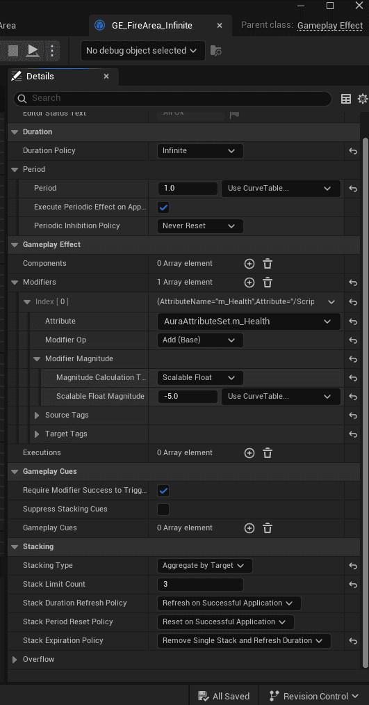

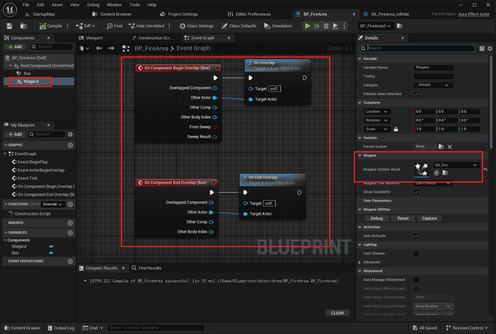

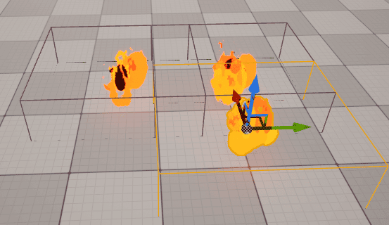

注意该接口第二个参数：

```cpp
// 移除指定的 GameplayEffect，第二个参数默认是 -1，会移除所有堆栈
TargetASC->RemoveActiveGameplayEffect(HandlePair.Key, 1);
```

> 对于药水来说，你还是可以直接在蓝图中直接使用 ApplyEffectToTarget，根据你的喜好

<br>

## UAttributeSet::PreAttributeChange 预属性更改

可以在这个函数里 **对修改值的范围进行限制等预处理操作**，该函数在值发生实际更改之前调用

> Epic 建议我们在这个函数中做限制处理

```cpp
/** Called just before any modification happens to an attribute. */
void UAuraAttributeSet::PreAttributeChange(const FGameplayAttribute& Attribute, float& NewValue)
{
	Super::PreAttributeChange(Attribute, NewValue);

	if (Attribute == GetHealthAttribute())
	{
		NewValue = FMath::Clamp(NewValue, 0.0f, GetMaxHealth());
	}
	if (Attribute == GetManaAttribute())
	{
		NewValue = FMath::Clamp(NewValue, 0.0f, GetMaxMana());
	}
}
```

> 当然也有 PostAttributeChange

<br>

## UAuraAttributeSet::PostGameplayEffectExecute【重要】

**这个函数是在游戏效果改变后执行的，可以根据刚刚应用的效果访问大量信息**

```cpp
/**
 * 在执行游戏效果后调用，用于修改某个属性的基础值。此后不能再进行任何修改。
 * 注意，此函数仅在 “执行” 阶段被调用。例如，对某个属性 “基础值” 的修改。它不会在应用游戏效果（如持续 5 秒且增加 10 点移动速度的增益效果）时被调用。
 */
void UAuraAttributeSet::PostGameplayEffectExecute(const struct FGameplayEffectModCallbackData& Data)
{
	Super::PostGameplayEffectExecute(Data);

	if (Data.EvaluatedData.Attribute == Getm_HealthAttribute())
	{
		UE_LOG(LogTemp, Warning, TEXT("Health: %f"), Getm_Health());
		UE_LOG(LogTemp, Warning, TEXT("Magnitude: %f"), Data.EvaluatedData.Magnitude);
	}
}
```

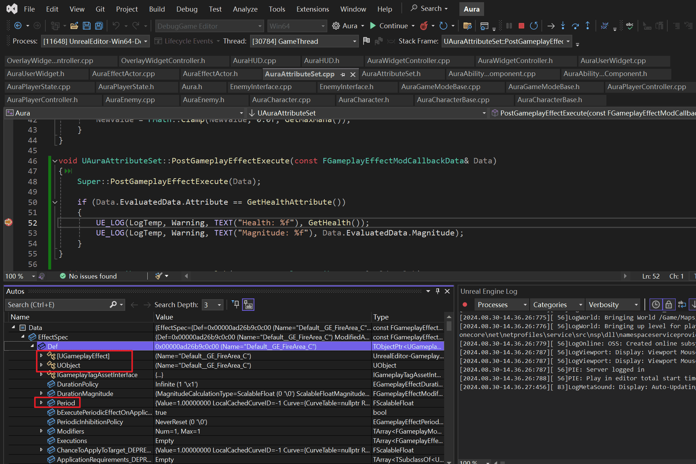

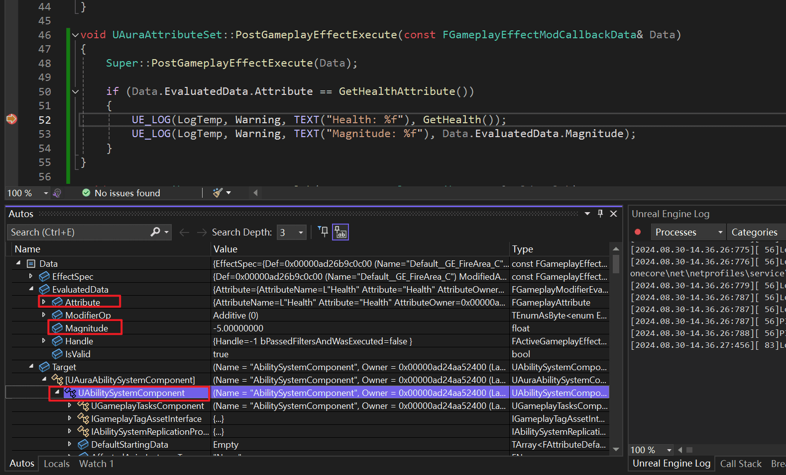

**能获取到 AbilitySystemComponent 就可以获取 Owner 和 Avatar，还有很多有用的信息**

我们可以在这收集许多有用的数据，例如放入一个结构体中，这是一个很好的练习！

在 AuraAttributeSet.h 中添加结构体：

```cpp
USTRUCT()
struct FEffectProperties
{
	GENERATED_BODY()

	FEffectProperties() {}

	FGameplayEffectContextHandle EffectContextHandle;
	
	/** Source */
	UPROPERTY()
	UAbilitySystemComponent* SourceASC = nullptr;

	UPROPERTY()
	AActor* SourceAvatarActor = nullptr;

	UPROPERTY()
	APlayerController* SourcePlayerController = nullptr;

	UPROPERTY()
	ACharacter* SourceCharacter = nullptr;

	/** Target */
	UPROPERTY()
	UAbilitySystemComponent* TargetASC = nullptr;

	UPROPERTY()
	AActor* TargetAvatarActor = nullptr;

	UPROPERTY()
	APlayerController* TargetPlayerController = nullptr;

	UPROPERTY()
	ACharacter* TargetCharacter = nullptr;
};
```

在 UAuraAttributeSet 类中添加一个私有函数：

```cpp
private:
	void SetEffectProperties(const struct FGameplayEffectModCallbackData& Data, FEffectProperties& Props) const;
```

AuraAttributeSet.cpp

```cpp
void UAuraAttributeSet::SetEffectProperties(const struct FGameplayEffectModCallbackData& Data, FEffectProperties& Props) const
{
	// Source = causer of the effect, Target = target of the effect (owner of this AS -> AttributeSet)

	Props.EffectContextHandle = Data.EffectSpec.GetContext();
	Props.SourceASC = Props.EffectContextHandle.GetOriginalInstigatorAbilitySystemComponent();

	if (IsValid(Props.SourceASC) && Props.SourceASC->AbilityActorInfo.IsValid())
	{
		Props.SourceAvatarActor = Props.SourceASC->GetAvatarActor();
		Props.SourcePlayerController = Props.SourceASC->AbilityActorInfo->PlayerController.Get();
		// 有时候我们的 ASC 挂在的 Actor 上可能不能获取到 PC，我们可以尝试通过 Pawn 直接获取
		if (Props.SourcePlayerController == nullptr && Props.SourceAvatarActor != nullptr)
		{
			if (const APawn* Pawn = Cast<APawn>(Props.SourceAvatarActor))
			{
				Props.SourcePlayerController = Cast<APlayerController>(Pawn->GetController());
			}
		}
		if (IsValid(Props.SourcePlayerController))
		{
			Props.SourceCharacter = Props.SourcePlayerController->GetCharacter();
		}
	}

	if (Data.Target.AbilityActorInfo.IsValid())
	{
		Props.TargetAvatarActor = Data.Target.GetAvatarActor();
		Props.TargetPlayerController = Data.Target.AbilityActorInfo->PlayerController.Get();
		if (IsValid(Props.TargetPlayerController))
		{
			Props.TargetCharacter = Props.TargetPlayerController->GetCharacter();
		}
		Props.TargetASC = UAbilitySystemBlueprintLibrary::GetAbilitySystemComponent(Props.TargetAvatarActor);
	}
}

void UAuraAttributeSet::PostGameplayEffectExecute(const struct FGameplayEffectModCallbackData& Data)
{
	Super::PostGameplayEffectExecute(Data);

	/**
	 * 我们可以在这里收集大量信息，这些数据可以存储在一个结构里，
	 * 然后更新的下面逻辑可以用一个单独函数封装起来，这样我们可以轻松访问这些数据，
	 * 当实现更复杂的机制和战斗时，我们会使用它们
	 */
	FEffectProperties Props;
	SetEffectProperties(Data, Props);
}
```

<br>

## 为游戏效果添加曲线表（Curve Tables for Sacalable Floats）

尽量不要硬编码值

> 很多 GAS 元素都有等级的概念，能力也有等级，游戏效果也有等级

曲线表使我们很方便的有选择根据等级按不同的值缩放幅度

可以创建一个 Linear Curve Table（右键 Miscellaneous/CurveTable），曲线很简单，有点像 Excel 表格：

可以点击菜单栏最右边这个：

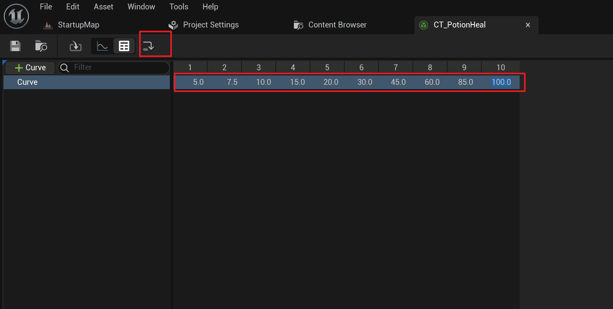

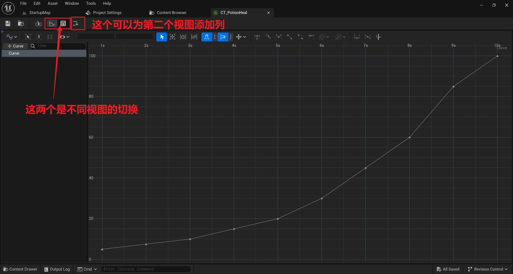

需要在曲线表中选择一条曲线，因为我们可能有多条曲线：

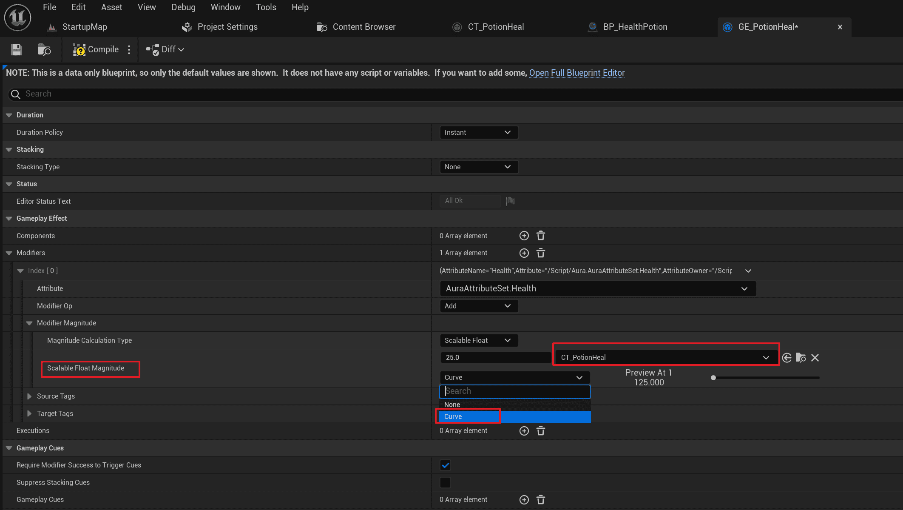

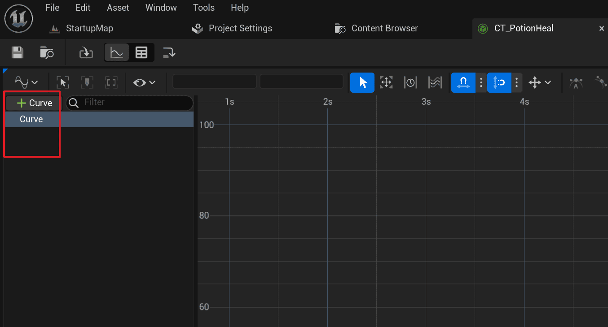

他会乘上我们的基础缩放，例如 1级我们上面设置为 5.0 缩放，这里基础缩放是 25.0，所以这里结果是 125.0

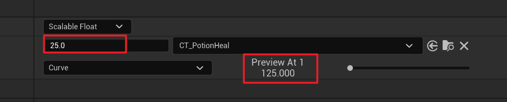

**示例：**

例如我们使用表格可以为药水配置等级对应的缩放值，然后让 EffectActor 的等级是可编辑的：

```cpp
class AURA_API AAuraEffectActor
{
private:
    UPROPERTY(EditAnywhere, BlueprintReadOnly, Category = "Applied Effects", meta = (AllowPrivateAccess = "true"))
	float m_ActorLevel = 1.0f;
};

void AAuraEffectActor::ApplyEffectToTarget(AActor* TargetActor, TSubclassOf<UGameplayEffect> GameplayEffectClass)
{
	// ...

	const FGameplayEffectSpecHandle EffectSpecHandle = TargetASC->MakeOutgoingSpec(GameplayEffectClass, m_ActorLevel, EffectContextHandle);

    // ...
}
```

> 我们也可以为 蓝药 和 血药 使用相同的曲线表格，一个曲线表格可以包含多条曲线，例如 HealingCurve 和 ManaCurve


> 这实际上非常好，因为我们可以使我们的游戏效果数据驱动。

<br>

**Q&A：**


<br>
<br>

# 第6节：游戏标签 (Gameplay Tags)

**Gameplay Tags 在 GAS 系统中至关重要，尽管它们确实独立于 GAS 系统。**

- 游戏标签基本就是名称，它们具有 FGameplayTag 类型，并且已在 游戏标签管理器（Gameplay Tag Manager）中注册；
- 游戏标签本质上是分层的，其中层次结构的每个级别都用点分隔，层级没有限制（1，2，3...层都可以）；
- 为什么游戏标签如此出色？在某些情况下，我们不能使用 FString 或 FName 或 枚举 或 布尔值 吗？
  - 游戏标签有许多固有品质，它们看起来很像字符串，事实上它们的核心是 FName，它们有一个名为 TagName 的成员变量，这是一个 FName 类型，但是它们的**层级性质**使它们让我们的代码更灵活；
  - 可以比较两个标签是否完全相等或者部分相等（这在代码中可能很重要）；
  - 游戏能力系统旨在在几乎每个类别中使用 Gameplay Tag，**我们将标签赋予 Actor's AbilitySystemComponent，然后说该能力系统具有该标签**，能力系统组件实现了一个称为 **IGameplayTagAssetInterface** 的接口（**可以查看特定标签是否存在等信息**），因为这是一个接口所以任何类都可以实现它；
  - **类可以有多个 Gameplay Tag**，我们需要将它们存储在某个容器中（现在我们不使用数组，相反我们使用 **Gameplay Tag Contanier**，*它具有一些游戏标签特定功能和一些效率提升*，**Gameplay Tag Contanier** 具有标签计数的概念，这意味对于容器中的单个标签你可以拥有多个实例，然后也能知道有多少个实例）

> 各种 Class 和 Gas 都可以具有并使用 Gamplay Tag


> **游戏能力系统中的很多操作都依赖于 Gameplay Tags**
> **例如，AbilitySystemComponent 必须具有一些标签才能激活某个 GameplayAbility（游戏能力）**
> 这些只是使用标签的内置功能的几个示例，但可以使用标签，我们也可以用它们来识别输入 (Inputs)、能力 (Abilities)、属性 (Attributes)、伤害类型 (Damage Types)、增益和减益消息 (Buffs/Debuffs)，任何类型的数据 (Data) 或我们能想到的任何其他数据 (Anything you want)！

<br>

## 如何在编辑器中创建标签 (GameplayTags)

我们可以创建一个 GameplayTagSource 和 GameplayTags，GameplayTags 和 GameplayTagSource（是一个 .ini 配置文件） 相关联


> 输入后按回车也可以直接 Add New Tag


> 可以直接去配置文件中添加标签或注释

<br>

## 从数据表（DataTable）中创建标签 (GameplayTags)

这种方式，我们必须先制作表格，然后将表格转换成游戏标签（GameplayTags）

我们可以创建一个 DataTable（每次创建时我们都需要选择一个行结构，以便数据表知道什么字段位于给定行中），开启了GAS插件后，会默认提供一个 `GameplayTagTableRow`


不过要小心，这里很容易出错


**这是一种添加标签很好的方式，更好维护。**

<br>

## 为 Gameplay Effects 添加标签

> 如果有继承，会继承添加的标签再减去需要移除的标签


但是这些是 Gamplay Effect Asset 本身 “拥有” 的标签 （所有者）。这些不会转移到任何 Actors


这个组件会处理向游戏效果的目标（有时称为所有者）授予标签


下面是一个示例：


> 注意这里 debug 模式下标签后面会有 (1)，这是**标签计数**
> **效果被移除时，该效果赋予给 Actor 的标签也会被移除。**

- **在游戏效果中的 Stacking，如果 StackingType 不是 None，增加限制数量并不能让标签计数增加，要注意这一点，如果想让计数增加，我们需要设置 StackingType 为 None，然后去被多个 Effect 作用，才会增加，跟 Stacking Limit Count 无关**
  > 如果使用堆叠，那么效果只会应用一次
- **标签仅在我们作用到 持续（duration） / 无限（Infinite）效果时才有用**
  - > 探索一下如何在 Instant 效果下添加标签？（委托？看看源码有没有类似可能的地方）

_**有空也可以去阅读一下源码：**_

> 13分钟的时候的建议，https://www.udemy.com/course/unreal-engine-5-gas-top-down-rpg/learn/lecture/39783704

例如可以搜索 **FOnGameplayEffectAppliedDelegate** 看看有哪些变量，一般我们可能会喜欢使用 **OnGameplayEffectAppliedDelegateToSelf**，因为它包括基于即时和持续时间的游戏效果

还有 **OnAnyGameplayEffectRemovedDelegate** 等


再次回顾这些内容是件好事，因为这实际上对我们现在更有意义不是吗


<br>

## Gameplay Effect Delegates (游戏效果委托)

这里给 UAuraAbilitySystemComponent 添加了两个接口 AbilityActorInfoSet 和 EffectApplied

```cpp
// AuraAbilitySystemComponent.h
UCLASS()
class AURA_API UAuraAbilitySystemComponent : public UAbilitySystemComponent
{
	GENERATED_BODY()

public:
	void AbilityActorInfoSet();

protected:
	void EffectApplied(UAbilitySystemComponent* AbilitySystemComponent, const FGameplayEffectSpec& EffectSpec, FActiveGameplayEffectHandle ActiveEffectHandle);
};


// AuraAbilitySystemComponent.cpp
void UAuraAbilitySystemComponent::AbilityActorInfoSet()
{
	/** 绑定相关委托 */
	OnGameplayEffectAppliedDelegateToSelf.AddUObject(this, &UAuraAbilitySystemComponent::EffectApplied);
}

void UAuraAbilitySystemComponent::EffectApplied(UAbilitySystemComponent* AbilitySystemComponent,
	const FGameplayEffectSpec& EffectSpec, FActiveGameplayEffectHandle ActiveEffectHandle)
{
	FGameplayTagContainer TagContainer;
	// EffectSpec.GetAllAssetTags(TagContainer);
	EffectSpec.GetAllGrantedTags(TagContainer);
	for (const FGameplayTag& Tag : TagContainer)
	{
		//TODO: Broadcast the tag to the Widget Controller
		const FString Msg = FString::Printf(TEXT("CE Tag: %s"), *Tag.ToString());
		GEngine->AddOnScreenDebugMessage(-1, 8.0f, FColor::Blue, Msg);
	}
}
```

<br>

> 这里做了一个修改操作，我将 AAuraCharacter 中的 InitAbilityActorInfo() 函数变成虚函数，放到了 AAuraCharacterBase 类中了，这样 AAuraEnemy 也可以实现这个函数
> - AbilityActorInfoSet 的调用时机看下面：

AAuraCharacterBase.h

```cpp
protected:
	// 初始化 Ability Actor Info.
	virtual void InitAbilityActorInfo();
```

AuraEnemy.cpp

```cpp
void AAuraEnemy::BeginPlay()
{
	Super::BeginPlay();

	check(m_AbilitySystemComponent);

	InitAbilityActorInfo();
}

void AAuraEnemy::InitAbilityActorInfo()
{
	Super::InitAbilityActorInfo();

	// Init Ability Actor Info for [Server].
	m_AbilitySystemComponent->InitAbilityActorInfo(this, this);

	UAuraAbilitySystemComponent* AuraAbilitySystemComponent = Cast<UAuraAbilitySystemComponent>(m_AbilitySystemComponent);
	AuraAbilitySystemComponent->AbilityActorInfoSet();
}
```

AuraCharacter.cpp

```cpp
void AAuraCharacter::InitAbilityActorInfo()
{
	Super::InitAbilityActorInfo();
	
	AAuraPlayerState* AuraPlayerState = GetPlayerState<AAuraPlayerState>();
	check(AuraPlayerState);
	check(AuraPlayerState->GetAbilitySystemComponent());
	check(AuraPlayerState->GetAttributeSet());
	AuraPlayerState->GetAbilitySystemComponent()->InitAbilityActorInfo(AuraPlayerState, this);
	UAuraAbilitySystemComponent* AuraAbilitySystemComponent = Cast<UAuraAbilitySystemComponent>(AuraPlayerState->GetAbilitySystemComponent());
	AuraAbilitySystemComponent->AbilityActorInfoSet();
	
	m_AbilitySystemComponent = AuraPlayerState->GetAbilitySystemComponent();
	m_AttributeSet = AuraPlayerState->GetAttributeSet();

	//~ Begin 初始化 Overlay Widget!!!
	if (AAuraPlayerController* AuraPlayerController = Cast<AAuraPlayerController>(GetController()))
	{
		if (AAuraHUD* AuraHUD = Cast<AAuraHUD>(AuraPlayerController->GetHUD()))
		{
			AuraHUD->InitOverlay(AuraPlayerController, AuraPlayerState, m_AbilitySystemComponent, m_AttributeSet);
		}
	}
	//~ End 初始化 Overlay Widget!!!
}
```

<br>
<br>


上面的代码中我们使用 UAbilitySystemComponent 中的 GetAllGrantedTags 这个接口，然后可以发现还有 GetAllAssetTags 接口


**如果要使用 `GetAllAssetTags` 需要改一下 CE 中的 Component 配置：**


**其实很好理解，GetAllGrantedTags 是获取该 ASC 被赋予的所有标签，GetAllAssetTags 是获取作用在这个 ASC 中的游戏效果 GE 上所附加的标签。**


```cpp
FGameplayTagContainer TagContainer;
EffectSpec.GetAllAssetTags(TagContainer);
```

> 注意看，我们不会将标签存储在 TArray 中，而是存储在 FGameplayTagContainer，这比数组存储在性能上更优化

<br>

## 广播 Effect Asset Tags

新添加一个 m_EffectAssetTag

```cpp
// AuraAbilitySystemComponent.h
UCLASS()
class AURA_API UAuraAbilitySystemComponent : public UAbilitySystemComponent
{
	GENERATED_BODY()

public:
	void AbilityActorInfoSet();

protected:
	void EffectApplied(UAbilitySystemComponent* AbilitySystemComponent, const FGameplayEffectSpec& EffectSpec, FActiveGameplayEffectHandle ActiveEffectHandle);

public:
	// 用来通知给 WidgetController，当我们被应用了能力并改变各种标签时
	// 我们绑定到任何这个委托的类都将收到 TagContanier 这个参数
	FEffectAssetTag m_EffectAssetTag;
};


// AuraAbilitySystemComponent.cpp
void UAuraAbilitySystemComponent::EffectApplied(UAbilitySystemComponent* AbilitySystemComponent,
	const FGameplayEffectSpec& EffectSpec, FActiveGameplayEffectHandle ActiveEffectHandle)
{
	FGameplayTagContainer TagContainer;
	// EffectSpec.GetAllAssetTags(TagContainer);
	EffectSpec.GetAllGrantedTags(TagContainer);

	// 将 TagContainer 广播
	m_EffectAssetTag.Broadcast(TagContainer);
}
```

将回调绑定在 UOverlayWidgetController::BindCallbacksToDependences

```cpp
void UOverlayWidgetController::BindCallbacksToDependences()
{
	Super::BindCallbacksToDependences();

	UAuraAttributeSet* AuraAttributeSet = CastChecked<UAuraAttributeSet>(m_AttributeSet);
	m_AbilitySystemComponent->GetGameplayAttributeValueChangeDelegate(
		AuraAttributeSet->Getm_HealthAttribute()).AddUObject(this, &UOverlayWidgetController::OnHealthChanged);
	m_AbilitySystemComponent->GetGameplayAttributeValueChangeDelegate(
		AuraAttributeSet->Getm_MaxHealthAttribute()).AddUObject(this, &UOverlayWidgetController::OnMaxHealthChanged);
	m_AbilitySystemComponent->GetGameplayAttributeValueChangeDelegate(
		AuraAttributeSet->Getm_ManaAttribute()).AddUObject(this, &UOverlayWidgetController::OnManaChanged);
	m_AbilitySystemComponent->GetGameplayAttributeValueChangeDelegate(
		AuraAttributeSet->Getm_MaxManaAttribute()).AddUObject(this, &UOverlayWidgetController::OnMaxManaChanged);

	// 当我们被应用了能力并改变各种标签时被通知到 WidgetController
	Cast<UAuraAbilitySystemComponent>(m_AbilitySystemComponent)->m_EffectAssetTag.AddLambda(
		[](const FGameplayTagContainer& AssetTags)
		{
			for (const FGameplayTag& Tag : AssetTags)
			{
				const FString Msg = FString::Printf(TEXT("CE Tag: %s"), *Tag.ToString());
				GEngine->AddOnScreenDebugMessage(-1, 8.0f, FColor::Blue, Msg);
			}
		}
	);
}
```

<br>

## UI Widget Data Table

在 OverlayWidgetController 类中添加表结构，以及 m_MessageWidgetDataTable

**添加一个模板函数 GetDataTableRowByTag**

修改 UOverlayWidgetController::BindCallbacksToDependences 接口：

```cpp
// OverlayWidgetController.h
USTRUCT(BlueprintType)
struct FUIWidgetRow : public FTableRowBase
{
	GENERATED_BODY()

	UPROPERTY(EditAnywhere, BlueprintReadOnly, Category = UI)
	FGameplayTag MessageTag = FGameplayTag();

	UPROPERTY(EditAnywhere, BlueprintReadOnly, Category = UI)
	FText MessageText = FText();

	UPROPERTY(EditAnywhere, BlueprintReadOnly, Category = UI)
	TSubclassOf<UAuraUserWidget> MessageWidgetClass;
	
	UPROPERTY(EditAnywhere, BlueprintReadOnly, Category = UI)
	UTexture2D* MessageImage = nullptr;
};

UCLASS()
class AURA_API UOverlayWidgetController : public UAuraWidgetController
{
	GENERATED_BODY()
	
public:
	/** 该函数将在 AAuraHUD::InitOverlay 中 OverlayWidget 设置了 WidgetController 之后调用 */
	virtual void BroadcastInitialValues() override;

	/** 为所有依赖 Widget 绑定回调 */
	virtual void BindCallbacksToDependences() override;

protected:
	void OnHealthChanged(const FOnAttributeChangeData& Data) const;
	void OnMaxHealthChanged(const FOnAttributeChangeData& Data) const;
	void OnManaChanged(const FOnAttributeChangeData& Data) const;
	void OnMaxManaChanged(const FOnAttributeChangeData& Data) const;
	
    template<typename T>
	T* GetDataTableRowByTag(UDataTable* DataTable, const FGameplayTag& Tag);

public:
	UPROPERTY(BlueprintAssignable, Category = "GAS|Attributes")
	FOnHealthChangedSignature m_OnHealthChanged;
	
	UPROPERTY(BlueprintAssignable, Category = "GAS|Attributes")
	FOnMaxHealthChangedSignature m_OnMaxHealthChanged;

	UPROPERTY(BlueprintAssignable, Category = "GAS|Attributes")
	FOnManaChangedSignature m_OnManaChanged;
	
	UPROPERTY(BlueprintAssignable, Category = "GAS|Attributes")
	FOnMaxManaChangedSignature m_OnMaxManaChanged;

private:
	UPROPERTY(EditDefaultsOnly, BlueprintReadOnly, Category = "Widget Data", meta = (AllowPrivateAccess = "true"))
	TObjectPtr<UDataTable> m_MessageWidgetDataTable;
};

template <typename T>
T* UOverlayWidgetController::GetDataTableRowByTag(UDataTable* DataTable, const FGameplayTag& Tag)
{
	return DataTable->FindRow<T>(Tag.GetTagName(), TEXT(""));
}

// OverlayWidgetController.cpp
void UOverlayWidgetController::BindCallbacksToDependences()
{
	Super::BindCallbacksToDependences();

	UAuraAttributeSet* AuraAttributeSet = CastChecked<UAuraAttributeSet>(m_AttributeSet);
	m_AbilitySystemComponent->GetGameplayAttributeValueChangeDelegate(
		AuraAttributeSet->Getm_HealthAttribute()).AddUObject(this, &UOverlayWidgetController::OnHealthChanged);
	m_AbilitySystemComponent->GetGameplayAttributeValueChangeDelegate(
		AuraAttributeSet->Getm_MaxHealthAttribute()).AddUObject(this, &UOverlayWidgetController::OnMaxHealthChanged);
	m_AbilitySystemComponent->GetGameplayAttributeValueChangeDelegate(
		AuraAttributeSet->Getm_ManaAttribute()).AddUObject(this, &UOverlayWidgetController::OnManaChanged);
	m_AbilitySystemComponent->GetGameplayAttributeValueChangeDelegate(
		AuraAttributeSet->Getm_MaxManaAttribute()).AddUObject(this, &UOverlayWidgetController::OnMaxManaChanged);

	// 当我们被应用了能力并改变各种标签时被通知到 WidgetController
	Cast<UAuraAbilitySystemComponent>(m_AbilitySystemComponent)->m_EffectAssetTag.AddLambda(
		[this](const FGameplayTagContainer& AssetTags)
		{
			for (const FGameplayTag& Tag : AssetTags)
			{
				const FString Msg = FString::Printf(TEXT("CE Tag: %s"), *Tag.ToString());
				GEngine->AddOnScreenDebugMessage(-1, 8.0f, FColor::Blue, Msg);

				FUIWidgetRow* Row = GetDataTableRowByTag<FUIWidgetRow>(m_MessageWidgetDataTable, Tag);
			}
		}
	);
}
```

新建 DT_MessageWidgetData


我们可以添加新的 Message 标签：


MessageWidgetClass 我们之后再补充：


<br>

## 广播数据表行

改动部分代码：

```cpp
USTRUCT(BlueprintType)
struct FUIWidgetRow : public FTableRowBase
{
	GENERATED_BODY()

	UPROPERTY(EditAnywhere, BlueprintReadOnly, Category = UI)
	FGameplayTag MessageTag = FGameplayTag();

	UPROPERTY(EditAnywhere, BlueprintReadOnly, Category = UI)
	FText MessageText = FText();

	UPROPERTY(EditAnywhere, BlueprintReadOnly, Category = UI)
	TSubclassOf<UAuraUserWidget> MessageWidgetClass;
	
	UPROPERTY(EditAnywhere, BlueprintReadOnly, Category = UI)
	UTexture2D* MessageImage = nullptr;
};

DECLARE_DYNAMIC_MULTICAST_DELEGATE_OneParam(FOnHealthChangedSignature, float, NewHealth);
DECLARE_DYNAMIC_MULTICAST_DELEGATE_OneParam(FOnMaxHealthChangedSignature, float, NewMaxHealth);
DECLARE_DYNAMIC_MULTICAST_DELEGATE_OneParam(FOnManaChangedSignature, float, NewMana);
DECLARE_DYNAMIC_MULTICAST_DELEGATE_OneParam(FOnMaxManaChangedSignature, float, NewMaxMana);

DECLARE_DYNAMIC_MULTICAST_DELEGATE_OneParam(FMessageWidgetRowSignature, FUIWidgetRow, Row);

/**
 * 
 */
UCLASS()
class AURA_API UOverlayWidgetController : public UAuraWidgetController
{
	GENERATED_BODY()
	
public:
	/** 该函数将在 AAuraHUD::InitOverlay 中 OverlayWidget 设置了 WidgetController 之后调用 */
	virtual void BroadcastInitialValues() override;

	/** 为所有依赖 Widget 绑定回调 */
	virtual void BindCallbacksToDependences() override;

protected:
	void OnHealthChanged(const FOnAttributeChangeData& Data) const;
	void OnMaxHealthChanged(const FOnAttributeChangeData& Data) const;
	void OnManaChanged(const FOnAttributeChangeData& Data) const;
	void OnMaxManaChanged(const FOnAttributeChangeData& Data) const;

	template<typename T>
	T* GetDataTableRowByTag(UDataTable* DataTable, const FGameplayTag& Tag);
	
public:
	UPROPERTY(BlueprintAssignable, Category = "GAS|Attributes")
	FOnHealthChangedSignature m_OnHealthChanged;
	
	UPROPERTY(BlueprintAssignable, Category = "GAS|Attributes")
	FOnMaxHealthChangedSignature m_OnMaxHealthChanged;

	UPROPERTY(BlueprintAssignable, Category = "GAS|Attributes")
	FOnManaChangedSignature m_OnManaChanged;
	
	UPROPERTY(BlueprintAssignable, Category = "GAS|Attributes")
	FOnMaxManaChangedSignature m_OnMaxManaChanged;

	UPROPERTY(BlueprintAssignable, Category = "GAS|Message")
	FMessageWidgetRowSignature m_MessageWidgetRowDelegate;

private:
	UPROPERTY(EditDefaultsOnly, BlueprintReadOnly, Category = "Widget Data", meta = (AllowPrivateAccess = "true"))
	TObjectPtr<UDataTable> m_MessageWidgetDataTable;
};

template <typename T>
T* UOverlayWidgetController::GetDataTableRowByTag(UDataTable* DataTable, const FGameplayTag& Tag)
{
	return DataTable->FindRow<T>(Tag.GetTagName(), TEXT(""));
}
```

OverlayWidgetController.cpp

```cpp
void UOverlayWidgetController::BindCallbacksToDependences()
{
	Super::BindCallbacksToDependences();

	UAuraAttributeSet* AuraAttributeSet = CastChecked<UAuraAttributeSet>(m_AttributeSet);
	m_AbilitySystemComponent->GetGameplayAttributeValueChangeDelegate(
		AuraAttributeSet->Getm_HealthAttribute()).AddUObject(this, &UOverlayWidgetController::OnHealthChanged);
	m_AbilitySystemComponent->GetGameplayAttributeValueChangeDelegate(
		AuraAttributeSet->Getm_MaxHealthAttribute()).AddUObject(this, &UOverlayWidgetController::OnMaxHealthChanged);
	m_AbilitySystemComponent->GetGameplayAttributeValueChangeDelegate(
		AuraAttributeSet->Getm_ManaAttribute()).AddUObject(this, &UOverlayWidgetController::OnManaChanged);
	m_AbilitySystemComponent->GetGameplayAttributeValueChangeDelegate(
		AuraAttributeSet->Getm_MaxManaAttribute()).AddUObject(this, &UOverlayWidgetController::OnMaxManaChanged);

	// 当我们被应用了能力并改变各种标签时被通知到 WidgetController
	Cast<UAuraAbilitySystemComponent>(m_AbilitySystemComponent)->m_EffectAssetTag.AddLambda(
		[this](const FGameplayTagContainer& AssetTags)
		{
			for (const FGameplayTag& Tag : AssetTags)
			{
				// For example, say that Tag = Message.HealthPotion
				// "Message.HealthPotion".MatchesTag("Message") will return True, "Message".MatchesTag("Message.HealthPotion") will return False
				const FGameplayTag MessageTag = FGameplayTag::RequestGameplayTag(FName("Message"));
				if (Tag.MatchesTag(MessageTag))
				{
					FUIWidgetRow* Row = GetDataTableRowByTag<FUIWidgetRow>(m_MessageWidgetDataTable, Tag);
                    m_MessageWidgetRowDelegate.Broadcast(*Row);
				}
			}
		}
	);
}
```


AuraAbilitySystemComponent.cpp 这里用的是 GetAllAssetTags，具体情况结合自己项目来：

```cpp
void UAuraAbilitySystemComponent::EffectApplied(UAbilitySystemComponent* AbilitySystemComponent,
	const FGameplayEffectSpec& EffectSpec, FActiveGameplayEffectHandle ActiveEffectHandle)
{
	FGameplayTagContainer TagContainer;
	EffectSpec.GetAllAssetTags(TagContainer);
	// EffectSpec.GetAllGrantedTags(TagContainer);

	// 将 TagContainer 广播
	m_EffectAssetTag.Broadcast(TagContainer);
}
```

接下来将药水和恢复水晶都加上 AssetTag，下面是其中一个示例：


最终效果：


> 现在我们可以获取许多我们想要的信息，并且跟 UI 关联起来。

<br>

## Message Widget（消息 UI）


现在运行游戏，我们有了可以停留在视口中间的文本 UI，接下来我们还想要制作淡出动画，并在 1s 左右消失：


<br>

## 代码优化，改用 【AddLambda】 注册委托

```cpp
class UAuraUserWidget;
struct FOnAttributeChangeData;

USTRUCT(BlueprintType)
struct FUIWidgetRow : public FTableRowBase
{
	GENERATED_BODY()

	UPROPERTY(EditAnywhere, BlueprintReadOnly, Category = UI)
	FGameplayTag MessageTag = FGameplayTag();

	UPROPERTY(EditAnywhere, BlueprintReadOnly, Category = UI)
	FText MessageText = FText();

	UPROPERTY(EditAnywhere, BlueprintReadOnly, Category = UI)
	TSubclassOf<UAuraUserWidget> MessageWidgetClass;
	
	UPROPERTY(EditAnywhere, BlueprintReadOnly, Category = UI)
	UTexture2D* MessageImage = nullptr;
};

DECLARE_DYNAMIC_MULTICAST_DELEGATE_OneParam(FOnAttributeChangedSignature, float, NewValue);

DECLARE_DYNAMIC_MULTICAST_DELEGATE_OneParam(FMessageWidgetRowSignature, FUIWidgetRow, Row);

/**
 * 
 */
UCLASS()
class AURA_API UOverlayWidgetController : public UAuraWidgetController
{
	GENERATED_BODY()
	
public:
	/** 该函数将在 AAuraHUD::InitOverlay 中 OverlayWidget 设置了 WidgetController 之后调用 */
	virtual void BroadcastInitialValues() override;

	/** 为所有依赖 Widget 绑定回调 */
	virtual void BindCallbacksToDependences() override;

protected:
	template<typename T>
	T* GetDataTableRowByTag(UDataTable* DataTable, const FGameplayTag& Tag);
	
public:
	UPROPERTY(BlueprintAssignable, Category = "GAS|Attributes")
	FOnAttributeChangedSignature m_OnHealthChanged;
	
	UPROPERTY(BlueprintAssignable, Category = "GAS|Attributes")
	FOnAttributeChangedSignature m_OnMaxHealthChanged;

	UPROPERTY(BlueprintAssignable, Category = "GAS|Attributes")
	FOnAttributeChangedSignature m_OnManaChanged;
	
	UPROPERTY(BlueprintAssignable, Category = "GAS|Attributes")
	FOnAttributeChangedSignature m_OnMaxManaChanged;

	UPROPERTY(BlueprintAssignable, Category = "GAS|Message")
	FMessageWidgetRowSignature m_MessageWidgetRowDelegate;

private:
	UPROPERTY(EditDefaultsOnly, BlueprintReadOnly, Category = "Widget Data", meta = (AllowPrivateAccess = "true"))
	TObjectPtr<UDataTable> m_MessageWidgetDataTable;
};

template <typename T>
T* UOverlayWidgetController::GetDataTableRowByTag(UDataTable* DataTable, const FGameplayTag& Tag)
{
	return DataTable->FindRow<T>(Tag.GetTagName(), TEXT(""));
}
```

OverlayWidgetController.cpp

```cpp
void UOverlayWidgetController::BindCallbacksToDependences()
{
	Super::BindCallbacksToDependences();

	UAuraAttributeSet* AuraAttributeSet = CastChecked<UAuraAttributeSet>(m_AttributeSet);
	m_AbilitySystemComponent->GetGameplayAttributeValueChangeDelegate(
		AuraAttributeSet->Getm_HealthAttribute()).AddLambda([this](const FOnAttributeChangeData& Data)
		{
			m_OnHealthChanged.Broadcast(Data.NewValue);
		});
	
	m_AbilitySystemComponent->GetGameplayAttributeValueChangeDelegate(
		AuraAttributeSet->Getm_MaxHealthAttribute()).AddLambda([this](const FOnAttributeChangeData& Data)
		{
			m_OnMaxHealthChanged.Broadcast(Data.NewValue);
		});
	
	m_AbilitySystemComponent->GetGameplayAttributeValueChangeDelegate(
		AuraAttributeSet->Getm_ManaAttribute()).AddLambda([this](const FOnAttributeChangeData& Data)
		{
			m_OnManaChanged.Broadcast(Data.NewValue);
		});
	
	m_AbilitySystemComponent->GetGameplayAttributeValueChangeDelegate(
		AuraAttributeSet->Getm_MaxManaAttribute()).AddLambda([this](const FOnAttributeChangeData& Data)
		{
			m_OnMaxManaChanged.Broadcast(Data.NewValue);
		});

	// 当我们被应用了能力并改变各种标签时被通知到 WidgetController
	Cast<UAuraAbilitySystemComponent>(m_AbilitySystemComponent)->m_EffectAssetTag.AddLambda(
		[this](const FGameplayTagContainer& AssetTags)
		{
			for (const FGameplayTag& Tag : AssetTags)
			{
				// For example, say that Tag = Message.HealthPotion
				// "Message.HealthPotion".MatchesTag("Message") will return True, "Message".MatchesTag("Message.HealthPotion") will return False
				const FGameplayTag MessageTag = FGameplayTag::RequestGameplayTag(FName("Message"));
				if (Tag.MatchesTag(MessageTag))
				{
					FUIWidgetRow* Row = GetDataTableRowByTag<FUIWidgetRow>(m_MessageWidgetDataTable, Tag);
					m_MessageWidgetRowDelegate.Broadcast(*Row);
				}
			}
		}
	);
}
```

<br>

## Ghost Global 【血条残影-类似DNF】

可以利用插值实现过渡的效果（这个项目中很少有这样的 UI，只有 Health 和 Mana 条，性能可以接受），例如每当我们的血条变化时，我们会等待1，2秒，然后使用插值让后面的残影进度条跟随变化：


这里 GhostProgressBarBrush 默认值是 MI_GhostHealthGlobe


这里 GhostDelay 默认值是 0.5f


GhostInterpSpeed 默认值是 1.0f


注意子类正确调用父类 Tick：


> 重新连一下 Tick 的线也可以

让我们的 GhostProgressBar 和 GlobeProgressBar 的值初始相同：


可以折叠为一个函数 InterpGlostGlobe


最终效果：


<br>

## 正确限制属性

先吃药加血超过 100，命令行调试 showdebug abilitysystem 当然我们看不到超过 100，因为我们初始化时设置了 m_MaxHealth = 100.0f

```cpp
UAuraAttributeSet::UAuraAttributeSet()
{
	Initm_Health(50.0f);
	Initm_MaxHealth(100.0f);
	Initm_Mana(25.0f);
	Initm_MaxMana(100.0f);
}
```

吃了让角色超过 100 的血量的药后，控制角色去火堆踩一下，按之前的逻辑发现是不掉血的，可以断点调试 PreAttributeChange 这里发现 NewValue 的值已经超过 100.0f 了：


还有一个调试方法：

**输入命令：GameplayDebugger.AutoCreateGameplayDebuggerManager**

因为我的按键原因我改了设置：


然后按 ' 开启 Gameplay Debugger，这个符号就是双引号 " "，那个按键：

**可以直接按 shift + ' 选中当前玩家：**


吃血药超过 100.0f，发现这里 m_Health 值已经出问题了。

> 第一个是当前值，方括号里面的是基础值，当当前值和基础值相同时，它只显示一个值。

**PS：建议不要再使用 ShowDebug AbilitySystem，因为它已被弃用（并且以有时显示不正确的值而闻名），而使用的是 Gameplay Debugger。**


<br>

AuraAttributeSet.cpp

```cpp
void UAuraAttributeSet::PreAttributeChange(const FGameplayAttribute& Attribute, float& NewValue)
{
	Super::PreAttributeChange(Attribute, NewValue);

	/** 这里并没有限制属性（可Debug测试下） */
	// 这里限制是为了防止该函数下面可能会用到 NewValue 做相关计算
	if (Attribute == Getm_HealthAttribute())
	{
		NewValue = FMath::Clamp(NewValue, 0.0f, Getm_MaxHealth());
	}
	if (Attribute == Getm_ManaAttribute())
	{
		NewValue = FMath::Clamp(NewValue, 0.0f, Getm_MaxMana());
	}
}

void UAuraAttributeSet::PostGameplayEffectExecute(const struct FGameplayEffectModCallbackData& Data)
{
	Super::PostGameplayEffectExecute(Data);

	/**
	 * 我们可以在这里收集大量信息，这些数据可以存储在一个结构里，
	 * 然后更新的下面逻辑可以用一个单独函数封装起来，这样我们可以轻松访问这些数据，
	 * 当实现更复杂的机制和战斗时，我们会使用它们
	 */
	FEffectProperties Props;
	SetEffectProperties(Data, Props);

	/** 正确限制属性（可Debug测试下） */
	// 实际值将在 Post 这里设置
	if (Data.EvaluatedData.Attribute == Getm_HealthAttribute())
	{
		Setm_Health(FMath::Clamp(Getm_Health(), 0.0f, Getm_MaxHealth()));
	}
	if (Data.EvaluatedData.Attribute == Getm_ManaAttribute())
	{
		Setm_Mana(FMath::Clamp(Getm_Mana(), 0.0f, Getm_MaxMana()));
	}
}
```

不过我没用用这种改法，**我们可以直接删除 PreAttributeChange，使用 PreAttribureBaseChange 进行限制，我们不需要在 PostGameplayEffectExecute（） 中进行任何限制**：

```cpp
void UAuraAttributeSet::PreAttributeBaseChange(const FGameplayAttribute& Attribute, float& NewValue) const
{
	Super::PreAttributeBaseChange(Attribute, NewValue);

	/** 限制属性 */
	if (Attribute == Getm_HealthAttribute())
	{
		NewValue = FMath::Clamp(NewValue, 0.0f, Getm_MaxHealth());
	}
	if (Attribute == Getm_ManaAttribute())
	{
		NewValue = FMath::Clamp(NewValue, 0.0f, Getm_MaxMana());
	}
}

void UAuraAttributeSet::PostGameplayEffectExecute(const struct FGameplayEffectModCallbackData& Data)
{
	Super::PostGameplayEffectExecute(Data);

	/**
	 * 我们可以在这里收集大量信息，这些数据可以存储在一个结构里，
	 * 然后更新的下面逻辑可以用一个单独函数封装起来，这样我们可以轻松访问这些数据，
	 * 当实现更复杂的机制和战斗时，我们会使用它们
	 */
	FEffectProperties Props;
	SetEffectProperties(Data, Props);
}
```

再次调试应该可以正常进行限制！

<br>
<br>

# 第7节：RPG Attributes

新增几个 Primary Attribute

AuraAttributeSet.h

```cpp
UCLASS()
class AURA_API UAuraAttributeSet : public UAttributeSet
{
	GENERATED_BODY()
	
public:
	UAuraAttributeSet();

protected:
	virtual void GetLifetimeReplicatedProps(TArray<FLifetimeProperty>& OutLifetimeProps) const override;

	/** Called just before any modification happens to an attribute. */
	virtual void PreAttributeBaseChange(const FGameplayAttribute& Attribute, float& NewValue) const override;
	
	/**
	 * 在执行游戏效果后调用，用于修改某个属性的基础值。此后不能再进行任何修改。
	 * 注意，此函数仅在 “执行” 阶段被调用。例如，对某个属性 “基础值” 的修改。它不会在应用游戏效果（如持续 5 秒且增加 10 点移动速度的增益效果）时被调用。
	 */
	virtual void PostGameplayEffectExecute(const struct FGameplayEffectModCallbackData& Data) override;

public:
	/**
	 * Primary Attributes
	 */
	UPROPERTY(BlueprintReadOnly, ReplicatedUsing = OnRep_Strength, Category = "Primary Attributes")
	FGameplayAttributeData m_Strength;
	ATTRIBUTE_ACCESSORS(UAuraAttributeSet, m_Strength);

	UPROPERTY(BlueprintReadOnly, ReplicatedUsing = OnRep_Intelligence, Category = "Primary Attributes")
	FGameplayAttributeData m_Intelligence;
	ATTRIBUTE_ACCESSORS(UAuraAttributeSet, m_Intelligence);

	// 韧性
	UPROPERTY(BlueprintReadOnly, ReplicatedUsing = OnRep_Resilience, Category = "Primary Attributes")
	FGameplayAttributeData m_Resilience;
	ATTRIBUTE_ACCESSORS(UAuraAttributeSet, m_Resilience);

	// 活力
	UPROPERTY(BlueprintReadOnly, ReplicatedUsing = OnRep_Vigor, Category = "Primary Attributes")
	FGameplayAttributeData m_Vigor;
	ATTRIBUTE_ACCESSORS(UAuraAttributeSet, m_Vigor);

	/**
	 * Vital Attributes
	 */
	UPROPERTY(BlueprintReadOnly, ReplicatedUsing = OnRep_Health, Category = "Vital Attributes")
	FGameplayAttributeData m_Health;
	ATTRIBUTE_ACCESSORS(UAuraAttributeSet, m_Health);

	UPROPERTY(BlueprintReadOnly, ReplicatedUsing = OnRep_MaxHealth, Category = "Vital Attributes")
	FGameplayAttributeData m_MaxHealth;
	ATTRIBUTE_ACCESSORS(UAuraAttributeSet, m_MaxHealth);

	UPROPERTY(BlueprintReadOnly, ReplicatedUsing = OnRep_Mana, Category = "Vital Attributes")
	FGameplayAttributeData m_Mana;
	ATTRIBUTE_ACCESSORS(UAuraAttributeSet, m_Mana);

	UPROPERTY(BlueprintReadOnly, ReplicatedUsing = OnRep_MaxMana, Category = "Vital Attributes")
	FGameplayAttributeData m_MaxMana;
	ATTRIBUTE_ACCESSORS(UAuraAttributeSet, m_MaxMana);

	UFUNCTION()
	void OnRep_Health(const FGameplayAttributeData& OldHealth) const;

	UFUNCTION()
	void OnRep_MaxHealth(const FGameplayAttributeData& OldMaxHealth) const;

	UFUNCTION()
	void OnRep_Mana(const FGameplayAttributeData& OldMana) const;

	UFUNCTION()
	void OnRep_MaxMana(const FGameplayAttributeData& OldMaxMana) const;

	UFUNCTION()
	void OnRep_Strength(const FGameplayAttributeData& OldStrength) const;

	UFUNCTION()
	void OnRep_Intelligence(const FGameplayAttributeData& OldIntelligence) const;

	UFUNCTION()
	void OnRep_Resilience(const FGameplayAttributeData& OldResilience) const;

	UFUNCTION()
	void OnRep_Vigor(const FGameplayAttributeData& OldVigor) const;

private:
	void SetEffectProperties(const struct FGameplayEffectModCallbackData& Data, FEffectProperties& Props) const;
};
```

AuraAttributeSet.cpp

```cpp
void UAuraAttributeSet::GetLifetimeReplicatedProps(TArray<FLifetimeProperty>& OutLifetimeProps) const
{
	Super::GetLifetimeReplicatedProps(OutLifetimeProps);

	/**
	 * 对于 DOREPLIFETIME_CONDITION_NOTIFY 来说 REPNOTIFY_OnChanged 条件默认启用，是当变量值改变时才复制
	 * 对于 GAS，我们无论如何都想复制它，因为如果我们设置它，我们可能想要响应设置它的行为。
	 * 无论我们将其设置为新值还是其自身的相同值，您都可能想要响应，即使它的数值没有改变。
	 * 因此这里我们使用 REPNOTIFY_Always
	 */
	DOREPLIFETIME_CONDITION_NOTIFY(UAuraAttributeSet, m_Strength, COND_None, REPNOTIFY_Always);
	DOREPLIFETIME_CONDITION_NOTIFY(UAuraAttributeSet, m_Intelligence, COND_None, REPNOTIFY_Always);
	DOREPLIFETIME_CONDITION_NOTIFY(UAuraAttributeSet, m_Resilience, COND_None, REPNOTIFY_Always);
	DOREPLIFETIME_CONDITION_NOTIFY(UAuraAttributeSet, m_Vigor, COND_None, REPNOTIFY_Always);
	
	DOREPLIFETIME_CONDITION_NOTIFY(UAuraAttributeSet, m_Health, COND_None, REPNOTIFY_Always);
	DOREPLIFETIME_CONDITION_NOTIFY(UAuraAttributeSet, m_MaxHealth, COND_None, REPNOTIFY_Always);
	DOREPLIFETIME_CONDITION_NOTIFY(UAuraAttributeSet, m_Mana, COND_None, REPNOTIFY_Always);
	DOREPLIFETIME_CONDITION_NOTIFY(UAuraAttributeSet, m_MaxMana, COND_None, REPNOTIFY_Always);
}

void UAuraAttributeSet::OnRep_Strength(const FGameplayAttributeData& OldStrength) const
{
	GAMEPLAYATTRIBUTE_REPNOTIFY(UAuraAttributeSet, m_Strength, OldStrength);
}

void UAuraAttributeSet::OnRep_Intelligence(const FGameplayAttributeData& OldIntelligence) const
{
	GAMEPLAYATTRIBUTE_REPNOTIFY(UAuraAttributeSet, m_Intelligence, OldIntelligence);
}

void UAuraAttributeSet::OnRep_Resilience(const FGameplayAttributeData& OldResilience) const
{
	GAMEPLAYATTRIBUTE_REPNOTIFY(UAuraAttributeSet, m_Resilience, OldResilience);
}

void UAuraAttributeSet::OnRep_Vigor(const FGameplayAttributeData& OldVigor) const
{
	GAMEPLAYATTRIBUTE_REPNOTIFY(UAuraAttributeSet, m_Vigor, OldVigor);
}
```

AuraPlayerState.h

> 这里将 m_AbilitySystemComponent 属性标记为 VisibleAnywhere，因为下面要在蓝图设置 DataTable 来测试初始化

```cpp
protected:
	// 玩家会在 PlayerState 中构造 GAS 相关信息
	UPROPERTY(VisibleAnywhere)
	TObjectPtr<UAbilitySystemComponent> m_AbilitySystemComponent = nullptr;
```

<br>

## 从数据表中初始化属性

在 Blueprints/AbilitySystem/Data 目录下新建 DataTable

DT_InitialPrimaryAttributes


## 用 Gameplay Effect 初始化属性【推荐】

添加 m_DefaultPrimaryAttributesEffect 属性 和 InitializePrimaryAttributes() 接口

AuraCharacterBase.h

```cpp
UCLASS(Abstract)
class AURA_API AAuraCharacterBase : public ACharacter, public IAbilitySystemInterface
{
	GENERATED_BODY()

public:
	AAuraCharacterBase();

protected:
	virtual void BeginPlay() override;

public:
	//~ Begin IAbilitySystemInterface.
	virtual UAbilitySystemComponent* GetAbilitySystemComponent() const override;
	//~ End IAbilitySystemInterface.
	
	FORCEINLINE UAttributeSet* GetAttributeSet() const { return m_AttributeSet; }

protected:
	// 初始化 Ability Actor Info.
	virtual void InitAbilityActorInfo();

	// 初始化 Primary 属性
	void InitializePrimaryAttributes() const;
	
protected:
	// 角色手持的武器
	UPROPERTY(EditAnywhere, Category = "Combat")
	TObjectPtr<USkeletalMeshComponent> m_Weapon;

	// 这里在基类存储一份 AbilitySystemComponent 和 AttributeSet 但是不在基类中构造
	// 玩家会在 PlayerState 中构造，敌人 AI 会在敌人类中构造
	UPROPERTY()
	TObjectPtr<UAbilitySystemComponent> m_AbilitySystemComponent = nullptr;

	UPROPERTY()
	TObjectPtr<UAttributeSet> m_AttributeSet = nullptr;

	// 该 GE 用来初始化 Primary 属性
	UPROPERTY(EditAnywhere, BlueprintReadOnly, Category = "Attributes")
	TSubclassOf<UGameplayEffect> m_DefaultPrimaryAttributesEffect;
```

AuraCharacterBase.cpp

```cpp
void AAuraCharacterBase::InitializePrimaryAttributes() const
{
	check(IsValid(GetAbilitySystemComponent()));
	check(m_DefaultPrimaryAttributesEffect);
	const FGameplayEffectContextHandle EffectContextHandle = GetAbilitySystemComponent()->MakeEffectContext();
	const FGameplayEffectSpecHandle EffectSpecHandl = GetAbilitySystemComponent()->MakeOutgoingSpec(m_DefaultPrimaryAttributesEffect, 1.0f, EffectContextHandle);
	GetAbilitySystemComponent()->ApplyGameplayEffectSpecToTarget(*EffectSpecHandl.Data.Get(), GetAbilitySystemComponent());
}
```

然后在 AAuraCharacter::InitAbilityActorInfo() 底部添加：

```cpp
// 初始化 Primary 属性
InitializePrimaryAttributes();
```

打开编辑器：

在 Blueprints/AbilitySystem/ 目录下新建文件夹 GameplayEffects

新建一个 GE_AuraPrimaryAttributesEffect 游戏效果：


<br>

## Attribute Based Modifiers

> 注意：我们是可以给 GE 添加多个修饰符的

现在，到目前为止，我们所有的游戏效果（GE）都是用 Scalable float 来表示其修饰符大小，让我们试试 Attribute Based 修饰符：


如果你在测试时是对象给自己施加效果（比如角色给自己加血），那么 Source 和 Target 是同一个对象，所以结果当然相同：


<br>

## 修饰符（Modifier）操作的顺序

**Gameplay Effect 中的修饰符是从上往下按顺序操作的**

> 测试的时候可以把这个限制暂时取消下

```cpp
void UAuraAttributeSet::PreAttributeBaseChange(const FGameplayAttribute& Attribute, float& NewValue) const
{
	Super::PreAttributeBaseChange(Attribute, NewValue);

	/** 限制属性 */
	if (Attribute == Getm_HealthAttribute())
	{
		// NewValue = FMath::Clamp(NewValue, 0.0f, Getm_MaxHealth());
	}
	if (Attribute == Getm_ManaAttribute())
	{
		// NewValue = FMath::Clamp(NewValue, 0.0f, Getm_MaxMana());
	}
}
```


<br>

## 修饰符系数（Modifier Coefficients）

> 想一想，如果你想为你的 Health 添加一个等于 Strength * 10 或 Strength * 0.1f 的值，该怎么办，或者 Strength * 0.1 + 12


这给了我们很大的灵活性，但还不够，我们不能以这种方式创建一些任意复杂的计算。

<br>

## 次要属性（Secondary Attributes）

我们将创建次要属性，这些属性依赖于主要属性，有些也依赖次要属性

比如，主要属性更改，会影响次要属性的值：活力值增加，生命回复速度加快（同时联想到可以添加一个无限效果来实现）


<br>

> 下面代码直接复制就行

AuraAttributeSet.h

```cpp
// Copyright AnnihilateSword.

#pragma once

#include "CoreMinimal.h"
#include "AbilitySystemComponent.h"
#include "AttributeSet.h"
#include "AuraAttributeSet.generated.h"

#define ATTRIBUTE_ACCESSORS(ClassName, PropertyName) \
	GAMEPLAYATTRIBUTE_PROPERTY_GETTER(ClassName, PropertyName) \
	GAMEPLAYATTRIBUTE_VALUE_GETTER(PropertyName) \
	GAMEPLAYATTRIBUTE_VALUE_SETTER(PropertyName) \
	GAMEPLAYATTRIBUTE_VALUE_INITTER(PropertyName)

USTRUCT()
struct FEffectProperties
{
	GENERATED_BODY()

	FEffectProperties() {}

	FGameplayEffectContextHandle EffectContextHandle;
	
	/** Source */
	UPROPERTY()
	UAbilitySystemComponent* SourceASC = nullptr;

	UPROPERTY()
	AActor* SourceAvatarActor = nullptr;

	UPROPERTY()
	APlayerController* SourcePlayerController = nullptr;

	UPROPERTY()
	ACharacter* SourceCharacter = nullptr;

	/** Target */
	UPROPERTY()
	UAbilitySystemComponent* TargetASC = nullptr;

	UPROPERTY()
	AActor* TargetAvatarActor = nullptr;

	UPROPERTY()
	APlayerController* TargetPlayerController = nullptr;

	UPROPERTY()
	ACharacter* TargetCharacter = nullptr;
};

/**
 * 
 */
UCLASS()
class AURA_API UAuraAttributeSet : public UAttributeSet
{
	GENERATED_BODY()
	
public:
	UAuraAttributeSet();

protected:
	virtual void GetLifetimeReplicatedProps(TArray<FLifetimeProperty>& OutLifetimeProps) const override;

	/** Called just before any modification happens to an attribute. */
	virtual void PreAttributeBaseChange(const FGameplayAttribute& Attribute, float& NewValue) const override;
	
	/**
	 * 在执行游戏效果后调用，用于修改某个属性的基础值。此后不能再进行任何修改。
	 * 注意，此函数仅在 “执行” 阶段被调用。例如，对某个属性 “基础值” 的修改。它不会在应用游戏效果（如持续 5 秒且增加 10 点移动速度的增益效果）时被调用。
	 */
	virtual void PostGameplayEffectExecute(const struct FGameplayEffectModCallbackData& Data) override;

public:
	/**
	 * Primary Attributes
	 */
	UPROPERTY(BlueprintReadOnly, ReplicatedUsing = OnRep_Strength, Category = "Primary Attributes")
	FGameplayAttributeData m_Strength;
	ATTRIBUTE_ACCESSORS(UAuraAttributeSet, m_Strength);

	UPROPERTY(BlueprintReadOnly, ReplicatedUsing = OnRep_Intelligence, Category = "Primary Attributes")
	FGameplayAttributeData m_Intelligence;
	ATTRIBUTE_ACCESSORS(UAuraAttributeSet, m_Intelligence);

	// 韧性
	UPROPERTY(BlueprintReadOnly, ReplicatedUsing = OnRep_Resilience, Category = "Primary Attributes")
	FGameplayAttributeData m_Resilience;
	ATTRIBUTE_ACCESSORS(UAuraAttributeSet, m_Resilience);

	// 活力
	UPROPERTY(BlueprintReadOnly, ReplicatedUsing = OnRep_Vigor, Category = "Primary Attributes")
	FGameplayAttributeData m_Vigor;
	ATTRIBUTE_ACCESSORS(UAuraAttributeSet, m_Vigor);

	/**
	 * Secondary Attributes
	 */
	// 护甲
	UPROPERTY(BlueprintReadOnly, ReplicatedUsing = OnRep_Armor, Category = "Secondary Attributes")
	FGameplayAttributeData m_Armor;
	ATTRIBUTE_ACCESSORS(UAuraAttributeSet, m_Armor);

	// 护甲穿透
	UPROPERTY(BlueprintReadOnly, ReplicatedUsing = OnRep_ArmorPenetration, Category = "Secondary Attributes")
	FGameplayAttributeData m_ArmorPenetration;
	ATTRIBUTE_ACCESSORS(UAuraAttributeSet, m_ArmorPenetration);

	// 格挡几率
	UPROPERTY(BlueprintReadOnly, ReplicatedUsing = OnRep_BlockChance, Category = "Secondary Attributes")
	FGameplayAttributeData m_BlockChance;
	ATTRIBUTE_ACCESSORS(UAuraAttributeSet, m_BlockChance);

	// 暴击率
	UPROPERTY(BlueprintReadOnly, ReplicatedUsing = OnRep_CriticalHitChance, Category = "Secondary Attributes")
	FGameplayAttributeData m_CriticalHitChance;
	ATTRIBUTE_ACCESSORS(UAuraAttributeSet, m_CriticalHitChance);

	// 暴击伤害
	UPROPERTY(BlueprintReadOnly, ReplicatedUsing = OnRep_CriticalHitDamage, Category = "Secondary Attributes")
	FGameplayAttributeData m_CriticalHitDamage;
	ATTRIBUTE_ACCESSORS(UAuraAttributeSet, m_CriticalHitDamage);

	// 暴击抗性
	UPROPERTY(BlueprintReadOnly, ReplicatedUsing = OnRep_CriticalHitResistance, Category = "Secondary Attributes")
	FGameplayAttributeData m_CriticalHitResistance;
	ATTRIBUTE_ACCESSORS(UAuraAttributeSet, m_CriticalHitResistance);

	// 生命回复
	UPROPERTY(BlueprintReadOnly, ReplicatedUsing = OnRep_HealthRegeneration, Category = "Secondary Attributes")
	FGameplayAttributeData m_HealthRegeneration;
	ATTRIBUTE_ACCESSORS(UAuraAttributeSet, m_HealthRegeneration);

	// 法力回复
	UPROPERTY(BlueprintReadOnly, ReplicatedUsing = OnRep_ManaRegeneration, Category = "Secondary Attributes")
	FGameplayAttributeData m_ManaRegeneration;
	ATTRIBUTE_ACCESSORS(UAuraAttributeSet, m_ManaRegeneration);

	UPROPERTY(BlueprintReadOnly, ReplicatedUsing = OnRep_MaxHealth, Category = "Secondary Attributes")
	FGameplayAttributeData m_MaxHealth;
	ATTRIBUTE_ACCESSORS(UAuraAttributeSet, m_MaxHealth);
	
	UPROPERTY(BlueprintReadOnly, ReplicatedUsing = OnRep_MaxMana, Category = "Secondary Attributes")
	FGameplayAttributeData m_MaxMana;
	ATTRIBUTE_ACCESSORS(UAuraAttributeSet, m_MaxMana);
	
	/**
	 * Vital Attributes
	 */
	UPROPERTY(BlueprintReadOnly, ReplicatedUsing = OnRep_Health, Category = "Vital Attributes")
	FGameplayAttributeData m_Health;
	ATTRIBUTE_ACCESSORS(UAuraAttributeSet, m_Health);
	
	UPROPERTY(BlueprintReadOnly, ReplicatedUsing = OnRep_Mana, Category = "Vital Attributes")
	FGameplayAttributeData m_Mana;
	ATTRIBUTE_ACCESSORS(UAuraAttributeSet, m_Mana);


	////////////////////////////////////
	/// OnRep_ Functions
	
	UFUNCTION()
	void OnRep_Health(const FGameplayAttributeData& OldHealth) const;

	UFUNCTION()
	void OnRep_Mana(const FGameplayAttributeData& OldMana) const;

	UFUNCTION()
	void OnRep_Strength(const FGameplayAttributeData& OldStrength) const;

	UFUNCTION()
	void OnRep_Intelligence(const FGameplayAttributeData& OldIntelligence) const;

	UFUNCTION()
	void OnRep_Resilience(const FGameplayAttributeData& OldResilience) const;

	UFUNCTION()
	void OnRep_Vigor(const FGameplayAttributeData& OldVigor) const;

	UFUNCTION()
	void OnRep_Armor(const FGameplayAttributeData& OldArmor) const;

	UFUNCTION()
	void OnRep_ArmorPenetration(const FGameplayAttributeData& OldArmorPenetration) const;

	UFUNCTION()
	void OnRep_BlockChance(const FGameplayAttributeData& OldBlockChance) const;

	UFUNCTION()
	void OnRep_CriticalHitChance(const FGameplayAttributeData& OldCriticalHitChance) const;

	UFUNCTION()
	void OnRep_CriticalHitDamage(const FGameplayAttributeData& OldCriticalHitDamage) const;

	UFUNCTION()
	void OnRep_CriticalHitResistance(const FGameplayAttributeData& OldCriticalHitResistance) const;

	UFUNCTION()
	void OnRep_HealthRegeneration(const FGameplayAttributeData& OldHealthRegeneration) const;

	UFUNCTION()
	void OnRep_ManaRegeneration(const FGameplayAttributeData& OldManaRegeneration) const;

	UFUNCTION()
	void OnRep_MaxHealth(const FGameplayAttributeData& OldMaxHealth) const;

	UFUNCTION()
	void OnRep_MaxMana(const FGameplayAttributeData& OldMaxMana) const;

private:
	void SetEffectProperties(const struct FGameplayEffectModCallbackData& Data, FEffectProperties& Props) const;
};
```

AuraAttributeSet.cpp

```cpp
// Copyright AnnihilateSword.


#include "AbilitySystem/AuraAttributeSet.h"

#include "AbilitySystemBlueprintLibrary.h"
#include "GameplayEffectExtension.h"
#include "Net/UnrealNetwork.h"

UAuraAttributeSet::UAuraAttributeSet()
{
	Initm_Health(10.0f);
	Initm_Mana(10.0f);
}

void UAuraAttributeSet::GetLifetimeReplicatedProps(TArray<FLifetimeProperty>& OutLifetimeProps) const
{
	Super::GetLifetimeReplicatedProps(OutLifetimeProps);

	/**
	 * 对于 DOREPLIFETIME_CONDITION_NOTIFY 来说 REPNOTIFY_OnChanged 条件默认启用，是当变量值改变时才复制
	 * 对于 GAS，我们无论如何都想复制它，因为如果我们设置它，我们可能想要响应设置它的行为。
	 * 无论我们将其设置为新值还是其自身的相同值，您都可能想要响应，即使它的数值没有改变。
	 * 因此这里我们使用 REPNOTIFY_Always
	 */
	// Primary Attributes
	DOREPLIFETIME_CONDITION_NOTIFY(UAuraAttributeSet, m_Strength, COND_None, REPNOTIFY_Always);
	DOREPLIFETIME_CONDITION_NOTIFY(UAuraAttributeSet, m_Intelligence, COND_None, REPNOTIFY_Always);
	DOREPLIFETIME_CONDITION_NOTIFY(UAuraAttributeSet, m_Resilience, COND_None, REPNOTIFY_Always);
	DOREPLIFETIME_CONDITION_NOTIFY(UAuraAttributeSet, m_Vigor, COND_None, REPNOTIFY_Always);
	
	// Secondary Attributes
	DOREPLIFETIME_CONDITION_NOTIFY(UAuraAttributeSet, m_Armor, COND_None, REPNOTIFY_Always);
	DOREPLIFETIME_CONDITION_NOTIFY(UAuraAttributeSet, m_ArmorPenetration, COND_None, REPNOTIFY_Always);
	DOREPLIFETIME_CONDITION_NOTIFY(UAuraAttributeSet, m_BlockChance, COND_None, REPNOTIFY_Always);
	DOREPLIFETIME_CONDITION_NOTIFY(UAuraAttributeSet, m_CriticalHitChance, COND_None, REPNOTIFY_Always);
	DOREPLIFETIME_CONDITION_NOTIFY(UAuraAttributeSet, m_CriticalHitDamage, COND_None, REPNOTIFY_Always);
	DOREPLIFETIME_CONDITION_NOTIFY(UAuraAttributeSet, m_CriticalHitResistance, COND_None, REPNOTIFY_Always);
	DOREPLIFETIME_CONDITION_NOTIFY(UAuraAttributeSet, m_HealthRegeneration, COND_None, REPNOTIFY_Always);	
	DOREPLIFETIME_CONDITION_NOTIFY(UAuraAttributeSet, m_ManaRegeneration, COND_None, REPNOTIFY_Always);
	DOREPLIFETIME_CONDITION_NOTIFY(UAuraAttributeSet, m_MaxHealth, COND_None, REPNOTIFY_Always);
	DOREPLIFETIME_CONDITION_NOTIFY(UAuraAttributeSet, m_MaxMana, COND_None, REPNOTIFY_Always);

	// Vital Attributes
	DOREPLIFETIME_CONDITION_NOTIFY(UAuraAttributeSet, m_Health, COND_None, REPNOTIFY_Always);
	DOREPLIFETIME_CONDITION_NOTIFY(UAuraAttributeSet, m_Mana, COND_None, REPNOTIFY_Always);
}

void UAuraAttributeSet::PreAttributeBaseChange(const FGameplayAttribute& Attribute, float& NewValue) const
{
	Super::PreAttributeBaseChange(Attribute, NewValue);

	/** 限制属性 */
	if (Attribute == Getm_HealthAttribute())
	{
		NewValue = FMath::Clamp(NewValue, 0.0f, Getm_MaxHealth());
	}
	if (Attribute == Getm_ManaAttribute())
	{
		NewValue = FMath::Clamp(NewValue, 0.0f, Getm_MaxMana());
	}
}

void UAuraAttributeSet::SetEffectProperties(const struct FGameplayEffectModCallbackData& Data, FEffectProperties& Props) const
{
	// Source = causer of the effect, Target = target of the effect (owner of this AS -> AttributeSet)

	Props.EffectContextHandle = Data.EffectSpec.GetContext();
	Props.SourceASC = Props.EffectContextHandle.GetOriginalInstigatorAbilitySystemComponent();

	if (IsValid(Props.SourceASC) && Props.SourceASC->AbilityActorInfo.IsValid())
	{
		Props.SourceAvatarActor = Props.SourceASC->GetAvatarActor();
		Props.SourcePlayerController = Props.SourceASC->AbilityActorInfo->PlayerController.Get();
		// 有时候我们的 ASC 挂在的 Actor 上可能不能获取到 PC，我们可以尝试通过 Pawn 直接获取
		if (Props.SourcePlayerController == nullptr && Props.SourceAvatarActor != nullptr)
		{
			if (const APawn* Pawn = Cast<APawn>(Props.SourceAvatarActor))
			{
				Props.SourcePlayerController = Cast<APlayerController>(Pawn->GetController());
			}
		}
		if (IsValid(Props.SourcePlayerController))
		{
			Props.SourceCharacter = Props.SourcePlayerController->GetCharacter();
		}
	}

	if (Data.Target.AbilityActorInfo.IsValid())
	{
		Props.TargetAvatarActor = Data.Target.GetAvatarActor();
		Props.TargetPlayerController = Data.Target.AbilityActorInfo->PlayerController.Get();
		if (IsValid(Props.TargetPlayerController))
		{
			Props.TargetCharacter = Props.TargetPlayerController->GetCharacter();
		}
		Props.TargetASC = UAbilitySystemBlueprintLibrary::GetAbilitySystemComponent(Props.TargetAvatarActor);
	}
}

void UAuraAttributeSet::PostGameplayEffectExecute(const struct FGameplayEffectModCallbackData& Data)
{
	Super::PostGameplayEffectExecute(Data);

	/**
	 * 我们可以在这里收集大量信息，这些数据可以存储在一个结构里，
	 * 然后更新的下面逻辑可以用一个单独函数封装起来，这样我们可以轻松访问这些数据，
	 * 当实现更复杂的机制和战斗时，我们会使用它们
	 */
	FEffectProperties Props;
	SetEffectProperties(Data, Props);
}

void UAuraAttributeSet::OnRep_Health(const FGameplayAttributeData& OldHealth) const
{
	// 负责通知 AbilitySystemComponent (ASC) 属性被复制了，ASC 注册这个更改，并跟踪旧值，以防万一需要回滚任何内容
	// 请记住，在预测的情况下，如果服务器认为发生变化，则可以回滚更改并撤消它们
	// @see https://dev.epicgames.com/documentation/en-us/unreal-engine/gameplay-attributes-and-attribute-sets-for-the-gameplay-ability-system-in-unreal-engine#replication
	GAMEPLAYATTRIBUTE_REPNOTIFY(UAuraAttributeSet, m_Health, OldHealth);
}

void UAuraAttributeSet::OnRep_Mana(const FGameplayAttributeData& OldMana) const
{
	GAMEPLAYATTRIBUTE_REPNOTIFY(UAuraAttributeSet, m_Mana, OldMana);
}

void UAuraAttributeSet::OnRep_Strength(const FGameplayAttributeData& OldStrength) const
{
	GAMEPLAYATTRIBUTE_REPNOTIFY(UAuraAttributeSet, m_Strength, OldStrength);
}

void UAuraAttributeSet::OnRep_Intelligence(const FGameplayAttributeData& OldIntelligence) const
{
	GAMEPLAYATTRIBUTE_REPNOTIFY(UAuraAttributeSet, m_Intelligence, OldIntelligence);
}

void UAuraAttributeSet::OnRep_Resilience(const FGameplayAttributeData& OldResilience) const
{
	GAMEPLAYATTRIBUTE_REPNOTIFY(UAuraAttributeSet, m_Resilience, OldResilience);
}

void UAuraAttributeSet::OnRep_Vigor(const FGameplayAttributeData& OldVigor) const
{
	GAMEPLAYATTRIBUTE_REPNOTIFY(UAuraAttributeSet, m_Vigor, OldVigor);
}

void UAuraAttributeSet::OnRep_Armor(const FGameplayAttributeData& OldArmor) const
{
	GAMEPLAYATTRIBUTE_REPNOTIFY(UAuraAttributeSet, m_Armor, OldArmor);
}

void UAuraAttributeSet::OnRep_ArmorPenetration(const FGameplayAttributeData& OldArmorPenetration) const
{
	GAMEPLAYATTRIBUTE_REPNOTIFY(UAuraAttributeSet, m_ArmorPenetration, OldArmorPenetration);
}

void UAuraAttributeSet::OnRep_BlockChance(const FGameplayAttributeData& OldBlockChance) const
{
	GAMEPLAYATTRIBUTE_REPNOTIFY(UAuraAttributeSet, m_BlockChance, OldBlockChance);
}

void UAuraAttributeSet::OnRep_CriticalHitChance(const FGameplayAttributeData& OldCriticalHitChance) const
{
	GAMEPLAYATTRIBUTE_REPNOTIFY(UAuraAttributeSet, m_CriticalHitChance, OldCriticalHitChance);
}

void UAuraAttributeSet::OnRep_CriticalHitDamage(const FGameplayAttributeData& OldCriticalHitDamage) const
{
	GAMEPLAYATTRIBUTE_REPNOTIFY(UAuraAttributeSet, m_CriticalHitDamage, OldCriticalHitDamage);
}

void UAuraAttributeSet::OnRep_CriticalHitResistance(const FGameplayAttributeData& OldCriticalHitResistance) const
{
	GAMEPLAYATTRIBUTE_REPNOTIFY(UAuraAttributeSet, m_CriticalHitResistance, OldCriticalHitResistance);
}

void UAuraAttributeSet::OnRep_HealthRegeneration(const FGameplayAttributeData& OldHealthRegeneration) const
{
	GAMEPLAYATTRIBUTE_REPNOTIFY(UAuraAttributeSet, m_HealthRegeneration, OldHealthRegeneration);
}

void UAuraAttributeSet::OnRep_ManaRegeneration(const FGameplayAttributeData& OldManaRegeneration) const
{
	GAMEPLAYATTRIBUTE_REPNOTIFY(UAuraAttributeSet, m_ManaRegeneration, OldManaRegeneration);
}

void UAuraAttributeSet::OnRep_MaxHealth(const FGameplayAttributeData& OldMaxHealth) const
{
	GAMEPLAYATTRIBUTE_REPNOTIFY(UAuraAttributeSet, m_MaxHealth, OldMaxHealth);
}

void UAuraAttributeSet::OnRep_MaxMana(const FGameplayAttributeData& OldMaxMana) const
{
	GAMEPLAYATTRIBUTE_REPNOTIFY(UAuraAttributeSet, m_MaxMana, OldMaxMana);
}

```

<br>

## 驱动属性

> 如果我们的 Armor 依赖于 韧性（Resilience），那么每次韧性发送改变时，Armor 都会变化

现在 AuraCharacterBase 做了一些修改

```cpp
protected:
	// 初始化 Ability Actor Info.
	virtual void InitAbilityActorInfo();

	// 对角色自身应用 GE
	void ApplyEffectToSelf(const TSubclassOf<UGameplayEffect>& GameplayEffectClass, float Level) const;

	// 初始化默认属性
	void InitializeDefaultAttributes() const;
```


```cpp
	UPROPERTY()
	TObjectPtr<UAttributeSet> m_AttributeSet = nullptr;

	// 该 GE 用来初始化 Primary 属性
	UPROPERTY(EditAnywhere, BlueprintReadOnly, Category = "Attributes")
	TSubclassOf<UGameplayEffect> m_DefaultPrimaryAttributesEffect;

	// 该 GE 用来初始化 Secondary 属性
	UPROPERTY(EditAnywhere, BlueprintReadOnly, Category = "Attributes")
	TSubclassOf<UGameplayEffect> m_DefaultSecondaryAttributesEffect;
```

```cpp
void AAuraCharacterBase::ApplyEffectToSelf(const TSubclassOf<UGameplayEffect>& GameplayEffectClass, const float Level) const
{
	check(IsValid(GetAbilitySystemComponent()));
	check(GameplayEffectClass);
	const FGameplayEffectContextHandle EffectContextHandle = GetAbilitySystemComponent()->MakeEffectContext();
	const FGameplayEffectSpecHandle EffectSpecHandl = GetAbilitySystemComponent()->MakeOutgoingSpec(GameplayEffectClass, Level, EffectContextHandle);
	GetAbilitySystemComponent()->ApplyGameplayEffectSpecToTarget(*EffectSpecHandl.Data.Get(), GetAbilitySystemComponent());
}

void AAuraCharacterBase::InitializeDefaultAttributes() const
{
	// 因为次要属性是根据主要属性驱动的，我们先初始化主要属性
	ApplyEffectToSelf(m_DefaultPrimaryAttributesEffect, 1.0f);
	ApplyEffectToSelf(m_DefaultSecondaryAttributesEffect, 1.0f);
}
```

新建一个 GE_AuraSecondaryAttributes，这里还新创建了一个文件夹 DefaultAttributes


确保我们角色蓝图中设置这个变量，我们使用了 check，如果不设置会触发断言


现在我们来设置一下我们的次要效果，**我们希望它是无限效果（Infinite Effect）**，下面是一个测试：

> **这里 Modifier Op 设置的是 Override，其他的次要属性修饰符（Modifiers）也一样**


> 事实上，许多 RPG 游戏在制作初期作为棋盘游戏进行测试，测试它们的数值关系是否符合预期。

<br>

花絮：


<br>

让我们继续填充完剩余的属性吧~


我们很快就会看到 Gameplay Debugger 的局限性，当我们的属性越来越多时，在 Debug 中很难显示它们。

> 这就是为什么像大多数 RPG 游戏一样，我们需要一个菜单来显示我们的属性值。我们现在需要一个属性菜单，它将是一个可以显示在屏幕上的小部件。

<br>

## 自定义计算（Custom Calculation）

> 让我们影响属性的方式更加自定义


你也可以把 Level 设置为一个 AttributeSet 中的属性，但我们觉得 Level 并不适合，GAS 中的 Attribute 一般具有更复杂的相互关系，而 Level 更像是一个角色升级时的计数器，是的我们会更具等级变化触发一些事情


<br>

## 玩家等级和 ICombatInterface


ICombatInterface

```cpp
class AURA_API ICombatInterface
{
	GENERATED_BODY()

	// Add interface functions to this class. This is the class that will be inherited to implement this interface.
public:
	virtual int32 GetPlayerLevel();
};

int32 ICombatInterface::GetPlayerLevel()
{
	return 0;
}
```

AuraPlayerState.h

```cpp
UCLASS()
class AURA_API AAuraPlayerState : public APlayerState, public IAbilitySystemInterface
{
	GENERATED_BODY()

public:
	AAuraPlayerState();

	virtual void GetLifetimeReplicatedProps(TArray<class FLifetimeProperty>& OutLifetimeProps) const override;

	//~ Begin IAbilitySystemInterface.
	virtual UAbilitySystemComponent* GetAbilitySystemComponent() const override;
	//~ End IAbilitySystemInterface.
	
	FORCEINLINE UAttributeSet* GetAttributeSet() const { return m_AttributeSet; }

	FORCEINLINE int32 GetPlayerLevel() const { return m_Level; }

protected:
	// 玩家会在 PlayerState 中构造 GAS 相关信息
	UPROPERTY(VisibleAnywhere)
	TObjectPtr<UAbilitySystemComponent> m_AbilitySystemComponent = nullptr;

	UPROPERTY()
	TObjectPtr<UAttributeSet> m_AttributeSet = nullptr;

private:
	UPROPERTY(VisibleAnywhere, ReplicatedUsing = OnRep_Level)
	int32 m_Level = 1;

	UFUNCTION()
	void OnRep_Level(int32 OldLevel);
};
```

AuraPlayerState.cpp

```cpp
void AAuraPlayerState::GetLifetimeReplicatedProps(TArray<class FLifetimeProperty>& OutLifetimeProps) const
{
	Super::GetLifetimeReplicatedProps(OutLifetimeProps);

	DOREPLIFETIME(AAuraPlayerState, m_Level);
}

UAbilitySystemComponent* AAuraPlayerState::GetAbilitySystemComponent() const
{
	return m_AbilitySystemComponent;
}

void AAuraPlayerState::OnRep_Level(int32 OldLevel)
{
}
```

为敌人也加上 m_Level 变量：

AuraEnemy.h

```cpp
UCLASS()
class AURA_API AAuraEnemy : public AAuraCharacterBase, public IHighlightInterface
{
	GENERATED_BODY()

public:
	AAuraEnemy();
	
protected:
	virtual void BeginPlay() override;

public:
	//~ Begin IHighlightInterface.
	virtual void HighlightActor() override;
	virtual void UnHighlightActor() override;
	//~ End IHighlightInterface.

	//~ Begin ICombatInterface
	virtual int32 GetPlayerLevel() override;	
	//~ End ICombatInterface

private:
	// 初始化 Ability Actor Info.
	virtual void InitAbilityActorInfo() override;

protected:
	UPROPERTY(EditAnywhere, BlueprintReadOnly, Category = "Character Class Defaults")	
	int32 m_Level;
};

```

AuraEnemy.cpp

```cpp
int32 AAuraEnemy::GetPlayerLevel()
{
	return m_Level;
}
```

修改 AuraCharacter

```cpp
public:
	//~ Begin ICombatInterface
	virtual int32 GetPlayerLevel() override;
	//~ End ICombatInterface
```

```cpp
int32 AAuraCharacter::GetPlayerLevel()
{
	const AAuraPlayerState* AuraPlayerState = GetPlayerState<AAuraPlayerState>();
	check(AuraPlayerState);
	return AuraPlayerState->GetPlayerLevel();
}
```

<br>

## 【MMC】 自定义计算类（Modifier Magnitude Calculations）


> 文件夹用 MMC 也可以，随你喜好


m_MaxHealth 将由我们这里创建的计算类决定

> 当你第一次打开这个，你不知道做什么对吧^ ^，所以我们将一起做这个

回顾下，我们之前有定义一些静态函数~


MMC_MaxHealth.h

```cpp
UCLASS()
class AURA_API UMMC_MaxHealth : public UGameplayModMagnitudeCalculation
{
	GENERATED_BODY()

public:
	UMMC_MaxHealth();

	virtual float CalculateBaseMagnitude_Implementation(const FGameplayEffectSpec& Spec) const override;

private:
	FGameplayEffectAttributeCaptureDefinition m_VigorDef;
};
```

MMC_MaxHealth.cpp

```cpp
UMMC_MaxHealth::UMMC_MaxHealth()
{
	m_VigorDef.AttributeToCapture = UAuraAttributeSet::Getm_VigorAttribute();
	m_VigorDef.AttributeSource = EGameplayEffectAttributeCaptureSource::Target;
	m_VigorDef.bSnapshot = false;

	RelevantAttributesToCapture.Add(m_VigorDef);
}

float UMMC_MaxHealth::CalculateBaseMagnitude_Implementation(const FGameplayEffectSpec& Spec) const
{
	/*************************/
	/** 在这里返回我们的计算值 */
	/*************************/

	// Gather tags from source and target.（这个我们这里暂时没用，只是示范下获取方法）
	const FGameplayTagContainer* SourceTags = Spec.CapturedSourceTags.GetAggregatedTags();
	const FGameplayTagContainer* TargetTags = Spec.CapturedTargetTags.GetAggregatedTags();

	FAggregatorEvaluateParameters EvaluateParameters;
	EvaluateParameters.SourceTags = SourceTags;
	EvaluateParameters.TargetTags = TargetTags;

	float Vigor = 0.0f;
	// 获取我们这个初始化设置的 Vigor Magnitude!!
	GetCapturedAttributeMagnitude(m_VigorDef, Spec, EvaluateParameters, Vigor);
	// 确保 Vigor 不会是负值
	Vigor = FMath::Max(Vigor, 0.0f);

	// 我们希望 m_MaxHealth 不仅取决于活力 Vigor，还取决于角色的等级 Level
	// 只要这个 GE 有一个 Source Object，我们就可以把它 Cast
	ICombatInterface* CombatInterface = Cast<ICombatInterface>(Spec.GetContext().GetSourceObject());
	const int32 PlayerLevel = CombatInterface->GetPlayerLevel();
	
	return 80.0f + 2.5f * Vigor + 10.0f * PlayerLevel;
}
```

这里要注意我们要修改下 AuraCharacterBase.cpp，**我们需要为初始化时应用的 GE 设置 SourceObject：**

> 当你出问题时，在调试模式下去捕获错误，所以这也是一个很好的练习。

```cpp
void AAuraCharacterBase::ApplyEffectToSelf(const TSubclassOf<UGameplayEffect>& GameplayEffectClass, const float Level) const
{
	check(IsValid(GetAbilitySystemComponent()));
	check(GameplayEffectClass);
	FGameplayEffectContextHandle EffectContextHandle = GetAbilitySystemComponent()->MakeEffectContext();
	EffectContextHandle.AddSourceObject(this);
	const FGameplayEffectSpecHandle EffectSpecHandl = GetAbilitySystemComponent()->MakeOutgoingSpec(GameplayEffectClass, Level, EffectContextHandle);
	GetAbilitySystemComponent()->ApplyGameplayEffectSpecToTarget(*EffectSpecHandl.Data.Get(), GetAbilitySystemComponent());
}
```


这是一种强大的自定义方法！

> 这里也体现了接口的好处，我们实现了 ICombatInterface，就算是敌人类，只要实现了这个接口我们也能获取他的 Level

<br>

同样，让我们也为 m_MaxMana 做这件事情：

```cpp
UCLASS()
class AURA_API UMMC_MaxMana : public UGameplayModMagnitudeCalculation
{
	GENERATED_BODY()
	
public:
	UMMC_MaxMana();

	virtual float CalculateBaseMagnitude_Implementation(const FGameplayEffectSpec& Spec) const override;

private:
	FGameplayEffectAttributeCaptureDefinition m_IntelligenceDef;
};
```

```cpp
UMMC_MaxMana::UMMC_MaxMana()
{
	m_IntelligenceDef.AttributeToCapture = UAuraAttributeSet::Getm_IntelligenceAttribute();
	m_IntelligenceDef.AttributeSource = EGameplayEffectAttributeCaptureSource::Target;
	m_IntelligenceDef.bSnapshot = false;

	RelevantAttributesToCapture.Add(m_IntelligenceDef);
}

float UMMC_MaxMana::CalculateBaseMagnitude_Implementation(const FGameplayEffectSpec& Spec) const
{
	/*************************/
	/** 在这里返回我们的计算值 */
	/*************************/

	// Gather tags from source and target.（这个我们这里暂时没用，只是示范下获取方法）
	const FGameplayTagContainer* SourceTags = Spec.CapturedSourceTags.GetAggregatedTags();
	const FGameplayTagContainer* TargetTags = Spec.CapturedTargetTags.GetAggregatedTags();

	FAggregatorEvaluateParameters EvaluateParameters;
	EvaluateParameters.SourceTags = SourceTags;
	EvaluateParameters.TargetTags = TargetTags;

	float Intelligence = 0.0f;
	// 获取我们这个初始化设置的 Intelligence Magnitude!!
	GetCapturedAttributeMagnitude(m_IntelligenceDef, Spec, EvaluateParameters, Intelligence);
	// 确保 Intelligence 不会是负值
	Intelligence = FMath::Max(Intelligence, 0.0f);

	// 我们希望 m_MaxHealth 不仅取决于活力 Intelligence，还取决于角色的等级 Level
	// 只要这个 GE 有一个 Source Object，我们就可以把它 Cast
	ICombatInterface* CombatInterface = Cast<ICombatInterface>(Spec.GetContext().GetSourceObject());
	const int32 PlayerLevel = CombatInterface->GetPlayerLevel();
	
	return 50.0f + 2.5f * Intelligence + 15.0f * PlayerLevel;
}
```


<br>

## 初始化我们的 Vital（重要）属性

我们用硬编码初始化我们的生命值和法力值，这绝对不是我们喜欢做的事情对吧。

所以我们将不在构造函数中调用 Initm_Health 和 Initm_Mana


让我们把它们删掉，我们的 m_MaxHealth 和 m_MaxMana 取决于其他属性，所以它们可能会跟我们这里硬编码的值有所不同。

AuraAttributeSet.cpp

```cpp
UAuraAttributeSet::UAuraAttributeSet()
{
}
```

<br>

**我们想把 m_Health 和 m_Mana 设置为 m_MaxHealth 和 m_MaxMana，我们必须在 最大生命值和 最大法力值设置之后再设置 m_Health 和 m_Mana**

所以时机（Timing）很重要！

我想要有 GE 去初始化 m_Health 和 m_Mana，这并不需要一个 Infinite 效果，只需要一个 Instant 效果

开始吧~

AuraCharacterBase.h

```cpp
protected:
	// 初始化 Ability Actor Info.
	virtual void InitAbilityActorInfo();

	// 对角色自身应用 GE
	void ApplyEffectToSelf(const TSubclassOf<UGameplayEffect>& GameplayEffectClass, float Level) const;

	// 初始化默认属性
	void InitializeDefaultAttributes() const;


	// 该 GE 用来初始化 Primary 属性
	UPROPERTY(EditAnywhere, BlueprintReadOnly, Category = "Attributes")
	TSubclassOf<UGameplayEffect> m_DefaultPrimaryAttributesEffect;

	// 该 GE 用来初始化 Secondary 属性
	UPROPERTY(EditAnywhere, BlueprintReadOnly, Category = "Attributes")
	TSubclassOf<UGameplayEffect> m_DefaultSecondaryAttributesEffect;

	// 该 GE 用来初始化 Vital 属性
	UPROPERTY(EditAnywhere, BlueprintReadOnly, Category = "Attributes")
	TSubclassOf<UGameplayEffect> m_DefaultVitalAttributesEffect;
```

AuraCharacterBase.cpp

```cpp
void AAuraCharacterBase::InitializeDefaultAttributes() const
{
	// 因为次要属性是根据主要属性驱动的，我们先初始化主要属性
	ApplyEffectToSelf(m_DefaultPrimaryAttributesEffect, 1.0f);
	ApplyEffectToSelf(m_DefaultSecondaryAttributesEffect, 1.0f);
	// 这里有些属性会依赖主要属性，比如我们先设置 m_MaxHealth 和 m_MaxMana 然后再把 m_Health 和 m_Mana 设置跟它们相等
	ApplyEffectToSelf(m_DefaultVitalAttributesEffect, 1.0f);
}
```


最终效果：


## Q&A


<br>

好的，我们已经学习了很多关于不同修改器（Modifer）的知识，还有不同类型的大小计算。我们还知道自定义计算类，不过我们还没有提及 Set by Caller，所以这是我们仍然需要学习的。不用担心，我们后面会涉及到。

> 但是仅仅学习这三个就已经很难了，你只需要知道这三个就可以变得更强大。
> 这证明了 GAS 是多么有用和强大。
> 
> 所以祝贺我们到目前为止所学到的一切，从这里开始它只会变得更好。

<br>
<br>

# 第8节：Attribute Menu

我们设计的 UI 中，主要属性（Primary）旁边会有按钮，而次要属性（Secondary）没有。

当我们角色升级时，我们会获得属性点，可以给主要属性升级。**主要属性从某种程度上来说驱动着所有其他属性。** 这就是我想设计的。

我们有一个 Health 和 Mana 在底部那里只是为了显示重要属性（Vital）。


<br>

## WBP_FramedValue

在 Blueprints/UI/AttributeMenu/ 目录下新建 WBP_FramedValue


这里设置成 Border 可以保持边框比例


这几个函数比较简单，就是设置 Image 的 Brush 属性，SizeBox 的宽是 80.0f，高是 45.0f


<br>

## WBP_TextValueRow


如果我们有一个基于此的子部件（Widget），我们可以在 Named Slot 中添加新部件（Widget）


<br>

## WBP_TextValueButtonRow


可以注意我们这里有一个 Named Slot，其他小部件（Widget）都被隐藏了


<br>

## WBP_Button


<br>

## WBP_WideButton（继承自 WBP_Button）


添加到 WBP_Overlay 中


<br>

## WBP_AttributeMenu


用我们新创建的按钮替换 WBP_TextValueButtonRow 里面的按钮


UI 按着这个大概搭就行，下面列一些细节部分：

> 基本是硬编码，没啥变量


Image_Background 的 Brush 用的是 MI_FlowingUIBG，然后这里我调了 Tint 的 HSV为（0, 0, 0.39f）


Wrap Box 里面的小部件可以勾选 Fill Empty Space 这个属性，这样就可以居中


<br>

## 打开和关闭属性菜单UI


<br>

## 计划显示我们的属性数据

我们需要为属性菜单也创建一个 WidgetController

想想，我们要为我们的每一个属性都绑定一个委托吗？这样做也挺高效，但是缺少可扩展性，比如仅仅添加一个新属性就会导致更改相当多的代码。

相反，我们可以广播一个通用的委托，可能这个委托可以广播一个属性改变的列表，换句话说，我们可以发送多条信息。我们甚至可以将它打包成一个漂亮的、整洁的小结构体，所以这是一个很好的方法。


> 不过这里 RequestGameplayTag 输入的参数需要注意，很容易打错字，是否可以考虑构建一个系统或者类来存放这些字段？


接下来让我们构建这个强大且优雅的系统。

<br>

## Gameplay Tags Singleton


AuraGameplayTags.h

```cpp
// Copyright AnnihilateSword.

#pragma once

#include "CoreMinimal.h"

/**
 * AuraGameplayTags
 *
 * Singleton containing native Gameplay Tags
 */
struct FAuraGameplayTags
{
public:
	static const FAuraGameplayTags& Get() { return GameplayTags; }
	static void InitializeNativeGameplayTags();

protected:

private:
	static FAuraGameplayTags GameplayTags;
};

```

AuraGameplayTags.cpp

```cpp
// Copyright AnnihilateSword.


#include "AuraGameplayTags.h"
#include "GameplayTagsManager.h"

FAuraGameplayTags FAuraGameplayTags::GameplayTags;

void FAuraGameplayTags::InitializeNativeGameplayTags()
{
	UGameplayTagsManager::Get().AddNativeGameplayTag(FName("Attributes.Secondary.Armor"), FString("Reduces damage taken, improves Block Chance."));
}

```

有个宏，可以了解下：**UE_DEFINE_GAMEPLAY_TAG_COMMENT**


<br>

## Aura Asset Manager【自定义 AssetManager】

AuraAssetManager 也是一个单例类


AuraAssetManager.h

```cpp
UCLASS()
class AURA_API UAuraAssetManager : public UAssetManager
{
	GENERATED_BODY()

public:
	static UAuraAssetManager& Get();

protected:
	virtual void StartInitialLoading() override;
	
};
```

AuraAssetManager.cpp

```cpp
#include "AuraAssetManager.h"
#include "AuraGameplayTags.h"

UAuraAssetManager& UAuraAssetManager::Get()
{
	check(GEngine);

	UAuraAssetManager* AuraAssetManager = Cast<UAuraAssetManager>(GEngine->AssetManager);
	return *AuraAssetManager;
}

void UAuraAssetManager::StartInitialLoading()
{
	Super::StartInitialLoading();

	// 这里是我们调用 FAuraGameplayTags::InitializeNativeGameplayTags 的最佳位置
	FAuraGameplayTags::InitializeNativeGameplayTags();
}
```

**为项目设置 AssetManager 类：**


需要重新编译一下。重新打开编辑器，可以看到我们以代码的形式添加成功了我们的 GameplayTag


也可以在编辑器中直接设置，它会保存在 .ini 中，更不容易出错。


<br>

那我们如何访问这些游戏标签呢，用 GameplayTags.Attributes_Secondary_Armor 把我们在 C++ 中动态创建的 Tag 保存起来

```cpp
struct FAuraGameplayTags
{
public:
	static const FAuraGameplayTags& Get() { return GameplayTags; }
	static void InitializeNativeGameplayTags();

	FGameplayTag Attributes_Secondary_Armor;

protected:

private:
	static FAuraGameplayTags GameplayTags;
};

void FAuraGameplayTags::InitializeNativeGameplayTags()
{
	GameplayTags.Attributes_Secondary_Armor = UGameplayTagsManager::Get().AddNativeGameplayTag(FName("Attributes.Secondary.Armor"), FString("Reduces damage taken, improves Block Chance."));
}
```

可以在 AuraAbilitySystemComponent.cpp 初始化时调试一下

```cpp
void UAuraAbilitySystemComponent::AbilityActorInfoSet()
{
	/** 绑定相关委托 */
	OnGameplayEffectAppliedDelegateToSelf.AddUObject(this, &UAuraAbilitySystemComponent::EffectApplied);

	const FAuraGameplayTags& GameplayTags = FAuraGameplayTags::Get();
	// GameplayTags.Attributes_Secondary_Armor.ToString()
	GEngine->AddOnScreenDebugMessage(-1, 10.0f, FColor::Orange, FString::Printf(TEXT("Tag: %s"), *GameplayTags.Attributes_Secondary_Armor.ToString()));
}
```


现在我们可以添加本地游戏标签，我想添加我们所有的属性标签在这里的 Aura gameplay Tags，然后我们可以访问这些标签，并在 C++中使用它们。

<br>

## C++ 动态生成 Native Gameplay Tags

先将 Primary Tags 和 MaxHealth，MaxMana 标签删除


删除后，在配置文件里面也能看见，这是它们实际存储的地方，我们可以看到这种变化


现在在我们的 C++ 代码中创建我们所有的标签（Tags）

AuraGameplayTags.h

```cpp
// Copyright AnnihilateSword.

#pragma once

#include "CoreMinimal.h"
#include "GameplayTagContainer.h"

/**
 * AuraGameplayTags
 *
 * Singleton containing native Gameplay Tags
 */
struct FAuraGameplayTags
{
public:
	static const FAuraGameplayTags& Get() { return GameplayTags; }
	static void InitializeNativeGameplayTags();

	FGameplayTag Attributes_Primary_Strength;
	FGameplayTag Attributes_Primary_Intelligence;
	FGameplayTag Attributes_Primary_Resilience;
	FGameplayTag Attributes_Primary_Vigor;

	FGameplayTag Attributes_Secondary_Armor;
	FGameplayTag Attributes_Secondary_ArmorPenetration;
	FGameplayTag Attributes_Secondary_BlockChance;
	FGameplayTag Attributes_Secondary_CriticalHitChance;
	FGameplayTag Attributes_Secondary_CriticalHitDamage;
	FGameplayTag Attributes_Secondary_CriticalHitResistance;
	FGameplayTag Attributes_Secondary_HealthRegeneration;
	FGameplayTag Attributes_Secondary_ManaRegeneration;
	FGameplayTag Attributes_Secondary_MaxHealth;
	FGameplayTag Attributes_Secondary_MaxMana;

protected:

private:
	static FAuraGameplayTags GameplayTags;
};

```

AuraGameplayTags.cpp

```cpp
// Copyright AnnihilateSword.


#include "AuraGameplayTags.h"
#include "GameplayTagsManager.h"

FAuraGameplayTags FAuraGameplayTags::GameplayTags;

void FAuraGameplayTags::InitializeNativeGameplayTags()
{
	/*Add commentMore actions
	 * Primary Attributes
	 */
	GameplayTags.Attributes_Primary_Strength = UGameplayTagsManager::Get().AddNativeGameplayTag(
		FName("Attributes.Primary.Strength"),
		FString("Increases physical damage")
		);

	GameplayTags.Attributes_Primary_Intelligence = UGameplayTagsManager::Get().AddNativeGameplayTag(
		FName("Attributes.Primary.Intelligence"),
		FString("Increases magical damage")
		);

	GameplayTags.Attributes_Primary_Resilience = UGameplayTagsManager::Get().AddNativeGameplayTag(
		FName("Attributes.Primary.Resilience"),
		FString("Increases Armor and Armor Penetration")
		);

	GameplayTags.Attributes_Primary_Vigor = UGameplayTagsManager::Get().AddNativeGameplayTag(
		FName("Attributes.Primary.Vigor"),
		FString("Increases Health")
		);

	/*
	 * Secondary Attributes
	 */
	GameplayTags.Attributes_Secondary_Armor = UGameplayTagsManager::Get().AddNativeGameplayTag(
		FName("Attributes.Secondary.Armor"),
		FString("Reduces damage taken, improves Block Chance")
		);

	GameplayTags.Attributes_Secondary_ArmorPenetration = UGameplayTagsManager::Get().AddNativeGameplayTag(
		FName("Attributes.Secondary.ArmorPenetration"),
		FString("Ignores Percentage of enemy Armor, increases Critical Hit Chance")
		);

	GameplayTags.Attributes_Secondary_BlockChance = UGameplayTagsManager::Get().AddNativeGameplayTag(
		FName("Attributes.Secondary.BlockChance"),
		FString("Chance to cut incoming damage in half")
		);

	GameplayTags.Attributes_Secondary_CriticalHitChance = UGameplayTagsManager::Get().AddNativeGameplayTag(
		FName("Attributes.Secondary.CriticalHitChance"),
		FString("Chance to double damage plus critical hit bonus")
		);

	GameplayTags.Attributes_Secondary_CriticalHitDamage = UGameplayTagsManager::Get().AddNativeGameplayTag(
		FName("Attributes.Secondary.CriticalHitDamage"),
		FString("Bonus damage added when a critical hit is scored")
		);

	GameplayTags.Attributes_Secondary_CriticalHitResistance = UGameplayTagsManager::Get().AddNativeGameplayTag(
		FName("Attributes.Secondary.CriticalHitResistance"),
		FString("Reduces Critical Hit Chance of attacking enemies")
		);

	GameplayTags.Attributes_Secondary_HealthRegeneration = UGameplayTagsManager::Get().AddNativeGameplayTag(
		FName("Attributes.Secondary.HealthRegeneration"),
		FString("Amount of Health regenerated every 1 second")
		);

	GameplayTags.Attributes_Secondary_ManaRegeneration = UGameplayTagsManager::Get().AddNativeGameplayTag(
		FName("Attributes.Secondary.ManaRegeneration"),
		FString("Amount of Mana regenerated every 1 second")
		);

	GameplayTags.Attributes_Secondary_MaxHealth = UGameplayTagsManager::Get().AddNativeGameplayTag(
		FName("Attributes.Secondary.MaxHealth"),
		FString("Maximum amount of Health obtainable")
		);

	GameplayTags.Attributes_Secondary_MaxMana = UGameplayTagsManager::Get().AddNativeGameplayTag(
		FName("Attributes.Secondary.MaxMana"),
		FString("Maximum amount of Mana obtainable")
		);
}

```

AuraAbilitySystemComponent.cpp 里面的测试可以删除了

```cpp
void UAuraAbilitySystemComponent::AbilityActorInfoSet()
{
	/** 绑定相关委托 */
	OnGameplayEffectAppliedDelegateToSelf.AddUObject(this, &UAuraAbilitySystemComponent::EffectApplied);
}
```

> 和制作 DataTable 一样，这种做法我们要小心写错别字


这些在蓝图中也是可用的


<br>

## 【Attribute Info】 DataAsset


我们想要创建一个结构体来存储与给定属性相关的所有信息。因此，一旦属性发生更改，我们就可以将此结构对象广播到小部件蓝图。

现在，如果您以前从未使用过数据资产，我认为您会非常喜欢它们，因为它们让我们有机会将资产信息存储在一个漂亮的蓝图可设置类中。


AuraAttributeInfo.h

```cpp
// Copyright AnnihilateSword.

#pragma once

#include "CoreMinimal.h"
#include "Engine/DataAsset.h"
#include "GameplayTagContainer.h"
#include "AttributeInfo.generated.h"


USTRUCT(BlueprintType)
struct FAuraAttributeInfo
{
	GENERATED_BODY()

	UPROPERTY(EditDefaultsOnly, BlueprintReadOnly)
	FGameplayTag AttributeTag = FGameplayTag();

	UPROPERTY(EditDefaultsOnly, BlueprintReadOnly)
	FText AttributeName = FText();

	UPROPERTY(EditDefaultsOnly, BlueprintReadOnly)
	FText AttributeDescription = FText();

	UPROPERTY(BlueprintReadOnly)
	float AttributeValue = 0.f;
};

/**
 * 
 */
UCLASS()
class AURA_API UAttributeInfo : public UDataAsset
{
	GENERATED_BODY()
	
public:
	FAuraAttributeInfo FindAttributeInfoForTag(const FGameplayTag& AttributeTag, bool bLogNotFound = false) const;

	UPROPERTY(EditDefaultsOnly, BlueprintReadOnly)
	TArray<FAuraAttributeInfo> AttributeInformation;
};

```

AuraAttributeInfo.cpp

```cpp
// Copyright AnnihilateSword.


#include "Data/AttributeInfo.h"

FAuraAttributeInfo UAttributeInfo::FindAttributeInfoForTag(const FGameplayTag& AttributeTag, bool bLogNotFound) const
{
	for (const FAuraAttributeInfo& Info : AttributeInformation)
	{
		if (Info.AttributeTag.MatchesTagExact(AttributeTag))
		{
			return Info;
		}
	}

	if (bLogNotFound)
	{
		UE_LOG(LogTemp, Error, TEXT("Can't find Info for AttributeTag [%s] on AttributeInfo [%s]."), *AttributeTag.ToString(),*GetNameSafe(this));
	}

	return FAuraAttributeInfo();
}

```


把我们的主要属性和次要属性全部填到表里，可以考虑做一个工具，将他们自动化：


接下来：


<br>

## Attribute Menu Widget Controller


AttributeMenuWidgetController.h

```cpp
// Copyright AnnihilateSword.

#pragma once

#include "CoreMinimal.h"
#include "UI/WidgetController/AuraWidgetController.h"
#include "AttributeMenuWidgetController.generated.h"

/**
 * 
 */
UCLASS()
class AURA_API UAttributeMenuWidgetController : public UAuraWidgetController
{
	GENERATED_BODY()
	
public:
	virtual void BroadcastInitialValues() override;
	virtual void BindCallbacksToDependences() override;
};
```

AttributeMenuWidgetController.cpp

```cpp
// Copyright AnnihilateSword.


#include "UI/WidgetController/AttributeMenuWidgetController.h"

void UAttributeMenuWidgetController::BroadcastInitialValues()
{
}

void UAttributeMenuWidgetController::BindCallbacksToDependences()
{
}
```

<br>

## 创建 AuraAbilitySystemLibrary 蓝图库函数

**创建蓝图库函数，更方便的获取我们的 AttributeMenuWidgetController**


AuraHUD.h

```cpp
UCLASS()
class AURA_API AAuraHUD : public AHUD
{
	GENERATED_BODY()

public:
	/** 如果有 m_OverlayWidgetController 则返回 m_OverlayWidgetController，如果没有就重新创建一个并存在 m_OverlayWidgetController */
	UOverlayWidgetController* GetOverlayWidgetController(const FWidgetControllerParams& WCParams);
	UAttributeMenuWidgetController* GetAttributeMenuWidgetController(const FWidgetControllerParams& WCParams);

	/** 
	 * 初始化 OverlayWidget
	 * 没有放在 BeginPlay 中是因为，在 BeginPlay 可能有些值未初始化
	 * 决定放在哪里调用 InitOverlay：我们什么时候知道它们都已经用有效数据初始化了？
	 * 
	 * 一个很好的地方是在 AAuraCharacter::InitAbilityActorInfo()，所以我们会在这里调用该函数
	 */
	void InitOverlay(APlayerController* PC, APlayerState* PS, UAbilitySystemComponent* ASC, UAttributeSet* AS);
	
public:
	// HUD 存储 Overlay Widget 控制器，这类似一个单例，游戏中只有一个
	UPROPERTY()
	TObjectPtr<UOverlayWidgetController> m_OverlayWidgetController = nullptr;
	
private:
	UPROPERTY()
	TObjectPtr<UAuraUserWidget> m_OverlayWidget;
	
	UPROPERTY(EditAnywhere)
	TSubclassOf<UAuraUserWidget> m_OverlayWidgetClass;
	
	UPROPERTY(EditAnywhere)
	TSubclassOf<UOverlayWidgetController> m_OverlayWidgetControllerClass;

	UPROPERTY()
	TObjectPtr<UAttributeMenuWidgetController> m_AttributeMenuWidgetController;

	UPROPERTY(EditAnywhere)
	TSubclassOf<UAttributeMenuWidgetController> m_AttributeMenuWidgetControllerClass;
};
```

AuraHUD.cpp

```cpp
UOverlayWidgetController* AAuraHUD::GetOverlayWidgetController(const FWidgetControllerParams& WCParams)
{
	if (m_OverlayWidgetController == nullptr)
	{
		m_OverlayWidgetController = NewObject<UOverlayWidgetController>(this, m_OverlayWidgetControllerClass);
		m_OverlayWidgetController->SetWidgetControllerParams(WCParams);

		// 2. 为所有依赖 Widget 绑定回调
		m_OverlayWidgetController->BindCallbacksToDependencies();
	}
	return m_OverlayWidgetController;
}

UAttributeMenuWidgetController* AAuraHUD::GetAttributeMenuWidgetController(const FWidgetControllerParams& WCParams)
{
	if (m_AttributeMenuWidgetController == nullptr)
	{
		m_AttributeMenuWidgetController = NewObject<UAttributeMenuWidgetController>(this, m_AttributeMenuWidgetControllerClass);
		m_AttributeMenuWidgetController->SetWidgetControllerParams(WCParams);
		m_AttributeMenuWidgetController->BindCallbacksToDependencies();
	}
	return m_AttributeMenuWidgetController;
}
```

<br>
<br>

AuraAbilitySystemLibrary.h

```cpp
UCLASS()
class AURA_API UAuraAbilitySystemLibrary : public UBlueprintFunctionLibrary
{
	GENERATED_BODY()

public:
	UFUNCTION(BlueprintPure, Category = "AuraAbilitySystemLibrary|WidgetController")
	static UOverlayWidgetController* GetOverlayWidgetController(const UObject* WorldContextObject);

	UFUNCTION(BlueprintPure, Category="AuraAbilitySystemLibrary|WidgetController")
	static UAttributeMenuWidgetController* GetAttributeMenuWidgetController(const UObject* WorldContextObject);
};

```

AuraAbilitySystemLibrary.cpp

```cpp
UOverlayWidgetController* UAuraAbilitySystemLibrary::GetOverlayWidgetController(const UObject* WorldContextObject)
{
	if (APlayerController* PC = UGameplayStatics::GetPlayerController(WorldContextObject, 0))
	{
		if (AAuraHUD* AuraHUD = Cast<AAuraHUD>(PC->GetHUD()))
		{
			AAuraPlayerState* PS = PC->GetPlayerState<AAuraPlayerState>();
			UAbilitySystemComponent* ASC = PS->GetAbilitySystemComponent();
			UAttributeSet* AS = PS->GetAttributeSet();
			const FWidgetControllerParams WidgetControllerParams(PC, PS, ASC, AS);
			return AuraHUD->GetOverlayWidgetController(WidgetControllerParams);
		}
	}
	return nullptr;
}

UAttributeMenuWidgetController* UAuraAbilitySystemLibrary::GetAttributeMenuWidgetController(
	const UObject* WorldContextObject)
{
	if (APlayerController* PC = UGameplayStatics::GetPlayerController(WorldContextObject, 0))
	{
		if (AAuraHUD* AuraHUD = Cast<AAuraHUD>(PC->GetHUD()))
		{
			AAuraPlayerState* PS = PC->GetPlayerState<AAuraPlayerState>();
			UAbilitySystemComponent* ASC = PS->GetAbilitySystemComponent();
			UAttributeSet* AS = PS->GetAttributeSet();
			const FWidgetControllerParams WidgetControllerParams(PC, PS, ASC, AS);
			return AuraHUD->GetAttributeMenuWidgetController(WidgetControllerParams);
		}
	}
	return nullptr;
}
```


<br>

## Attribute Info Delegate


AuraAttributeSet.h

添加 FGameplayAttribute

```cpp
#define ATTRIBUTE_ACCESSORS(ClassName, PropertyName) \
	GAMEPLAYATTRIBUTE_PROPERTY_GETTER(ClassName, PropertyName) \
	GAMEPLAYATTRIBUTE_VALUE_GETTER(PropertyName) \
	GAMEPLAYATTRIBUTE_VALUE_SETTER(PropertyName) \
	GAMEPLAYATTRIBUTE_VALUE_INITTER(PropertyName)

DECLARE_DELEGATE_RetVal(FGameplayAttribute, FAttributeSignature);
```

```cpp
public:
	TMap<FGameplayTag, FAttributeSignature> m_TagsToAttributes;
	
	/**
	 * Primary Attributes
	 */
	UPROPERTY(BlueprintReadOnly, ReplicatedUsing = OnRep_Strength, Category = "Primary Attributes")
	FGameplayAttributeData m_Strength;
	ATTRIBUTE_ACCESSORS(UAuraAttributeSet, m_Strength);
```

AuraAttributeSet.cpp

```cpp
UAuraAttributeSet::UAuraAttributeSet()
{
	const FAuraGameplayTags& AuraGameplayTags = FAuraGameplayTags::Get();
	
	FAttributeSignature StrengthDelegate;
	FAttributeSignature IntelligenceDelegate;
	FAttributeSignature ResilienceDelegate;
	FAttributeSignature VigorDelegate;
	// 因为 GetxxxAttribute 这些函数是静态的，所以我们用 BindStatic 绑定
	StrengthDelegate.BindStatic(Getm_StrengthAttribute);
	IntelligenceDelegate.BindStatic(Getm_IntelligenceAttribute);
	ResilienceDelegate.BindStatic(Getm_ResilienceAttribute);
	VigorDelegate.BindStatic(Getm_VigorAttribute);
	m_TagsToAttributes.Add(AuraGameplayTags.Attributes_Primary_Strength, StrengthDelegate);
	m_TagsToAttributes.Add(AuraGameplayTags.Attributes_Primary_Intelligence, IntelligenceDelegate);
	m_TagsToAttributes.Add(AuraGameplayTags.Attributes_Primary_Resilience, ResilienceDelegate);
	m_TagsToAttributes.Add(AuraGameplayTags.Attributes_Primary_Vigor, VigorDelegate);
}
```

AttributeMenuWidgetController.h

```cpp
class UAttributeInfo;
struct FAuraAttributeInfo;

DECLARE_DYNAMIC_MULTICAST_DELEGATE_OneParam(FAttributeInfoSignature, const FAuraAttributeInfo&, Info);

/**
 * 
 */
UCLASS()
class AURA_API UAttributeMenuWidgetController : public UAuraWidgetController
{
	GENERATED_BODY()
	
public:
	virtual void BroadcastInitialValues() override;
	virtual void BindCallbacksToDependencies() override;

	UPROPERTY(BlueprintAssignable, Category = "GAS|Attributes")
	FAttributeInfoSignature m_AttributeInfoDelegate;
	
protected:
	UPROPERTY(EditDefaultsOnly)
	TObjectPtr<UAttributeInfo> m_AttributeInfo;
};
```

AttributeMenuWidgetController.cpp

```cpp
// Copyright AnnihilateSword.


#include "UI/WidgetController/AttributeMenuWidgetController.h"

#include "AbilitySystem/AuraAttributeSet.h"
#include "Data/AttributeInfo.h"

void UAttributeMenuWidgetController::BroadcastInitialValues()
{
	UAuraAttributeSet* AS = CastChecked<UAuraAttributeSet>(m_AttributeSet);

	check(m_AttributeInfo);

	for (auto& Pair : AS->m_TagsToAttributes)
	{
		FAuraAttributeInfo Info = m_AttributeInfo->FindAttributeInfoForTag(Pair.Key);
		Info.AttributeValue = Pair.Value.Execute().GetNumericValue(AS);
		m_AttributeInfoDelegate.Broadcast(Info);
	}
}

void UAttributeMenuWidgetController::BindCallbacksToDependencies()
{
}
```


我们把 WBP_TextValueButtonRow 构造函数的逻辑移到父类里面去


最终效果：


<br>

## 优化标签映射到属性的逻辑

> 上面的做法有一点笨重，我们来优化一下

FAttributeSignature 只是存储静态函数指针

```cpp
TMap<FGameplayTag, FAttributeSignature> m_TagsToAttributes;
```


查看这个模板类的做法


所以我们能不能这样做呢？直接在 TMap 中存储函数指针，而不用在构造函数中手动绑定那么多


下面我们就来修改：

AuraAttributeSet.h

```cpp
public:
	TMap<FGameplayTag, TBaseStaticDelegateInstance<FGameplayAttribute(), FDefaultDelegateUserPolicy>::FFuncPtr> m_TagsToAttributes;
```

AuraAttributeSet.cpp

```cpp
UAuraAttributeSet::UAuraAttributeSet()
{
	const FAuraGameplayTags& AuraGameplayTags = FAuraGameplayTags::Get();

	m_TagsToAttributes.Add(AuraGameplayTags.Attributes_Primary_Strength, Getm_StrengthAttribute);
	m_TagsToAttributes.Add(AuraGameplayTags.Attributes_Primary_Intelligence, Getm_IntelligenceAttribute);
	m_TagsToAttributes.Add(AuraGameplayTags.Attributes_Primary_Resilience, Getm_ResilienceAttribute);
	m_TagsToAttributes.Add(AuraGameplayTags.Attributes_Primary_Vigor, Getm_VigorAttribute);
}
```

AttributeMenuWidgetController.cpp

```cpp
void UAttributeMenuWidgetController::BroadcastInitialValues()
{
	UAuraAttributeSet* AS = CastChecked<UAuraAttributeSet>(m_AttributeSet);

	check(m_AttributeInfo);

	for (auto& Pair : AS->m_TagsToAttributes)
	{
		FAuraAttributeInfo Info = m_AttributeInfo->FindAttributeInfoForTag(Pair.Key);
		Info.AttributeValue = Pair.Value().GetNumericValue(AS);
		m_AttributeInfoDelegate.Broadcast(Info);
	}
}
```

这样可以得到一样的效果

如果你使用 Rider 可以发现一件有趣的事情；


其实用这个也可以

```cpp
public:
	TMap<FGameplayTag, FGameplayAttribute(*)()> m_TagsToAttributes;
```

不过，我们不太喜欢看到函数指针语法，我们通常将它藏起来，有很多方法可以做到这一点，比如别名。

```cpp
typedef TBaseStaticDelegateInstance<FGameplayAttribute(), FDefaultDelegateUserPolicy>::FFuncPtr FAttributFunPtr;
```

<br>
<br>

**更通用的做法，也是我们最终使用的做法：**

AuraAttributeSet.h

```cpp
template<typename T>
using TStaticFuncPtr = typename TBaseStaticDelegateInstance<T, FDefaultDelegateUserPolicy>::FFuncPtr;
```

```cpp
TMap<FGameplayTag, TStaticFuncPtr<FGameplayAttribute()>> m_TagsToAttributes;
```

其他代码不用更改，运行可以看到效果一样，但是 **代码更优雅了**。

其他代码也列出来吧哈哈：

```cpp
UAuraAttributeSet::UAuraAttributeSet()
{
	const FAuraGameplayTags& AuraGameplayTags = FAuraGameplayTags::Get();

	m_TagsToAttributes.Add(AuraGameplayTags.Attributes_Primary_Strength, Getm_StrengthAttribute);
	m_TagsToAttributes.Add(AuraGameplayTags.Attributes_Primary_Intelligence, Getm_IntelligenceAttribute);
	m_TagsToAttributes.Add(AuraGameplayTags.Attributes_Primary_Resilience, Getm_ResilienceAttribute);
	m_TagsToAttributes.Add(AuraGameplayTags.Attributes_Primary_Vigor, Getm_VigorAttribute);
}
```

```cpp
void UAttributeMenuWidgetController::BroadcastInitialValues()
{
	UAuraAttributeSet* AS = CastChecked<UAuraAttributeSet>(m_AttributeSet);

	check(m_AttributeInfo);

	for (auto& Pair : AS->m_TagsToAttributes)
	{
		FAuraAttributeInfo Info = m_AttributeInfo->FindAttributeInfoForTag(Pair.Key);
		Info.AttributeValue = Pair.Value().GetNumericValue(AS);
		m_AttributeInfoDelegate.Broadcast(Info);
	}
}
```


<br>

## Responding to Attribute Changes

响应我们的属性更改，以及把我们的 Secondary Attributes 也做好绑定

AuraAttributeSet.cpp

```cpp
UAuraAttributeSet::UAuraAttributeSet()
{
	const FAuraGameplayTags& AuraGameplayTags = FAuraGameplayTags::Get();

	/* Primary Attributes */
	m_TagsToAttributes.Add(AuraGameplayTags.Attributes_Primary_Strength, Getm_StrengthAttribute);
	m_TagsToAttributes.Add(AuraGameplayTags.Attributes_Primary_Intelligence, Getm_IntelligenceAttribute);
	m_TagsToAttributes.Add(AuraGameplayTags.Attributes_Primary_Resilience, Getm_ResilienceAttribute);
	m_TagsToAttributes.Add(AuraGameplayTags.Attributes_Primary_Vigor, Getm_VigorAttribute);

	/* Secondary Attributes */
	m_TagsToAttributes.Add(AuraGameplayTags.Attributes_Secondary_Armor, Getm_ArmorAttribute);
	m_TagsToAttributes.Add(AuraGameplayTags.Attributes_Secondary_ArmorPenetration, Getm_ArmorPenetrationAttribute);
	m_TagsToAttributes.Add(AuraGameplayTags.Attributes_Secondary_BlockChance, Getm_BlockChanceAttribute);	
	m_TagsToAttributes.Add(AuraGameplayTags.Attributes_Secondary_CriticalHitChance, Getm_CriticalHitChanceAttribute);
	m_TagsToAttributes.Add(AuraGameplayTags.Attributes_Secondary_CriticalHitResistance, Getm_CriticalHitResistanceAttribute);
	m_TagsToAttributes.Add(AuraGameplayTags.Attributes_Secondary_CriticalHitDamage, Getm_CriticalHitDamageAttribute);
	m_TagsToAttributes.Add(AuraGameplayTags.Attributes_Secondary_HealthRegeneration, Getm_HealthRegenerationAttribute);
	m_TagsToAttributes.Add(AuraGameplayTags.Attributes_Secondary_ManaRegeneration, Getm_ManaRegenerationAttribute);
	m_TagsToAttributes.Add(AuraGameplayTags.Attributes_Secondary_MaxHealth, Getm_MaxHealthAttribute);
	m_TagsToAttributes.Add(AuraGameplayTags.Attributes_Secondary_MaxMana, Getm_MaxManaAttribute);
}
```

添加 BroadcastAttributeInfo 函数

AttributeMenuWidgetController.h

```cpp
class AURA_API UAttributeMenuWidgetController : public UAuraWidgetController
{
	GENERATED_BODY()
	
public:
	virtual void BroadcastInitialValues() override;
	virtual void BindCallbacksToDependencies() override;

	UPROPERTY(BlueprintAssignable, Category = "GAS|Attributes")
	FAttributeInfoSignature m_AttributeInfoDelegate;
	
protected:
	UPROPERTY(EditDefaultsOnly)
	TObjectPtr<UAttributeInfo> m_AttributeInfo;

private:
	/** 广播指定属性标签的属性信息 */
	void BroadcastAttributeInfo(const FGameplayTag& AttributeTag, const FGameplayAttribute& Attribute) const;
};
```

AttributeMenuWidgetController.cpp

```cpp
void UAttributeMenuWidgetController::BroadcastInitialValues()
{
	UAuraAttributeSet* AS = CastChecked<UAuraAttributeSet>(m_AttributeSet);

	check(m_AttributeInfo);

	for (auto& Pair : AS->m_TagsToAttributes)
	{
		BroadcastAttributeInfo(Pair.Key, Pair.Value());
	}
}

void UAttributeMenuWidgetController::BindCallbacksToDependencies()
{
	UAuraAttributeSet* AS = CastChecked<UAuraAttributeSet>(m_AttributeSet);
	check(m_AttributeInfo);
	for (auto& Pair : AS->m_TagsToAttributes)
	{
		m_AbilitySystemComponent->GetGameplayAttributeValueChangeDelegate(Pair.Value()).AddLambda(
			[this, Pair](const FOnAttributeChangeData& Data)
			{
				BroadcastAttributeInfo(Pair.Key, Pair.Value());
			}
		);
	}
}

void UAttributeMenuWidgetController::BroadcastAttributeInfo(const FGameplayTag& AttributeTag, const FGameplayAttribute& Attribute) const
{
	FAuraAttributeInfo Info = m_AttributeInfo->FindAttributeInfoForTag(AttributeTag);
	Info.AttributeValue = Attribute.GetNumericValue(m_AttributeSet);
	m_AttributeInfoDelegate.Broadcast(Info);
}
```

测试


我们顺便测测我们的依赖属性吧，Secondary Attributes 有些是依赖 Primary Attributes 的：


一切顺利，不是吗


> 所以现在我们有了这个漂亮的、健壮的系统，其中我们的属性菜单有小部件，每个小部件都有它们自己的属性标记，它们都响应从我们的窗口小部件控制器广播过来的委托。

所以，再一次，出色的工作！

<br>
<br>

那么，这篇篇幅也有点长了，我决定在这里做一次收尾。

下一篇，我们会看到 Gameplay Abilities 和 Ability Tasks 等更多精彩内容！

拼图就快完成了，不是吗 ^ ^

<br>
<br>

The end.
